# releasekit -- Ecosystem-Agnostic Release Orchestration Tool

> **Status**: Design document / implementation roadmap.
> **Location**: Will live at `python/tools/release/` in this repo as a uv workspace member.
> **PyPI package**: `releasekit`
> **Invocation**: `uvx releasekit publish` (or `pipx run releasekit publish`)

---

## Table of Contents

- [1. Vision](#1-vision)
- [2. Design Principles](#2-design-principles)
- [3. Architecture Overview](#3-architecture-overview)
- [4. Module Catalog](#4-module-catalog)
- [5. Extension Points (24 Protocols)](#5-extension-points-24-protocols)
- [6. Dependency Graph](#6-dependency-graph)
- [7. Phased Implementation Roadmap](#7-phased-implementation-roadmap)
- [8. Configuration: Starlark (RELEASE.star)](#8-configuration-starlark-releasestar)
- [9. Bazel-Like Action Graph Execution](#9-bazel-like-action-graph-execution)
- [10. Feature Catalog](#10-feature-catalog)
- [11. Package Structure](#11-package-structure)
- [12. Dependencies](#12-dependencies)
- [13. Strict Typing](#13-strict-typing)
- [14. Example RELEASE.star](#14-example-releasestar)

---

## 1. Vision

releasekit is a single tool that can release **any package** from **any ecosystem** to
**any registry**, orchestrated through a dependency-aware DAG with caching, parallel
execution, and production-grade safety features. It is:

- The **GoReleaser** of the polyglot monorepo world.
- Configured with **Starlark** (not YAML/TOML/JSON), giving full programming power.
- Extended through **24 protocol-based extension points** via Python entry points.
- Observable through **OpenTelemetry**, **live dashboards**, and **formatted reports**.
- Augmented by **AI-guided failure resolution** powered by Genkit (v2).

---

## 2. Design Principles

- **Ecosystem-agnostic**: Core orchestration decoupled from package managers via `Backend` protocol.
- **VCS-agnostic**: Git, Mercurial, Jujutsu via `Vcs` protocol.
- **Forge-agnostic**: GitHub, GitLab, Bitbucket, Gitea via `Forge` protocol.
- **Registry-agnostic**: PyPI, npm, crates.io, OCI, S3, Homebrew via `Registry` protocol.
- **Zero source modifications**: All version pinning is ephemeral at build time.
- **Starlark-first**: `RELEASE.star` is the sole configuration language.
- **Gazelle-style discovery**: `releasekit generate` auto-discovers packages and generates `RELEASE.star`.
- **Bazel-like execution**: Fine-grained action DAG with content-addressable caching.
- **Plugin everything**: 24 extension points, all discoverable via Python entry points.
- **Strict typing**: Zero errors from ty, pyright, and pyrefly.
- **Production-safe**: Locking, pre-flight checks, signing, SBOM, approval gates.

---

## 3. Architecture Overview

```
                          RELEASE.star
                              |
                        starlark_eval.py
                              |
                       ResolvedConfig
                              |
           +------------------+------------------+
           |                  |                  |
      workspace.py       federation.py      generate.py
           |                  |
           +--------+---------+
                    |
                graph.py
                    |
               action.py (DAG)
                    |
              scheduler.py
           /    |    |    \
        pin  build publish poll  smoke_test  tag  changelog  release
         |     |      |     |       |         |       |         |
      [Backend Protocol -- uv, cargo, pnpm, npm, bazel]
         |                    |                     |
    [Registry Protocol]  [Vcs Protocol]      [Forge Protocol]
         |                    |                     |
      PyPI/npm/...       git/hg/jj          GitHub/GitLab/...
```

---

## 4. Module Catalog

### Core Modules (no extension points, pure logic)

| Module | Purpose | Depends On |
|--------|---------|------------|
| `logging.py` | structlog configuration (pretty, plain, JSON) | -- (leaf) |
| `net.py` | DNS resilience, HTTP retry, connection pooling | `logging` |
| `versions.py` | Export/import published versions manifest (JSON) | `logging` |
| `lock.py` | Advisory lock file (.releasekit.lock) | `logging` |
| `state.py` | Run state file, registry-based resume | `logging`, `versions` |
| `graph.py` | Dependency graph, cycle detection, topo sort | `logging` |
| `pin.py` | Ephemeral version pinning (tomlkit) | `logging`, `versions` |

### Protocol Modules (define abstract interfaces)

| Module | Purpose | Depends On |
|--------|---------|------------|
| `backend.py` | Backend protocol + registry | `logging` |
| `vcs.py` | VCS protocol + registry + auto-detect | `logging` |
| `forge.py` | Forge protocol + registry + auth | `logging`, `vcs` |
| `plugins.py` | Plugin system, entry-point discovery, 24 extension points | `logging` |
| `registries.py` | Registry protocol (publish-anywhere) | `logging`, `backend` |

### Configuration & Discovery

| Module | Purpose | Depends On |
|--------|---------|------------|
| `starlark_eval.py` | Starlark runtime (starlark-pyo3) | `logging` |
| `config.py` | Thin wrapper calling starlark_eval | `starlark_eval`, `logging` |
| `workspace.py` | Workspace discovery via backend | `backend`, `config`, `logging` |
| `federation.py` | Multi-repo clone + merge | `workspace`, `vcs`, `graph`, `logging` |
| `generate.py` | Gazelle-style RELEASE.star generation | `workspace`, `graph`, `backend`, `logging` |

### Orchestration

| Module | Purpose | Depends On |
|--------|---------|------------|
| `action.py` | Action DAG dataclasses + graph construction | `graph`, `logging` |
| `cache.py` | Content-addressable store + action cache | `action`, `logging`, `net` |
| `scheduler.py` | DAG-walking async scheduler (replaces publisher.py) | `action`, `cache`, `backend`, `plugins`, `logging`, `net` |
| `channels.py` | Release channels, dist-tags, nightly, snapshot | `logging`, `versions` |
| `plans.py` | Version plan files (changeset-style) | `logging`, `vcs` |

### Pre/Post Pipeline

| Module | Purpose | Depends On |
|--------|---------|------------|
| `preflight.py` | Pre-flight checks (lock, git clean, CI status) | `lock`, `vcs`, `forge`, `graph`, `logging` |
| `versioning.py` | Version strategy (conventional commits, plans, fixed) | `vcs`, `plans`, `channels`, `logging` |
| `bump.py` | Version bump file rewriting | `logging` |
| `tags.py` | Git tags, push | `vcs`, `logging` |
| `changelog.py` | Per-package changelog from git log | `vcs`, `logging` |
| `signing.py` | Artifact signing (Sigstore, GPG, checksums) | `logging`, `net` |
| `sbom.py` | SBOM generation (SPDX, CycloneDX) | `logging` |
| `lifecycle.py` | Deprecation, yank, migration guides | `backend`, `registries`, `forge`, `logging` |
| `branches.py` | Release branch management, channel mapping | `vcs`, `channels`, `logging` |
| `commitback.py` | Post-release commit/PR back to main | `vcs`, `forge`, `bump`, `logging` |

### UI & Observability

| Module | Purpose | Depends On |
|--------|---------|------------|
| `ui.py` | Rich Live TUI display | `logging` |
| `tracing.py` | OpenTelemetry instrumentation | `logging` |
| `telemetry.py` | TelemetrySink protocol, event bus | `logging`, `net` |
| `osnotify.py` | Native OS desktop notifications | `logging` |
| `interactive.py` | Interactive/guided release mode (Rich prompts) | `ui`, `logging` |
| `dashboard_server.py` | aiohttp API server for Angular dashboard | `telemetry`, `logging`, `net` |

### Reports & Notifications

| Module | Purpose | Depends On |
|--------|---------|------------|
| `reports/__init__.py` | ReportData, ReportRenderer protocol | `logging` |
| `reports/html.py` | HTML report renderer | `reports` |
| `reports/markdown.py` | Markdown report renderer | `reports` |
| `reports/json.py` | JSON report renderer | `reports` |
| `announce.py` | Rich announcement channels (Slack, Discord, etc.) | `logging`, `net` |
| `notify.py` | Legacy webhook notifications (subsumed by announce) | `logging`, `net` |

### Approval & AI

| Module | Purpose | Depends On |
|--------|---------|------------|
| `approval.py` | Release approval/gating | `forge`, `logging`, `net` |
| `ai_advisor.py` | AI-guided failure resolution (Genkit) | `scheduler`, `logging` |

### Backends (ecosystem adapters)

| Module | Purpose | Depends On |
|--------|---------|------------|
| `backends/uv.py` | UvBackend (Python/uv) | `backend`, `pin`, `net`, `logging` |
| `backends/cargo.py` | CargoBackend stub (Rust) | `backend`, `logging` |
| `backends/pnpm.py` | PnpmBackend stub (JS/pnpm) | `backend`, `logging` |
| `backends/npm.py` | NpmBackend stub (JS/npm) | `backend`, `logging` |
| `backends/bazel.py` | BazelBackend stub | `backend`, `logging` |

### VCS Adapters

| Module | Purpose | Depends On |
|--------|---------|------------|
| `vcs_adapters/git.py` | GitVcs | `vcs`, `logging` |
| `vcs_adapters/hg.py` | HgVcs stub | `vcs`, `logging` |
| `vcs_adapters/jj.py` | JjVcs | `vcs`, `logging` |

### Forge Adapters

| Module | Purpose | Depends On |
|--------|---------|------------|
| `forges/github.py` | GitHubForge | `forge`, `logging` |
| `forges/gitlab.py` | GitLabForge stub | `forge`, `logging` |
| `forges/bitbucket.py` | BitbucketForge stub | `forge`, `logging` |
| `forges/gitea.py` | GiteaForge stub | `forge`, `logging` |

### Formatters (graph output)

| Module | Purpose | Depends On |
|--------|---------|------------|
| `formatters/dot.py` | Graphviz DOT | `graph`, `logging` |
| `formatters/json_fmt.py` | JSON adjacency list | `graph`, `logging` |
| `formatters/levels.py` | Human-readable levels | `graph`, `logging` |
| `formatters/ascii_art.py` | ASCII box-drawing | `graph`, `logging` |
| `formatters/mermaid.py` | Mermaid diagram | `graph`, `logging` |
| `formatters/d2.py` | D2 diagram | `graph`, `logging` |

### Distributors (package manager targets)

| Module | Purpose | Depends On |
|--------|---------|------------|
| `distributors/homebrew.py` | Homebrew formula generation | `forge`, `signing`, `logging` |
| `distributors/conda.py` | conda-forge recipe | `logging` |
| `distributors/scoop.py` | Scoop manifest | `logging` |
| `distributors/snap.py` | Snapcraft YAML | `logging` |

### CLI Entry Point

| Module | Purpose | Depends On |
|--------|---------|------------|
| `cli.py` | Porcelain + plumbing CLI (argparse) | **everything** |

### Starlark Rules (bundled .star files)

| File | Purpose |
|------|---------|
| `rules/uv.star` | uv_workspace, uv_package |
| `rules/cargo.star` | cargo_workspace, cargo_package |
| `rules/pnpm.star` | pnpm_workspace, pnpm_package |
| `rules/train.star` | release_train, release_group |
| `rules/federation.star` | federation |

### Angular Dashboard (separate build)

| Component | Purpose |
|-----------|---------|
| `dashboard/` | Angular 19+ SPA with Material + Tailwind |
| `dashboard/src/app/graph/` | Interactive DAG visualization (D3/Cytoscape) |
| `dashboard/src/app/train/` | Level-by-level progress bars |
| `dashboard/src/app/timeline/` | Gantt-style waterfall chart |
| `dashboard/src/app/logs/` | Live structured log stream |
| `dashboard/src/app/cache/` | Cache inspector |
| `dashboard/src/app/summary/` | Final report view |

---

## 5. Extension Points (24 Protocols)

All extension points use Python's `typing.Protocol` with `@runtime_checkable` and are
discovered via `importlib.metadata.entry_points()`.

| # | Extension Point | Entry Point Group | Protocol | Module |
|---|-----------------|-------------------|----------|--------|
| 1 | Backends | `releasekit.backends` | `Backend` | `backend.py` |
| 2 | Lifecycle Hooks | `releasekit.hooks` | `Hook` | `plugins.py` |
| 3 | Middleware | `releasekit.middleware` | `Middleware` | `plugins.py` |
| 4 | VCS Adapters | `releasekit.vcs` | `Vcs` | `vcs.py` |
| 5 | Forge Adapters | `releasekit.forges` | `Forge` | `forge.py` |
| 6 | Graph Formatters | `releasekit.formatters` | `Formatter` | `formatters/` |
| 7 | Registries | `releasekit.registries` | `Registry` | `registries.py` |
| 8 | Version Strategies | `releasekit.version_strategies` | `VersionStrategy` | `versioning.py` |
| 9 | Changelog Generators | `releasekit.changelog_generators` | `ChangelogGenerator` | `changelog.py` |
| 10 | Secret Providers | `releasekit.secret_providers` | `SecretProvider` | `secrets.py` |
| 11 | Pre-flight Checks | `releasekit.preflight_checks` | `PreflightCheck` | `preflight.py` |
| 12 | Smoke Test Strategies | `releasekit.smoke_tests` | `SmokeTestStrategy` | `smoke.py` |
| 13 | Notifiers | `releasekit.notifiers` | `Notifier` | `notify.py` |
| 14 | Artifact Signers | `releasekit.signers` | `ArtifactSigner` | `signing.py` |
| 15 | Audit Trails | `releasekit.audit_trails` | `AuditTrail` | `audit.py` |
| 16 | UI Renderers | `releasekit.ui_renderers` | `UIRenderer` | `ui.py` |
| 17 | Cache Backends | `releasekit.cache_backends` | `CacheBackend` | `cache.py` |
| 18 | Telemetry Sinks | `releasekit.telemetry` | `TelemetrySink` | `telemetry.py` |
| 19 | Report Renderers | `releasekit.report_renderers` | `ReportRenderer` | `reports/` |
| 20 | AI Advisors | `releasekit.ai_advisors` | `AiAdvisor` | `ai_advisor.py` |
| 21 | SBOM Generators | `releasekit.sbom_generators` | `SbomGenerator` | `sbom.py` |
| 22 | Announcers | `releasekit.announcers` | `Announcer` | `announce.py` |
| 23 | Distributors | `releasekit.distributors` | `Distributor` | `distribute.py` |
| 24 | Approval Gates | `releasekit.approval_gates` | `ApprovalGate` | `approval.py` |

---

## 6. Dependency Graph

The graph below shows module dependencies. Edges point from dependent to dependency.
Reverse topological sort of this graph determines implementation order.

```mermaid
graph TD
    logging[logging.py]
    net[net.py]
    versions[versions.py]
    lockmod[lock.py]
    state[state.py]
    graphmod[graph.py]
    pin[pin.py]
    backend[backend.py]
    vcs[vcs.py]
    forge[forge.py]
    plugins[plugins.py]
    registries[registries.py]
    starlark[starlark_eval.py]
    config[config.py]
    workspace[workspace.py]
    federation[federation.py]
    generate[generate.py]
    action[action.py]
    cachemod[cache.py]
    scheduler[scheduler.py]
    channels[channels.py]
    plans[plans.py]
    preflight[preflight.py]
    versioning[versioning.py]
    bump[bump.py]
    tags[tags.py]
    changelogmod[changelog.py]
    signing[signing.py]
    sbom[sbom.py]
    lifecycle[lifecycle.py]
    branches[branches.py]
    commitback[commitback.py]
    ui[ui.py]
    tracing[tracing.py]
    telemetry[telemetry.py]
    osnotify[osnotify.py]
    interactive[interactive.py]
    dashboard[dashboard_server.py]
    reports[reports/]
    announce[announce.py]
    notify[notify.py]
    approval[approval.py]
    ai[ai_advisor.py]
    cli[cli.py]
    uv_be[backends/uv.py]
    cargo_be[backends/cargo.py]
    pnpm_be[backends/pnpm.py]
    npm_be[backends/npm.py]
    bazel_be[backends/bazel.py]
    git_vcs[vcs_adapters/git.py]
    hg_vcs[vcs_adapters/hg.py]
    jj_vcs[vcs_adapters/jj.py]
    gh_forge[forges/github.py]
    gl_forge[forges/gitlab.py]
    bb_forge[forges/bitbucket.py]
    gt_forge[forges/gitea.py]
    fmt_dot[formatters/dot.py]
    fmt_json[formatters/json_fmt.py]
    fmt_lvl[formatters/levels.py]
    fmt_asc[formatters/ascii_art.py]
    fmt_mer[formatters/mermaid.py]
    fmt_d2[formatters/d2.py]
    dist_brew[distributors/homebrew.py]
    dist_conda[distributors/conda.py]

    net --> logging
    versions --> logging
    lockmod --> logging
    state --> logging
    state --> versions
    graphmod --> logging
    pin --> logging
    pin --> versions
    backend --> logging
    vcs --> logging
    forge --> logging
    forge --> vcs
    plugins --> logging
    registries --> logging
    registries --> backend
    starlark --> logging
    config --> starlark
    config --> logging
    workspace --> backend
    workspace --> config
    workspace --> logging
    federation --> workspace
    federation --> vcs
    federation --> graphmod
    federation --> logging
    generate --> workspace
    generate --> graphmod
    generate --> backend
    generate --> logging
    action --> graphmod
    action --> logging
    cachemod --> action
    cachemod --> logging
    cachemod --> net
    scheduler --> action
    scheduler --> cachemod
    scheduler --> backend
    scheduler --> plugins
    scheduler --> logging
    scheduler --> net
    channels --> logging
    channels --> versions
    plans --> logging
    plans --> vcs
    preflight --> lockmod
    preflight --> vcs
    preflight --> forge
    preflight --> graphmod
    preflight --> logging
    versioning --> vcs
    versioning --> plans
    versioning --> channels
    versioning --> logging
    bump --> logging
    tags --> vcs
    tags --> logging
    changelogmod --> vcs
    changelogmod --> logging
    signing --> logging
    signing --> net
    sbom --> logging
    lifecycle --> backend
    lifecycle --> registries
    lifecycle --> forge
    lifecycle --> logging
    branches --> vcs
    branches --> channels
    branches --> logging
    commitback --> vcs
    commitback --> forge
    commitback --> bump
    commitback --> logging
    ui --> logging
    tracing --> logging
    telemetry --> logging
    telemetry --> net
    osnotify --> logging
    interactive --> ui
    interactive --> logging
    dashboard --> telemetry
    dashboard --> logging
    dashboard --> net
    reports --> logging
    announce --> logging
    announce --> net
    notify --> logging
    notify --> net
    approval --> forge
    approval --> logging
    approval --> net
    ai --> scheduler
    ai --> logging

    uv_be --> backend
    uv_be --> pin
    uv_be --> net
    uv_be --> logging
    cargo_be --> backend
    cargo_be --> logging
    pnpm_be --> backend
    pnpm_be --> logging
    npm_be --> backend
    npm_be --> logging
    bazel_be --> backend
    bazel_be --> logging

    git_vcs --> vcs
    git_vcs --> logging
    hg_vcs --> vcs
    hg_vcs --> logging
    jj_vcs --> vcs
    jj_vcs --> logging

    gh_forge --> forge
    gh_forge --> logging
    gl_forge --> forge
    gl_forge --> logging
    bb_forge --> forge
    bb_forge --> logging
    gt_forge --> forge
    gt_forge --> logging

    fmt_dot --> graphmod
    fmt_dot --> logging
    fmt_json --> graphmod
    fmt_json --> logging
    fmt_lvl --> graphmod
    fmt_lvl --> logging
    fmt_asc --> graphmod
    fmt_asc --> logging
    fmt_mer --> graphmod
    fmt_mer --> logging
    fmt_d2 --> graphmod
    fmt_d2 --> logging

    dist_brew --> forge
    dist_brew --> signing
    dist_brew --> logging
    dist_conda --> logging

    cli --> scheduler
    cli --> config
    cli --> workspace
    cli --> federation
    cli --> generate
    cli --> graphmod
    cli --> preflight
    cli --> versioning
    cli --> tags
    cli --> changelogmod
    cli --> signing
    cli --> sbom
    cli --> lifecycle
    cli --> branches
    cli --> commitback
    cli --> ui
    cli --> tracing
    cli --> telemetry
    cli --> dashboard
    cli --> reports
    cli --> announce
    cli --> approval
    cli --> ai
    cli --> interactive
    cli --> plugins
    cli --> channels
    cli --> osnotify
```



---

## 7. Phased Implementation Roadmap

Phases are derived from **reverse topological sort** of the dependency graph.
Within each phase, modules have no inter-dependencies and can be implemented in
parallel. Each phase unlocks the next.

### Phase 0 -- Foundation (no dependencies)

**Goal**: Establish the base layer everything else builds on.

| Module | Description | Effort |
|--------|-------------|--------|
| `logging.py` | structlog config (pretty/plain/JSON, TTY detection) | S |
| `pyproject.toml` | Package scaffold, dependencies, entry points | S |
| `__init__.py` | Version only | XS |
| `py.typed` | PEP 561 marker file | XS |

**Deliverable**: A pip-installable package that does nothing but configure logging.

### Phase 1 -- Leaf Modules (depend only on logging)

**Goal**: Pure-logic modules with no protocol dependencies.

| Module | Description | Effort |
|--------|-------------|--------|
| `net.py` | DNS resilience, HTTP retry, connection pool | M |
| `versions.py` | Export/import version manifests (JSON) | S |
| `lock.py` | Advisory lock file | S |
| `graph.py` | Dependency graph, cycle detection, Kahn's topo sort | M |
| `pin.py` | Ephemeral pinning base + tomlkit implementation | M |
| `bump.py` | Version bump file rewriting | S |
| `ui.py` | Rich Live TUI display | M |
| `tracing.py` | OpenTelemetry instrumentation (optional import) | S |
| `osnotify.py` | Native OS notifications | S |
| `sbom.py` | SBOM generation (SPDX + CycloneDX) | M |
| `reports/__init__.py` | ReportData dataclass, ReportRenderer protocol | S |
| `reports/html.py` | HTML report renderer | M |
| `reports/markdown.py` | Markdown report renderer | S |
| `reports/json.py` | JSON report renderer | S |

**Deliverable**: `releasekit graph` works (reads pyproject.toml directly), produces all 6 graph formats.

### Phase 2 -- Protocol Definitions

**Goal**: Define all abstract interfaces. No implementations yet.

| Module | Description | Effort |
|--------|-------------|--------|
| `backend.py` | Backend protocol + registry + auto-detect | M |
| `vcs.py` | Vcs protocol + registry + auto-detect | M |
| `forge.py` | Forge protocol + registry + auth | M |
| `plugins.py` | Plugin system, all 24 entry-point groups | L |
| `registries.py` | Registry protocol (publish-anywhere) | M |
| `signing.py` | ArtifactSigner protocol + Sigstore + GPG + checksums | M |

**Deliverable**: All protocols defined with full type signatures. `plugins.py` can discover and load entry points.

### Phase 3 -- v1 Adapters (first implementations of each protocol)

**Goal**: One working adapter per protocol -- enough for a real release.

| Module | Description | Effort |
|--------|-------------|--------|
| `backends/uv.py` | UvBackend (Python/uv) -- full implementation | L |
| `backends/cargo.py` | CargoBackend stub | S |
| `backends/pnpm.py` | PnpmBackend stub | S |
| `backends/npm.py` | NpmBackend stub | S |
| `vcs_adapters/git.py` | GitVcs -- full implementation | M |
| `vcs_adapters/hg.py` | HgVcs stub | S |
| `vcs_adapters/jj.py` | JjVcs -- full implementation | M |
| `forges/github.py` | GitHubForge -- full implementation | M |
| `forges/gitlab.py` | GitLabForge stub | S |
| `forges/bitbucket.py` | BitbucketForge stub | S |
| `forges/gitea.py` | GiteaForge stub | S |
| `formatters/*.py` | All 6 graph formatters (DOT, JSON, levels, ASCII, Mermaid, D2) | M |

**Deliverable**: `releasekit discover`, `releasekit graph --format dot` work end-to-end with uv + git + GitHub.

### Phase 4 -- Configuration & Discovery

**Goal**: Starlark configuration replaces TOML parsing. Gazelle-style generation.

| Module | Description | Effort |
|--------|-------------|--------|
| `starlark_eval.py` | Starlark runtime (starlark-pyo3), built-in rules, FileLoader | L |
| `rules/*.star` | Bundled rule libraries (uv, cargo, pnpm, train, federation) | M |
| `config.py` | Thin wrapper calling starlark_eval | S |
| `workspace.py` | Workspace discovery via backend | M |
| `federation.py` | Multi-repo clone + merge | M |
| `generate.py` | Gazelle-style RELEASE.star generation | L |
| `channels.py` | Release channels, dist-tags, nightly, snapshot | M |
| `plans.py` | Version plan files (changeset-style) | M |

**Deliverable**: `releasekit generate --write` produces a working `RELEASE.star`. `releasekit publish --dry-run` reads it.

### Phase 5 -- Orchestration Engine

**Goal**: The action DAG scheduler that replaces level-by-level publishing.

| Module | Description | Effort |
|--------|-------------|--------|
| `action.py` | Action dataclass, ActionKey (sha256), ActionGraph DAG | L |
| `cache.py` | Content-addressable store (CAS), action cache, remote cache | L |
| `scheduler.py` | DAG-walking async scheduler, semaphore concurrency | XL |
| `state.py` | Run state (simplified -- action cache is primary resume) | M |
| `versioning.py` | Version strategy (conventional commits, plans, fixed, independent) | M |

**Deliverable**: `releasekit publish` works end-to-end -- discovers, graphs, pins, builds, publishes, polls, smoke-tests.

### Phase 6 -- Pre/Post Pipeline

**Goal**: Everything that happens before and after the core publish loop.

| Module | Description | Effort |
|--------|-------------|--------|
| `preflight.py` | Pre-flight checks (lock, clean, CI, cycles, versions) | M |
| `tags.py` | Git tags + push | S |
| `changelog.py` | Per-package changelog from git log | M |
| `branches.py` | Release branch management, channel mapping | M |
| `commitback.py` | Post-release commit/PR back to main | M |
| `lifecycle.py` | Deprecation, yank, migration guides | M |

**Deliverable**: `releasekit publish` with `--create-release --commit-back=pr` does a full production release.

### Phase 7 -- Observability & UI

**Goal**: Live dashboard, telemetry, reports, announcements.

| Module | Description | Effort |
|--------|-------------|--------|
| `telemetry.py` | TelemetrySink protocol, event bus, built-in sinks | L |
| `dashboard_server.py` | aiohttp API server (REST + WebSocket) | L |
| `dashboard/` | Angular 19 SPA (Material + Tailwind) | XL |
| `announce.py` | Rich announcements (Slack, Discord, Teams, etc.) | M |
| `notify.py` | Legacy webhook (superseded by announce) | S |
| `interactive.py` | Interactive/guided release mode | M |

**Deliverable**: `releasekit publish --dashboard` opens a live browser dashboard.

### Phase 8 -- Distribution & Security

**Goal**: Publish to package managers beyond registries. Full supply chain security.

| Module | Description | Effort |
|--------|-------------|--------|
| `distributors/homebrew.py` | Homebrew formula generation | M |
| `distributors/conda.py` | conda-forge recipe | M |
| `distributors/scoop.py` | Scoop manifest | S |
| `distributors/snap.py` | Snapcraft YAML | S |
| `approval.py` | Release approval/gating (CLI, GitHub, Slack, dashboard) | L |
| `backends/bazel.py` | BazelBackend stub | S |

**Deliverable**: `releasekit publish --distribute homebrew --require-approval github-pr` does it all.

### Phase 9 -- AI-Guided Resolution (v2)

**Goal**: Genkit-powered failure diagnosis and remediation.

| Module | Description | Effort |
|--------|-------------|--------|
| `ai_advisor.py` | Genkit flows for diagnose, suggest, apply, explain | XL |

**Deliverable**: `releasekit publish --ai-resolve=suggest` analyzes failures with Genkit.

### Phase 10 -- CLI & Documentation

**Goal**: Finalize the CLI, man pages, docs, and tests.

| Module | Description | Effort |
|--------|-------------|--------|
| `cli.py` | Porcelain + plumbing CLI with all subcommands | XL |
| `man/releasekit.1` | Generated man page | S |
| `query.py` | Graph query engine (deps, rdeps, path, group) | M |
| Tests | Full test suite for all modules | XL |
| `architecture.md` | Design overview document | M |
| `user-guide.md` | User-facing documentation | L |
| `README.md` | PyPI description | S |

**Deliverable**: `releasekit` is feature-complete and documented.

### Summary Timeline

| Phase | Name | Modules | Effort | Can Start After |
|-------|------|---------|--------|-----------------|
| 0 | Foundation | 4 | 1 day | -- |
| 1 | Leaf Modules | 14 | 1-2 weeks | Phase 0 |
| 2 | Protocol Definitions | 6 | 1 week | Phase 0 |
| 3 | v1 Adapters | 12 | 1-2 weeks | Phase 2 |
| 4 | Configuration | 8 | 2 weeks | Phases 1, 2 |
| 5 | Orchestration | 5 | 2-3 weeks | Phases 3, 4 |
| 6 | Pre/Post Pipeline | 6 | 1-2 weeks | Phase 5 |
| 7 | Observability & UI | 6 + dashboard | 3-4 weeks | Phase 5 |
| 8 | Distribution & Security | 6 | 1-2 weeks | Phase 6 |
| 9 | AI Resolution | 1 | 2-3 weeks | Phase 5 |
| 10 | CLI & Docs | 5+ | 2-3 weeks | All phases |

**Phases 1-3 can run in parallel.** Phases 7-9 can run in parallel after Phase 5.
Critical path: 0 -> 1/2 -> 3/4 -> 5 -> 6 -> 10.

**Estimated total**: 12-16 weeks with 1-2 developers.

---

## 8. Configuration: Starlark (RELEASE.star)

### Why Starlark

- **Full programming language**: loops, conditionals, functions, string formatting -- unlike TOML/YAML/JSON.
- **Deterministic**: no I/O, no network, no file system access. Sandboxed evaluation.
- **Fast**: Evaluated by Rust (starlark-pyo3), not Python.
- **Familiar**: Python-like syntax. Any Python developer can read/write it.
- **Bazel ecosystem**: Same language used by Bazel BUILD files, Buck2, Pants.

### Runtime

`starlark-pyo3` (PyPI package, ~5MB binary wheel). Rust `starlark-rust` under the hood via PyO3.

### Config Modes

| Mode | Flag | Behavior |
|------|------|----------|
| Central | `--config-mode=central` | Single `RELEASE.star` at workspace root |
| Hybrid | `--config-mode=hybrid` | Root `RELEASE.star` + per-package overrides |
| Decentralized | `--config-mode=decentralized` | Per-package `RELEASE.star` only |

Auto-detection: if only root exists -> central; if root + per-package -> hybrid; if only per-package -> decentralized.

### Gazelle-Style Generation

`releasekit generate` scans workspace manifests (pyproject.toml, Cargo.toml, package.json),
builds the dependency graph, infers groups, and outputs well-formatted `RELEASE.star` file(s).

`releasekit generate --update` incrementally updates existing files, preserving manual customizations.

Directives in comments control generation:
```starlark
# releasekit:generate ignore          -- skip this package
# releasekit:generate group=custom    -- override inferred group
```

### Built-in Rule Functions

```python
# Workspace rules
uv_workspace(name, root, members, exclude)
cargo_workspace(name, root, members)
pnpm_workspace(name, root, packages)

# Package rules
uv_package(name, group, skip, cross_deps, pin_strategy, platforms, bump_files, build_backend)
cargo_package(name, group, skip, cross_deps)
pnpm_package(name, group, skip, cross_deps)

# Orchestration
release_group(name, packages, pin_strategy, smoke_test, versioning)
release_train(name, groups, jobs, pin_strategy, smoke_test_delay,
              max_retries, retry_backoff, lock_timeout, publish_rate,
              channel, prerelease_token, versioning, interactive,
              create_release, release_draft, release_artifacts, release_notes,
              tag_format, dashboard, dashboard_port, ai_resolve, ai_model,
              reports, report_dir, report_title, telemetry, telemetry_labels,
              commit_back, commit_back_branch, commit_back_message,
              approval, approval_timeout, approval_reviewers,
              nightly_channel, nightly_tag, nightly_version,
              version_strategy, plans_dir, signing, sbom)

# Federation
federation(name, git, ref, path, backend, groups)

# VCS / Forge
vcs(name)           # "git", "hg", "jj"
forge(name)         # "github", "gitlab", "bitbucket", "gitea"

# Hooks / middleware
hook(name, events, handler)
middleware(name, priority, wrap_build, wrap_publish)

# Custom actions
action(name, inputs, outputs, command, timeout)

# Signing / security
signer(name, key_id)
sbom(formats)

# Announcements
announce(channel, webhook, template, token, instance)

# Distribution
distribute(target, tap, formula, feedstock, dependencies)

# Telemetry
telemetry_sink(name, type, endpoint, url, path, host, port, prefix,
               headers, batch_size, flush_interval, tags, protocol)

# Reports
report(formats)

# Channels / branches
branch_channel(branch, channel, prerelease)

# Version bump targets
bump_file(path, pattern)

# Platform matrix
platform_matrix(os, arch, python, exclude)

# Config mode
config(mode)

# Helpers
env(name)           # Read environment variable
secret(name)        # Read from SecretProvider
```

---

## 9. Bazel-Like Action Graph Execution

### Action Types

```
pin(pkg, versions)       -> pinned_manifest
build(pkg, manifest)     -> artifact (wheel/crate/tarball)
sign(pkg, artifact)      -> signatures (sigstore, gpg, checksums)
publish(pkg, artifact)   -> receipt {name, version, timestamp, registry}
poll(pkg, version)       -> availability {name, version, url}
smoke_test(pkg, version) -> result {passed, duration}
verify(pkg, artifact)    -> verification {checksums_ok, sig_ok, sbom_ok}
tag(pkg, version)        -> tag_ref
changelog(pkg, prev_tag) -> changelog_text
release(pkg, tag, notes) -> release_url
bump(pkg, version)       -> bumped_files
announce(train)          -> announcement_sent
distribute(pkg, artifact)-> distribution_result
commit_back(train)       -> commit_sha / pr_url
```

### Action DAG for a Single Package

```
bump -> pin -> build -> sign -> publish -> poll -> smoke_test -> verify -> tag -> changelog -> release
```

### Caching

- **ActionKey**: SHA-256 of (action_type, package_name, input_hashes, config_hash)
- **Content-Addressable Store (CAS)**: `~/.cache/releasekit/cas/<sha256>`
- **Action Cache (AC)**: `~/.cache/releasekit/ac/<action_key>` -> CAS hash of output
- **Remote cache**: HTTP GET/PUT to a Bazel-compatible remote cache endpoint (optional)
- Cache-hit actions are skipped instantly (logged as "cached" in telemetry)

### Scheduler

- Walks the DAG with `asyncio`
- Respects `--jobs N` semaphore for concurrency
- Failure propagation: if `build(A)` fails, all downstream actions for A are skipped
- `--fail-fast`: stop all execution on first failure
- `--continue-on-error`: skip failed package's descendants, continue others
- Hooks/middleware invoked at each action boundary
- Telemetry events emitted for every state transition

---

## 10. Feature Catalog

### Core Pipeline
- Topological dependency graph with cycle detection
- Parallel async execution within levels
- Ephemeral version pinning (tomlkit, byte-identical restore)
- Registry polling with exponential backoff
- Smoke tests (install from registry + import check)
- Resume from failure (action cache + registry check)
- Retry with configurable backoff

### Version Management
- Semantic versioning from Conventional Commits
- Version plan files (changeset-style, alternative to commit conventions)
- Release channels (latest, next, beta, alpha, canary, rc, custom)
- Nightly builds (date-stamped dev versions)
- Snapshot builds (local validation, no publish)
- Fixed (lockstep) and independent versioning modes
- Per-group versioning strategy
- Version bump file rewriting (non-manifest files)

### Multi-Repo & Multi-Ecosystem
- Federation (clone external repos, unified graph)
- Cross-ecosystem dependency ordering (Rust -> Python -> JS)
- Backend protocol for uv, cargo, pnpm, npm, Bazel
- Cross-compilation / multi-platform artifacts (maturin)

### Security & Compliance
- Sigstore signing (keyless OIDC)
- GPG signing
- SHA-256 / SHA-512 checksum manifests
- SBOM generation (SPDX + CycloneDX)
- SLSA provenance attestation
- Artifact verification (download + recompute + validate)

### GitHub Releases
- Draft release workflow (create draft -> promote after smoke tests)
- Attach artifacts, checksums, Sigstore bundles, SBOM
- Auto-generated release notes from changelog
- Tag format (monorepo `name/vX.Y.Z` or lockstep `vX.Y.Z`)

### Observability
- OpenTelemetry tracing (spans per action, nested under levels)
- OpenTelemetry metrics (counters, histograms, gauges)
- TelemetrySink protocol (OTLP, webhook, file, WebSocket, StatsD)
- Rich TUI progress display (default)
- Live Angular dashboard (Material + Tailwind, WebSocket)
- Formatted reports (HTML, Markdown, JSON)
- OS desktop notifications

### Notifications
- Rich announcements (Slack, Discord, Teams, Telegram, Mastodon, Bluesky, Email, Discourse)
- Legacy webhook notifications
- Custom announcement templates with variable interpolation

### Distribution
- Homebrew tap formula generation
- conda-forge recipe generation
- Scoop / Winget manifests
- Snap / Flatpak packaging

### Safety & Governance
- Advisory locking (concurrent release protection)
- Pre-flight checks (git clean, lock file, CI status, cycle detection, PEP 440)
- Release approval/gating (CLI, GitHub issue, GitHub PR, Slack, dashboard)
- Deprecation notices with migration guides
- Release branch management (maintenance branches, cherry-pick)
- Post-release commit/PR back to main

### Developer Experience
- Starlark configuration (RELEASE.star)
- Gazelle-style auto-discovery and RELEASE.star generation
- Three config modes (central, hybrid, decentralized)
- Interactive/guided release mode
- Dry-run and plan-only modes
- Porcelain + plumbing CLI (like git)
- Shell completion (argcomplete)
- Man page generation
- Graph query engine (deps, rdeps, path, group)

### AI (v2)
- AI-guided failure resolution powered by Genkit
- Three modes: suggest, auto-with-approval, autonomous
- Genkit flows with tool-use (re-pin, rebuild, skip, check registry)
- Guardrails: max retries, cost budget, action blocklist, audit trail

---

## 11. Package Structure

```
python/tools/release/
  pyproject.toml
  src/
    releasekit/
      __init__.py
      py.typed
      cli.py
      logging.py
      net.py
      backend.py
      backends/
        __init__.py
        uv.py
        cargo.py
        pnpm.py
        npm.py
        bazel.py
      vcs.py
      vcs_adapters/
        __init__.py
        git.py
        hg.py
        jj.py
      forge.py
      forges/
        __init__.py
        github.py
        gitlab.py
        bitbucket.py
        gitea.py
      plugins.py
      registries.py
      starlark_eval.py
      rules/
        uv.star
        cargo.star
        pnpm.star
        train.star
        federation.star
      config.py
      workspace.py
      federation.py
      generate.py
      graph.py
      action.py
      cache.py
      scheduler.py
      pin.py
      versions.py
      state.py
      lock.py
      channels.py
      plans.py
      versioning.py
      bump.py
      preflight.py
      tags.py
      changelog.py
      signing.py
      sbom.py
      lifecycle.py
      branches.py
      commitback.py
      ui.py
      interactive.py
      tracing.py
      telemetry.py
      osnotify.py
      dashboard_server.py
      dashboard/
        dist/              # Pre-built Angular SPA (static assets)
      reports/
        __init__.py
        html.py
        markdown.py
        json.py
        templates/
      announce.py
      notify.py
      approval.py
      ai_advisor.py
      query.py
      formatters/
        __init__.py
        dot.py
        json_fmt.py
        levels.py
        ascii_art.py
        mermaid.py
        d2.py
      distributors/
        __init__.py
        homebrew.py
        conda.py
        scoop.py
        snap.py
  dashboard/               # Angular source (built separately)
    angular.json
    package.json
    src/
      app/
        graph/
        train/
        timeline/
        logs/
        cache/
        summary/
  tests/
    conftest.py
    logging_test.py
    net_test.py
    graph_test.py
    backend_test.py
    backends/
      uv_test.py
    vcs_test.py
    vcs_adapters/
      git_test.py
      jj_test.py
    forge_test.py
    forges/
      github_test.py
    starlark_eval_test.py
    config_test.py
    workspace_test.py
    federation_test.py
    generate_test.py
    action_test.py
    cache_test.py
    scheduler_test.py
    pin_test.py
    versions_test.py
    state_test.py
    lock_test.py
    channels_test.py
    plans_test.py
    versioning_test.py
    bump_test.py
    preflight_test.py
    tags_test.py
    changelog_test.py
    signing_test.py
    sbom_test.py
    lifecycle_test.py
    branches_test.py
    commitback_test.py
    ui_test.py
    interactive_test.py
    telemetry_test.py
    reports/
      html_test.py
      markdown_test.py
      json_test.py
    announce_test.py
    approval_test.py
    formatters/
      dot_test.py
      json_fmt_test.py
      levels_test.py
      ascii_art_test.py
      mermaid_test.py
      d2_test.py
    cli_test.py
```

---

## 12. Dependencies

### Core (always installed)

| Package | Size | Purpose |
|---------|------|---------|
| `starlark-pyo3` | ~5MB | Starlark evaluation (Rust via PyO3) |
| `tomlkit` | ~100KB | TOML read/write for ephemeral pinning |
| `structlog` | ~200KB | Structured logging |
| `rich` | ~3MB | Console UI, progress, TUI |
| `argcomplete` | ~50KB | Shell completion |

**Total core**: ~8.5MB (5MB is starlark-pyo3 binary wheel).

### Optional Extras

| Extra | Packages | Purpose |
|-------|----------|---------|
| `[otel]` | `opentelemetry-api`, `opentelemetry-sdk`, `opentelemetry-exporter-otlp-proto-http` | OpenTelemetry tracing/metrics |
| `[dashboard]` | `aiohttp` | Dashboard API server (Angular assets bundled) |
| `[security]` | `sigstore` | Sigstore signing/verification |
| `[sbom]` | `spdx-tools`, `cyclonedx-python-lib` | SBOM generation |
| `[ai]` | `genkit` | AI-guided failure resolution |
| `[all]` | All of the above | Everything |

---

## 13. Strict Typing

### Requirements

Zero errors from **all three** type checkers simultaneously:
- **ty** (Astral, Rust-based)
- **pyright** (Microsoft)
- **pyrefly** (Meta, Rust-based)

### Configuration

```toml
# pyproject.toml

[tool.pyright]
pythonVersion = "3.10"
typeCheckingMode = "strict"
reportMissingImports = true
reportMissingTypeStubs = true

[tool.ty.rules]
all = "error"

[tool.ty.terminal]
error-on-warning = true

[tool.ty.environment]
python-version = "3.10"

[tool.pyrefly]
python_version = "3.10"
untyped_def_behavior = "check-and-infer-return-type"
```

### Coding Conventions

- All functions must have complete parameter and return type annotations.
- No bare `Any` -- use `object` or proper generics. If `Any` is unavoidable, add `# type: ignore[<code>]` with justification comment.
- All Protocols use `@runtime_checkable` where needed for plugin discovery.
- All dataclasses have typed fields (no `field()` without type).
- Generic types are fully parameterized (`list[str]`, not `list`).
- Use `from __future__ import annotations` in every file for PEP 604 unions on Python 3.10.
- `TypeAlias` for complex types.
- `Final` for constants.
- `TypeVar` / `ParamSpec` for generic functions.
- `overload` for functions with multiple signatures.
- `py.typed` marker file for PEP 561 compliance.

### CI Enforcement

```yaml
# .github/workflows/typecheck.yml
- run: uv run ty check src/ tests/
- run: uv run pyright src/ tests/
- run: uv run pyrefly check
```

All three must pass with zero errors before merge.

---

## 14. Example RELEASE.star

```starlark
# RELEASE.star -- releasekit configuration for google/dotprompt
#
# Auto-generated by `releasekit generate`, then customized.
# Re-run `releasekit generate --update` after adding/removing packages.

load("@releasekit//rules/uv.star", "uv_workspace", "uv_package")
load("@releasekit//rules/pnpm.star", "pnpm_workspace", "pnpm_package")
load("@releasekit//rules/train.star", "release_train", "release_group")

# ---------------------------------------------------------------------------
# VCS and Forge
# ---------------------------------------------------------------------------

vcs("git")
forge("github")

# ---------------------------------------------------------------------------
# Workspaces
# ---------------------------------------------------------------------------

uv_workspace(
    name = "dotprompt-py",
    root = "python",
    members = ["dotpromptz", "handlebarrz"],
)

pnpm_workspace(
    name = "dotprompt-ts",
    root = ".",
    packages = ["packages/*"],
)

# ---------------------------------------------------------------------------
# Python packages
# ---------------------------------------------------------------------------

uv_package(
    name = "dotpromptz-handlebars",
    group = "foundation",
    pin_strategy = "exact",
)

uv_package(
    name = "dotpromptz",
    group = "core",
    pin_strategy = "compatible",
    cross_deps = ["dotpromptz-handlebars"],
)

# ---------------------------------------------------------------------------
# TypeScript packages
# ---------------------------------------------------------------------------

EDITOR_PLUGINS = ["monaco", "codemirror", "jetbrains", "vscode"]

pnpm_package(name = "dotprompt", group = "core-ts")
pnpm_package(name = "promptly", group = "core-ts", cross_deps = ["dotprompt"])

for plugin in EDITOR_PLUGINS:
    pnpm_package(
        name = "dotprompt-{}".format(plugin),
        group = "editors",
        cross_deps = ["dotprompt"],
    )

# ---------------------------------------------------------------------------
# Groups
# ---------------------------------------------------------------------------

release_group(name = "foundation", packages = ["dotpromptz-handlebars"])
release_group(name = "core", packages = ["dotpromptz"])
release_group(name = "core-ts", packages = ["dotprompt", "promptly"])
release_group(
    name = "editors",
    packages = ["dotprompt-{}".format(p) for p in EDITOR_PLUGINS],
)

# ---------------------------------------------------------------------------
# Security
# ---------------------------------------------------------------------------

signer("sigstore")
signer("checksums")
sbom(["spdx", "cyclonedx"])

# ---------------------------------------------------------------------------
# Telemetry
# ---------------------------------------------------------------------------

telemetry_sink(name = "ci_log", type = "file", path = "release-events.jsonl")

# ---------------------------------------------------------------------------
# Announcements
# ---------------------------------------------------------------------------

announce(
    channel = "slack",
    webhook = env("SLACK_RELEASE_WEBHOOK"),
)

# ---------------------------------------------------------------------------
# Reports
# ---------------------------------------------------------------------------

report(["html", "markdown", "json"])

# ---------------------------------------------------------------------------
# Release train
# ---------------------------------------------------------------------------

release_train(
    name = "default",
    groups = ["foundation", "core", "core-ts", "editors"],
    versioning = "independent",
    pin_strategy = "compatible",
    jobs = 4,
    smoke_test_delay = 30,
    max_retries = 3,
    retry_backoff = "exponential",

    # Channels
    channel = "latest",

    # GitHub Releases
    create_release = True,
    release_draft = True,
    release_artifacts = True,
    release_notes = "conventional-commits",
    tag_format = "{name}/v{version}",

    # Post-release
    commit_back = "pr",
    commit_back_message = "chore(release): {train_name} {version}",

    # Reports
    reports = ["html", "markdown", "json"],
    report_dir = "releasekit-reports",
    report_title = "dotprompt Release Report",

    # Telemetry
    telemetry = ["ci_log"],
)
```

---

## License

Apache-2.0
