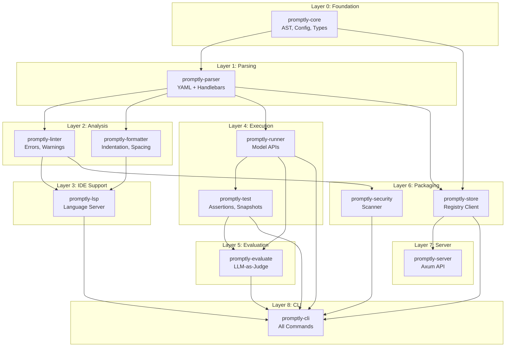
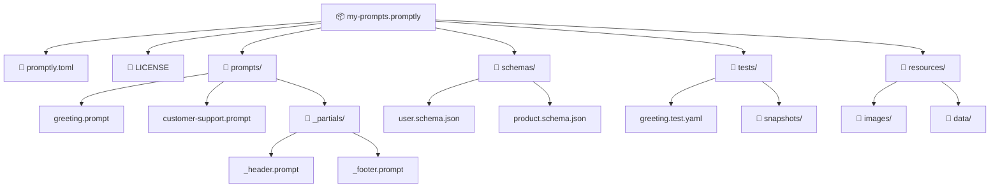

# Promptly Design Document

> *Cargo for prompts: build, test, publish, and share*
> **Authors**: Dotprompt Team
> **Created**: 2026-01-23
> **Last Updated**: 2026-01-23

## Overview

**Promptly** is a comprehensive Rust-based toolchain for `.prompt` files—like **Cargo** for prompts. It provides everything developers need to write, test, evaluate, package, and share prompts—from local development to enterprise deployment.

### Core Capabilities

| Capability | Description |
|------------|-------------|
| **Lint & Format** | Fast static analysis and consistent formatting |
| **Language Server** | IDE integration via LSP (VS Code, Neovim, Emacs, JetBrains) |
| **Execute** | Run prompts against Gemini, OpenAI, Anthropic, Ollama |
| **Test** | Automated testing with assertions and snapshots |
| **Evaluate** | A/B compare prompt variations with LLM-as-judge |
| **Package** | Bundle prompts into versioned `.promptly` archives |
| **Publish** | Share via the Prompt Store (store.dotprompt.dev) |
| **Secure** | Scan for prompt injection, PII, and vulnerabilities |

### Design Philosophy

```
┌────────────────────────────────────────────────────────────────────────────┐
│                           PROMPTLY ECOSYSTEM                               │
├────────────────────────────────────────────────────────────────────────────┤
│                                                                            │
│   Developer Experience              │    Community & Enterprise           │
│   ─────────────────────             │    ──────────────────────           │
│                                     │                                      │
│   promptly check    ─── Lint        │    promptly pack    ─── Package     │
│   promptly fmt      ─── Format      │    promptly publish ─── Share       │
│   promptly lsp      ─── IDE         │    promptly store   ─── Browse      │
│   promptly run      ─── Execute     │                                      │
│   promptly test     ─── Test        │    Prompt Store (store.dotprompt.dev)│
│   promptly evaluate ─── Compare     │    ├── Angular + Material 3          │
│                                     │    ├── Firebase Hosting              │
│   VS Code Extension                 │    └── Cloud Run (Rust/Axum API)    │
│   Neovim + Emacs Support            │                                      │
│   Chrome DevTools Panel             │    Enterprise: SSO, RBAC, Audit     │
│                                     │                                      │
└────────────────────────────────────────────────────────────────────────────┘
```

### Goals

1. **Fast**: Written in Rust for maximum performance, sub-second response times
2. **Comprehensive**: Full lifecycle from authoring to production deployment
3. **Developer-friendly**: Rust-style error messages with context and suggestions
4. **Editor-agnostic**: LSP support for all major editors
5. **AI-native**: Dogfoods Dotprompt for its own AI-powered features
6. **Package ecosystem**: npm/crates.io-style sharing and discovery
7. **Enterprise-ready**: SSO, RBAC, audit logs, compliance (SOC 2, HIPAA)

### Non-Goals

1. Replacing Dotprompt runtimes (promptly executes, but SDKs handle production)
2. Model fine-tuning or training
3. Replacing existing syntax highlighting (complements it)

### Quick Start

```bash
# Install
cargo install promptly

# Lint and format
promptly check prompts/
promptly fmt

# Run a prompt
promptly run greeting.prompt -i '{"name": "Alice"}'

# Test prompts
promptly test

# Evaluate variations
promptly evaluate experiment.yaml

# Publish to the Prompt Store
promptly login
promptly pack
promptly publish
```

---

## Architecture

```
┌───────────────────────────────────────────────────────────────────────────────────┐
│                                    promptly                                       │
├───────────────────────────────────────────────────────────────────────────────────┤
│                                                                                   │
│  ┌────────────────────────────────────────────────────────────────────────────┐  │
│  │                              CLI / LSP / Library                            │  │
│  ├────────────────────────────────────────────────────────────────────────────┤  │
│  │  promptly-cli    │  promptly-lsp    │  promptly-core (library crate)       │  │
│  └──────────────────┴──────────────────┴──────────────────────────────────────┘  │
│                                        │                                          │
│  ┌─────────────────────────────────────┴──────────────────────────────────────┐  │
│  │                              Core Engine                                    │  │
│  ├────────────────────────────────────────────────────────────────────────────┤  │
│  │  promptly-parser    │  promptly-linter    │  promptly-formatter            │  │
│  │  (YAML + Handlebars)│  (errors/warnings)  │  (indentation, spacing)        │  │
│  └─────────────────────┴────────────────────┴─────────────────────────────────┘  │
│                                        │                                          │
│  ┌─────────────────────────────────────┴──────────────────────────────────────┐  │
│  │                              Execution Layer                                │  │
│  ├────────────────────────────────────────────────────────────────────────────┤  │
│  │  promptly-runner    │  promptly-test      │  promptly-evaluate             │  │
│  │  (Gemini/OpenAI/...)│  (assertions/snaps) │  (LLM-as-judge)                │  │
│  └─────────────────────┴────────────────────┴─────────────────────────────────┘  │
│                                        │                                          │
│  ┌─────────────────────────────────────┴──────────────────────────────────────┐  │
│  │                              Package Layer                                  │  │
│  ├────────────────────────────────────────────────────────────────────────────┤  │
│  │  promptly-store     │  promptly-server    │  promptly-security             │  │
│  │  (registry client)  │  (Rust/Axum API)    │  (injection/PII scan)          │  │
│  └─────────────────────┴────────────────────┴─────────────────────────────────┘  │
│                                        │                                          │
│  ┌─────────────────────────────────────┴──────────────────────────────────────┐  │
│  │                              Project Indexer                                │  │
│  │  ├─ File watcher (notify)       ├─ Dependency graph                        │  │
│  │  ├─ Prompt/Partial discovery    └─ Incremental caching (salsa)             │  │
│  └────────────────────────────────────────────────────────────────────────────┘  │
│                                                                                   │
│  ┌────────────────────────────────────────────────────────────────────────────┐  │
│  │                     Internal Prompts (Dogfooding)                           │  │
│  │  prompts/evaluate/*.prompt  │  prompts/security/*.prompt                   │  │
│  │  prompts/optimize/*.prompt  │  prompts/assist/*.prompt                     │  │
│  └────────────────────────────────────────────────────────────────────────────┘  │
│                                                                                   │
└───────────────────────────────────────────────────────────────────────────────────┘
```

---

## Components

### 1. Parser

The parser is responsible for converting `.prompt` file content into an Abstract Syntax Tree (AST).

#### Input Format

```yaml
---
model: gemini-2.0-flash
config:
  temperature: 0.7
input:
  schema:
    name: string
    items: object[]
output:
  format: json
---

{{#role "system"}}
You are a helpful assistant.
{{/role}}

{{#role "user"}}
Hello, {{name}}! Here are your items:
{{#each items}}
- {{this.title}}: {{this.description}}
{{/each}}
{{/role}}
```

#### AST Structure

```rust
pub struct PromptFile {
    pub frontmatter: Option<Frontmatter>,
    pub template: Template,
    pub span: Span,
}

pub struct Frontmatter {
    pub model: Option<String>,
    pub config: Option<Config>,
    pub input: Option<InputSpec>,
    pub output: Option<OutputSpec>,
    pub tools: Option<Vec<String>>,
    pub metadata: HashMap<String, Value>,
    pub span: Span,
}

pub struct Template {
    pub nodes: Vec<TemplateNode>,
    pub span: Span,
}

pub enum TemplateNode {
    Text(TextNode),
    Expression(ExpressionNode),      // {{variable}}
    Partial(PartialNode),            // {{> partialName}}
    Block(BlockNode),                // {{#helper}}...{{/helper}}
    Comment(CommentNode),            // {{! comment }}
}

pub struct Span {
    pub start: Position,
    pub end: Position,
    pub source_id: SourceId,
}

pub struct Position {
    pub offset: usize,    // Byte offset
    pub line: u32,        // 1-indexed
    pub column: u32,      // 1-indexed, UTF-8 aware
}
```

#### Dependencies

| Crate | Purpose |
|-------|---------|
| `handlebars` | Handlebars parsing (already in use) |
| `serde_yaml` | YAML frontmatter parsing (already in use) |
| `pest` | Grammar-based parsing if needed for extensions |

---

### 2. Linter

The linter validates the AST against a set of configurable rules.

#### Lint Rules

| Message Key | Severity | Description | Auto-fixable |
|-------------|----------|-------------|--------------|
| `invalid-yaml` | Error | Invalid YAML syntax in frontmatter | No |
| `unclosed-block` | Error | Handlebars block not closed | No |
| `unmatched-closing-block` | Error | Closing block without matching open | No |
| `unbalanced-brace` | Error | Unbalanced `{{` or `}}` braces | No |
| `missing-partial` | Error | Missing partial file | Yes (create) |
| `circular-partial` | Error | Circular partial dependency | No |
| `unknown-block-helper` | Error | Unknown block helper | No |
| `unused-variable` | Warning | Variable in schema but not used | Yes (remove) |
| `undefined-variable` | Warning | Variable used but not in schema | Yes (add) |
| `deprecated-helper` | Warning | Deprecated helper | Yes (replace) |
| `schema-type-mismatch` | Warning | Schema type mismatch | No |
| `empty-block` | Warning | Empty block | Yes (remove) |
| `potential-injection` | Warning | Potential prompt injection | No |
| `unverified-partial` | Info | Partial template used (verify exists) | No |
| `prefer-if-block` | Info | Consider using `{{#if}}` instead of inline conditional | No |
| `long-template` | Info | Long template (consider extracting partials) | No |
| `token-count` | Info | Token count estimate | No |

#### Error Message Format (Rust-style)

```
error[missing-partial]: missing partial 'userProfile'
  --> prompts/greeting.prompt:15:3
   |
15 |   {{> userProfile}}
   |   ^^^^^^^^^^^^^^^^^ partial not found
   |
   = help: create file `prompts/_userProfile.prompt`
   = help: or check for typos in the partial name

error[circular-partial]: cyclic partial reference detected
  --> prompts/partialA.prompt:5:1
   |
 5 | {{> partialB}}
   | ^^^^^^^^^^^^^^ partialA references partialB
   |
  --> prompts/partialB.prompt:3:1
   |
 3 | {{> partialA}}
   | ^^^^^^^^^^^^^^ partialB references partialA
   |
   = note: cycle: partialA -> partialB -> partialA
```

#### Configuration

```toml
# promptly.toml
extends = "recommended"

[rules]
missing-partial = "error"      # Missing partial
unused-variable = "off"        # Disable unused variable warning
undefined-variable = "warn"    # Undefined variable
prefer-if-block = "off"        # Disable suggestion

[settings]
max-template-lines = 200
max-partial-depth = 10

[ignore]
patterns = ["**/fixtures/**", "**/tests/**"]
```

---

### 3. Formatter

The formatter ensures consistent styling across all `.prompt` files.

#### Formatting Rules

| Category | Rule | Default | Configurable |
|----------|------|---------|--------------|
| **Indentation** | Use spaces vs tabs | spaces | Yes |
| **Indentation** | Indent width | 2 | Yes |
| **YAML** | Quote style for strings | preserve | Yes |
| **YAML** | Key ordering | preserve | Yes |
| **YAML** | Trailing newline in frontmatter | yes | Yes |
| **Template** | Trim trailing whitespace | yes | Yes |
| **Template** | Ensure final newline | yes | Yes |
| **Template** | Max line length (soft wrap) | 100 | Yes |
| **Template** | Handlebars spacing (`{{ x }}` vs `{{x}}`) | `{{ x }}` | Yes |
| **Template** | Block helper indentation | yes | Yes |
| **Comments** | Normalize comment spacing | yes | Yes |

#### Formatting Examples

**Before:**
```handlebars
---
model: gemini-2.0-flash
config:
    temperature: 0.7
input:
  schema:
    name: string
---

{{#role "system"}}
You are helpful.
{{/role}}
{{#role "user"}}
Hello,{{name}}!
{{#each items}}
-{{this.title}}
{{/each}}
{{/role}}
```

**After:**
```handlebars
---
model: gemini-2.0-flash
config:
  temperature: 0.7
input:
  schema:
    name: string
---

{{#role "system"}}
You are helpful.
{{/role}}

{{#role "user"}}
Hello, {{ name }}!
{{#each items}}
  - {{ this.title }}
{{/each}}
{{/role}}
```

#### Configuration

```toml
# promptly.toml

[format]
indent = 2
use-tabs = false
line-width = 100
line-ending = "lf"              # "lf" (default), "crlf", "native"
handlebars-spacing = true       # {{ x }} vs {{x}}
yaml-quote-style = "preserve"   # "double", "single", "preserve"
yaml-key-order = "preserve"     # "preserve", "alphabetical"
trim-trailing-whitespace = true
ensure-final-newline = true
block-indent = true             # Indent content inside blocks
```

#### EditorConfig

Recommended `.editorconfig` for projects using Dotprompt:

```ini
# .editorconfig
root = true

# Default settings for all files
[*]
charset = utf-8
end_of_line = lf
insert_final_newline = true
trim_trailing_whitespace = true
indent_style = space
indent_size = 2

# Dotprompt files
[*.prompt]
end_of_line = lf
insert_final_newline = true
trim_trailing_whitespace = true
indent_style = space
indent_size = 2
max_line_length = 100

# Partial templates (underscore prefix)
[_*.prompt]
end_of_line = lf
insert_final_newline = true
trim_trailing_whitespace = true
indent_style = space
indent_size = 2

# Package manifests
[promptly.toml]
indent_style = space
indent_size = 2

# Test specifications
[*.test.yaml]
indent_style = space
indent_size = 2
```

**Generate with CLI:**
```bash
promptly init --editorconfig    # Creates .editorconfig with prompt defaults
```

---

### 4. Language Server Protocol (LSP)

The LSP server provides IDE integration via the standardized Language Server Protocol.

#### LSP Feature Matrix

All 14 standard LSP features are supported for `.prompt` files:

| Feature | LSP Method | Support | Description |
|---------|------------|---------|-------------|
| **File/Workspace Diagnostics** | `textDocument/publishDiagnostics` | ✅ Full | Lint errors, YAML validation, Handlebars syntax, missing refs |
| **Hover Type Information** | `textDocument/hover` | ✅ Full | Variable types from schema, helper docs, partial previews |
| **Go to Definition** | `textDocument/definition` | ✅ Full | Jump to partial files, schema definitions |
| **Go to Declaration** | `textDocument/declaration` | ✅ Partial | Same as definition for partials (no separate declaration) |
| **Go to Type Definition** | `textDocument/typeDefinition` | ✅ Partial | Jump to schema type definitions |
| **Go to Symbol** | `textDocument/documentSymbol` | ✅ Full | Navigate to variables, helpers, partials in file |
| **Open Symbol by Name** | `workspace/symbol` | ✅ Full | Workspace-wide search for prompts/partials |
| **Find References** | `textDocument/references` | ✅ Full | Find all uses of a partial, variable, or schema |
| **Inlay Hints** | `textDocument/inlayHint` | ✅ Full | Show inferred types, token counts, variable values |
| **Completions** | `textDocument/completion` | ✅ Full | Variables, helpers, partials, model names, config |
| **Signature Help** | `textDocument/signatureHelp` | ✅ Full | Helper function signatures `{{#each items}}` |
| **Highlight References** | `textDocument/documentHighlight` | ✅ Full | Highlight all occurrences of a variable in file |
| **Semantic Highlighting** | `textDocument/semanticTokens` | ✅ Full | Handlebars syntax, YAML frontmatter, roles |
| **Symbol Renaming** | `textDocument/rename` | ✅ Full | Rename variables, partials across workspace |

#### Additional LSP Features

| Feature | LSP Method | Support |
|---------|------------|---------|
| **Formatting** | `textDocument/formatting` | ✅ Full |
| **Range Formatting** | `textDocument/rangeFormatting` | ✅ Full |
| **Code Actions** | `textDocument/codeAction` | ✅ Full |
| **Folding Ranges** | `textDocument/foldingRange` | ✅ Full |
| **Selection Range** | `textDocument/selectionRange` | ✅ Full |
| **Call Hierarchy** | `callHierarchy/incomingCalls` | ✅ Full |
| **Linked Editing** | `textDocument/linkedEditingRange` | ✅ Full |

#### Feature Details

##### Diagnostics

```
error[invalid-yaml]: Invalid YAML frontmatter
  --> greeting.prompt:3:5
   |
 3 |     temperature: "hot"
   |                  ^^^^^ expected number, found string
   |
help: temperature should be a number between 0.0 and 2.0
   |
 3 |     temperature: 0.7
   |                  ~~~

warning[unused-variable]: Unused variable
  --> greeting.prompt:12:5
   |
12 |     {{ userName }}
   |        ^^^^^^^^ 'userName' is defined in schema but never used
```

##### Hover Information

| Target | Information Shown |
|--------|-------------------|
| `{{> partial}}` | Partial file content preview, file path |
| `{{ variable }}` | Type from schema, description, default value |
| `{{#helper}}` | Helper documentation, signature, examples |
| `{{#role "system"}}` | Role documentation, best practices |
| Frontmatter key | Key documentation, valid values |
| `model:` | Model info, context window, capabilities |

**Example Hover on Variable:**
```
{{ userName }}
─────────────────────────────────
**userName**: string

Defined in input.schema at line 5

Description: The user's display name
Default: "Guest"
```

**Example Hover on Partial:**
```
{{> header}}
─────────────────────────────────
**_header.prompt**

{{#role "system"}}
You are a helpful assistant...
{{/role}}

📁 prompts/_header.prompt
```

##### Go to Definition

| Source | Destination |
|--------|-------------|
| `{{> myPartial}}` | `prompts/_myPartial.prompt` |
| `{{ userName }}` | `input.schema.userName` in frontmatter |
| `{{#myHelper}}` | Helper registration in code (if configured) |
| `@org/package/prompt` | Package prompt file |

##### Find References

| Source | Finds |
|--------|-------|
| `_header.prompt` | All prompts using `{{> header}}` |
| `userName` variable | All `{{ userName }}` uses across workspace |
| `User` schema | All prompts with `input.schema.$ref: User` |

##### Completions

| Context | Trigger | Completions |
|---------|---------|-------------|
| Template | `{{` | Variables from schema, built-in helpers |
| Template | `{{#` | Block helpers: `each`, `if`, `unless`, `with`, `role` |
| Template | `{{> ` | Available partials in workspace |
| Template | `{{@` | Loop variables: `@index`, `@first`, `@last`, `@key` |
| Frontmatter | `model:` | All known model names with metadata |
| Frontmatter | `output.format:` | `json`, `text`, `media` |
| Frontmatter | `config.` | Model configuration options |
| Frontmatter | `input.schema:` | Registered schemas, inline types |
| Frontmatter | `tools:` | Available tool definitions |

##### Model Autocompletion

When typing `model:`, the LSP provides intelligent completions with model metadata:

```yaml
model: g|   # Cursor after 'g'
       ├── gemini-2.0-flash          ✨ Recommended
       │   Context: 1M tokens | Output: 8K | Cost: $0.075/1M
       ├── gemini-2.0-flash-lite
       │   Context: 1M tokens | Output: 8K | Cost: $0.02/1M
       ├── gemini-1.5-pro
       │   Context: 2M tokens | Output: 8K | Cost: $1.25/1M
       ├── gpt-4o
       │   Context: 128K tokens | Output: 16K | Cost: $2.50/1M
       ├── gpt-4o-mini
       │   Context: 128K tokens | Output: 16K | Cost: $0.15/1M
       └── gpt-4-turbo
           Context: 128K tokens | Output: 4K | Cost: $10/1M
```

**Model Metadata Shown:**
- Context window size
- Max output tokens
- Approximate cost per million tokens
- Capabilities (vision, function calling, structured output)
- Deprecation warnings for old models

**Model Registry Sync:**

The LSP fetches model information from the Prompt Store registry, keeping completions up-to-date:

```
┌─────────────────────────────────────────────────────────────────┐
│                    MODEL REGISTRY SYNC                          │
├─────────────────────────────────────────────────────────────────┤
│                                                                 │
│   Prompt Store API                    LSP Server                │
│   ─────────────────                   ──────────                │
│                                                                 │
│   GET /api/models                                               │
│   ┌─────────────────┐                ┌─────────────────┐       │
│   │ models.json     │ ──────────────▶│ Local cache     │       │
│   │                 │   (periodic)   │ ~/.promptly/    │       │
│   │ - gemini-*      │                │ models.json     │       │
│   │ - gpt-*         │                │                 │       │
│   │ - claude-*      │                │ TTL: 24 hours   │       │
│   │ - ollama/*      │                └─────────────────┘       │
│   └─────────────────┘                        │                  │
│                                              ▼                  │
│                                     ┌─────────────────┐        │
│                                     │ Completions     │        │
│                                     │ with metadata   │        │
│                                     └─────────────────┘        │
│                                                                 │
└─────────────────────────────────────────────────────────────────┘
```

**Sync Configuration:**
```toml
# promptly.toml
[lsp]
model-registry-url = "https://store.dotprompt.dev/api/models"
model-registry-sync-interval = "24h"   # How often to refresh
model-registry-cache-dir = "~/.promptly/cache"
offline-mode = false                    # Use bundled models only
```

**Registry API Response:**
```json
{
  "models": [
    {
      "id": "gemini-2.0-flash",
      "provider": "google",
      "displayName": "Gemini 2.0 Flash",
      "contextWindow": 1048576,
      "maxOutputTokens": 8192,
      "costPerMillionInput": 0.075,
      "costPerMillionOutput": 0.30,
      "capabilities": ["text", "vision", "function_calling", "structured_output"],
      "recommended": true,
      "deprecated": false,
      "deprecationDate": null,
      "replacementModel": null
    },
    {
      "id": "gpt-3.5-turbo",
      "provider": "openai",
      "deprecated": true,
      "deprecationDate": "2025-06-01",
      "replacementModel": "gpt-4o-mini"
    }
  ],
  "lastUpdated": "2026-01-23T00:00:00Z",
  "version": "1.0"
}
```

**Offline Fallback:**
- Bundled model list ships with each promptly release
- Cache persists between sessions
- Works fully offline after first sync

##### Frontmatter Configuration Help

The LSP provides completions and validation for all frontmatter fields:

**Top-Level Keys:**
```yaml
|         # Cursor at start of frontmatter
├── model:          # Required - AI model to use
├── config:         # Model configuration
├── input:          # Input schema definition
├── output:         # Output format and schema
├── tools:          # Function/tool definitions
├── metadata:       # Custom metadata
└── default:        # Default variable values
```

**Config Section:**
```yaml
config:
  |               # Cursor in config section
  ├── temperature: 0.7      # 0.0-2.0, creativity control
  ├── maxOutputTokens: 1024 # Maximum response length
  ├── topP: 0.95           # Nucleus sampling
  ├── topK: 40             # Top-k sampling
  ├── stopSequences: []    # Stop generation tokens
  ├── presencePenalty: 0   # -2.0 to 2.0
  ├── frequencyPenalty: 0  # -2.0 to 2.0
  └── responseMimeType:    # Response format hint
```

**Input Section:**
```yaml
input:
  |
  ├── schema:              # Inline schema definition
  │   ├── fieldName: string
  │   ├── fieldName: number
  │   ├── fieldName: boolean
  │   ├── fieldName: string[]
  │   └── fieldName: object
  ├── default:             # Default values
  │   └── fieldName: "value"
  └── $ref: "#/schemas/User"  # Reference to schema
```

**Output Section:**
```yaml
output:
  |
  ├── format: json         # json, text, media
  ├── schema:              # Expected output structure
  │   ├── fieldName: string
  │   └── fieldName: number
  └── $ref: "#/schemas/Response"
```

**Tools Section:**
```yaml
tools:
  |
  ├── - name: searchWeb    # Tool name
  │     description: ...   # What the tool does
  │     parameters:        # Tool parameters
  │       query: string
  └── - $ref: myTool       # Reference to defined tool
```

##### Frontmatter Hover Information

| Field | Hover Shows |
|-------|-------------|
| `model: gemini-2.0-flash` | Model info, context size, pricing |
| `config.temperature: 0.7` | Valid range, effect on output |
| `input.schema.name: string` | Type info, validation rules |
| `output.format: json` | Format options, when to use each |
| `tools: [...]` | Tool capabilities, usage examples |

**Example Hover on `temperature`:**
```
config:
  temperature: 0.7
  ─────────────────────────────────
  **temperature**: number (0.0 - 2.0)

  Controls randomness in output generation.

  • 0.0 = Deterministic, consistent outputs
  • 0.7 = Balanced (recommended for most tasks)
  • 1.0 = More creative, varied outputs
  • 2.0 = Maximum randomness

  Default: Model-specific (typically 1.0)
```

##### Frontmatter Diagnostics

The LSP validates frontmatter and provides diagnostics:

```yaml
model: gemini-3.0-flash
       ^^^^^^^^^^^^^^^^
error[unknown-model]: Unknown model 'gemini-3.0-flash'
  --> greeting.prompt:1:8
   |
 1 |   model: gemini-3.0-flash
   |          ^^^^^^^^^^^^^^^^ did you mean 'gemini-2.0-flash'?
   |
help: available models: gemini-2.0-flash, gemini-1.5-pro, gpt-4o

---

config:
  temperature: 3.0
               ^^^
error[invalid-config-value]: Invalid temperature value
  --> greeting.prompt:4:16
   |
 4 |     temperature: 3.0
   |                  ^^^ value must be between 0.0 and 2.0
   |
help: typical values: 0.0 (deterministic), 0.7 (balanced), 1.0 (creative)

---

input:
  schema:
    name: strnig
          ^^^^^^
warning[unknown-type]: Unknown type 'strnig'
  --> greeting.prompt:8:12
   |
 8 |       name: strnig
   |             ^^^^^^ did you mean 'string'?
```

##### Code Actions for Frontmatter

| Issue | Quick Fix |
|-------|-----------|
| Unknown model | Suggest similar model names |
| Invalid config value | Show valid range |
| Missing required field | Add field with default |
| Deprecated model | Replace with newer model |
| Unknown type | Suggest valid types |

##### Signature Help

```
{{#each items}}
      ──────
each(array: T[], options?: { limit?: number })

Iterates over an array. Available variables:
  @index - Current index (0-based)
  @first - true if first item
  @last  - true if last item
  this   - Current item

Example:
  {{#each users}}
    {{@index}}: {{this.name}}
  {{/each}}
```

##### Inlay Hints

```handlebars
{{#role "system"}}                    [📊 ~50 tokens]
You are a helpful assistant.
{{/role}}

{{#role "user"}}                      [📊 ~25 tokens]
Hello, {{ userName }}!                [: string]
Your items:
{{#each items}}                       [: Item[]]
  - {{ this.name }}: ${{ this.price }} [: string] [: number]
{{/each}}
{{/role}}
                                      [📊 Total: ~150 tokens]
```

##### Semantic Highlighting

| Token Type | Example | Color (typical) |
|------------|---------|-----------------|
| `keyword` | `model`, `config`, `input` | Purple |
| `variable` | `{{ userName }}` | Blue |
| `function` | `{{#each}}`, `{{#if}}` | Yellow |
| `string` | `"system"`, `"user"` | Green |
| `number` | `0.7`, `1024` | Orange |
| `comment` | `{{! comment }}` | Gray |
| `operator` | `{{`, `}}`, `{{#`, `{{/` | White |
| `type` | `string`, `number`, `object` | Cyan |

##### Symbol Renaming

Rename `userName` → `displayName` across all files:

```diff
# greeting.prompt
 input:
   schema:
-    userName: string
+    displayName: string
 ---
-Hello, {{ userName }}!
+Hello, {{ displayName }}!

# farewell.prompt
-Goodbye, {{ userName }}!
+Goodbye, {{ displayName }}!
```

#### LSP Server Configuration

```json
// VS Code settings.json
{
  "promptly.lsp.trace.server": "verbose",
  "promptly.lsp.inlayHints.enabled": true,
  "promptly.lsp.inlayHints.showTokenCounts": true,
  "promptly.lsp.inlayHints.showTypes": true,
  "promptly.lsp.semanticHighlighting.enabled": true,
  "promptly.lsp.completion.showModelInfo": true,
  "promptly.lsp.hover.showPartialPreview": true,
  "promptly.lsp.hover.previewMaxLines": 10
}
```

#### Completion Triggers

| Context | Trigger | Completions |
|---------|---------|-------------|
| Template | `{{` | Variables, helpers |
| Template | `{{#` | Block helpers |
| Template | `{{> ` | Partials |
| Frontmatter | `model:` | Known model names |
| Frontmatter | `output.format:` | `json`, `text`, `media` |
| Frontmatter | `input.schema:` | Registered schemas |

---

### 5. Dependencies

```toml
[package]
name = "promptly"
version = "0.1.0"
edition = "2024"
rust-version = "1.85"
description = "Linter, formatter, and language server for Dotprompt .prompt files"
license = "Apache-2.0"
repository = "https://github.com/google/dotprompt"
keywords = ["linter", "formatter", "lsp", "prompt", "dotprompt"]
categories = ["development-tools", "command-line-utilities"]

[[bin]]
name = "promptly"
path = "src/main.rs"

[lib]
name = "promptly_core"
path = "src/lib.rs"

[dependencies]
# Parsing
handlebars = "6.4"
serde = { version = "1.0", features = ["derive"] }
serde_json = "1.0"
serde_yaml = "0.9"

# LSP
tower-lsp-server = "0.23"
tokio = { version = "1", features = ["full"] }

# Diagnostics
ariadne = "0.4"              # Beautiful error messages
codespan-reporting = "0.11"  # Alternative diagnostic formatting

# File watching
notify = "6.0"

# CLI
clap = { version = "4", features = ["derive"] }

# Utilities
thiserror = "2.0"
tracing = "0.1"
tracing-subscriber = "0.3"

[dev-dependencies]
insta = "1.38"               # Snapshot testing
tempfile = "3.10"
```

---

## CLI Interface

The CLI uses a unified command with subcommands (similar to `cargo`, `git`, `ruff`):

```
promptly <COMMAND>

Commands:
  check         Lint .prompt files for errors and warnings
  fmt           Format .prompt files
  run           Execute a prompt and display the result
  test          Run prompt tests
  evaluate      Compare prompt variations (A/B testing)
  workflow      Run multi-step prompt pipelines
  pack          Create a .promptly package archive
  publish       Publish package to Prompt Store
  lsp           Start the language server
  store         Manage packages from the Prompt Store
  graph         Show partial dependency graph
  unused        Find unused partials
  security-scan Scan for security vulnerabilities
  init          Initialize configuration file

Options:
  -h, --help     Print help
  -V, --version  Print version
```

### Subcommands

```bash
# Lint files
promptly check                      # Check current directory
promptly check prompts/             # Check specific directory  
promptly check *.prompt             # Check specific files
promptly check --fix                # Auto-fix issues
promptly check --format=json        # JSON output for CI
promptly check --format=github      # GitHub Actions annotations
promptly check --format=sarif       # SARIF format for security tools

# CI/CD modes
promptly check --strict             # Errors + warnings → fail (default)
promptly check --warn-only          # Report issues but never fail
promptly check --max-warnings=10    # Fail only if warnings exceed limit
promptly check --report-only        # Report all issues, always exit 0

# Format files
promptly fmt                        # Format all files in place
promptly fmt --check                # Check formatting (CI mode, exit 1 if unformatted)
promptly fmt --diff                 # Show diff without writing
promptly fmt prompts/greeting.prompt

# Run prompts (execute against model API)
promptly run greeting.prompt -i '{"name": "Alice"}'    # Run with inline input
promptly run greeting.prompt -f input.json             # Run with input file
promptly run greeting.prompt --dry-run                 # Render template only
promptly run greeting.prompt --stream                  # Stream output tokens
promptly run greeting.prompt -m gemini-2.0-flash       # Override model
cat context.json | promptly run summarizer.prompt      # Pipe input

# Evaluate prompts (comparative A/B testing)
promptly evaluate experiment.yaml                      # Run evaluation
promptly evaluate experiment.yaml --output results.json  # Export results
promptly evaluate experiment.yaml --judge gpt-4o       # Use specific judge model
promptly evaluate experiment.yaml --runs 5             # Multiple runs per variation
promptly evaluate --interactive                        # Interactive mode (opens browser)

# Package and publish
promptly login                                         # Authenticate with Prompt Store
promptly login --token                                 # Login with API token (for CI)
promptly pack                                          # Create .promptly archive
promptly pack --output my-package-1.0.0.promptly       # Custom output path
promptly publish                                       # Publish to Prompt Store
promptly publish --dry-run                             # Validate without publishing
promptly publish --tag beta                            # Publish with tag (like npm)
promptly publish --access public                       # Set package visibility

# Language server (started by editors, rarely used directly)
promptly lsp                        # Start LSP server on stdio
promptly lsp --tcp 8080             # Start LSP server on TCP port

# Project analysis
promptly graph                      # Show dependency graph (text)
promptly graph --format=dot         # Output as Graphviz DOT
promptly graph --format=mermaid     # Output as Mermaid diagram
promptly unused                     # Find unused partials

# Configuration
promptly init                       # Create promptly.toml
promptly init --minimal             # Create minimal config
promptly init --package             # Initialize as publishable package
```

### Exit Codes

| Code | Meaning |
|------|---------|
| 0 | Success, no issues |
| 1 | Lint errors found |
| 2 | Configuration error |
| 3 | File not found |
| 4 | Network/API error |
| 5 | Authentication error |

---

## Prompt Store

The **Prompt Store** is an online registry for sharing and discovering reusable prompt templates, partials, and schemas. It functions similarly to npm, crates.io, or PyPI but specifically for Dotprompt assets.

### Concepts

| Term | Description |
|------|-------------|
| **Package** | A collection of related prompts, partials, and schemas with a manifest |
| **Registry** | The central server hosting packages (default: `store.dotprompt.dev`) |
| **Scope** | Namespace for packages (e.g., `@google/`, `@vercel/`) |
| **Version** | Semver versioning for packages |

### CLI Subcommands

```bash
# Search for packages
promptly store search "code review"
promptly store search --tag=coding --tag=assistant

# View package details
promptly store info @google/code-assistant
promptly store info @community/resume-helper@2.1.0

# Install packages
promptly store add @google/code-assistant           # Latest version
promptly store add @google/code-assistant@^1.0.0    # Version range
promptly store add @community/email-templates --save-dev

# Update packages
promptly store update                               # Update all
promptly store update @google/code-assistant        # Update specific

# Remove packages
promptly store remove @google/code-assistant

# List installed packages
promptly store list
promptly store list --outdated

# Publish packages (authenticated)
promptly store login                                # Authenticate
promptly store publish                              # Publish current package
promptly store publish --dry-run                    # Validate without publishing

# Initialize a new package
promptly store init                                 # Interactive
promptly store init --scope=@myorg
```

---

## Package Format (`.promptly`)

Prompt packages are distributed as `.promptly` archives—compressed ZIP files with a standardized structure, similar to `.whl` (Python), `.crate` (Rust), or `.tgz` (npm).

### Archive Structure

```
@google-code-assistant-1.2.0.promptly
├── promptly.toml              # Package manifest (required)
├── README.md                  # Package documentation
├── LICENSE                    # License file
├── CHANGELOG.md               # Version history
├── prompts/                   # Prompt templates
│   ├── code-review.prompt
│   ├── refactor-suggestion.prompt
│   └── explain-code.prompt
├── partials/                  # Reusable partial templates
│   ├── _review-header.prompt
│   ├── _code-block.prompt
│   └── _rating-scale.prompt
├── schemas/                   # JSON schemas for validation
│   └── review-input.json
└── .promptly-meta/            # Package metadata (generated)
    ├── checksums.sha256       # File integrity hashes
    └── signature.sig          # Ed25519 package signature
```

### Package Manifest (`promptly.toml`)

```toml
# promptly.toml - Package manifest for Prompt Store

[package]
name = "@google/code-assistant"
version = "1.2.0"
description = "AI-powered code review and refactoring prompts"
license = "Apache-2.0"
readme = "README.md"
repository = "https://github.com/google/dotprompt"
homepage = "https://dotprompt.dev"
documentation = "https://dotprompt.dev/docs/code-assistant"
keywords = ["code-review", "refactoring", "programming", "assistant"]
categories = ["development", "code-quality"]

[package.authors]
names = ["Google Dotprompt Team"]
email = "dotprompt@google.com"

# Minimum promptly CLI version required
[package.requires]
promptly = ">=0.2.0"

# Entry points - which files are included
[package.include]
prompts = ["prompts/*.prompt"]
partials = ["partials/_*.prompt"]
schemas = ["schemas/*.json"]
files = ["README.md", "LICENSE", "CHANGELOG.md"]

# Files to exclude from package
[package.exclude]
patterns = ["**/*.test.prompt", "fixtures/", ".git/", "*.bak"]

# Dependencies on other packages (like npm/cargo)
[dependencies]
"@community/common-helpers" = "^1.0.0"
"@google/formatting-utils" = "~2.3.0"

# Development dependencies (not included in published package)
[dev-dependencies]
"@testing/mock-data" = "^2.0.0"
"@testing/prompt-fixtures" = "*"

# Optional dependencies (installed only if explicitly requested)
[optional-dependencies]
multilingual = ["@google/i18n-helpers"]
enterprise = ["@google/audit-logging", "@google/compliance-checks"]

# Feature flags (like Cargo features)
[features]
default = []
enterprise = ["optional-dependencies.enterprise"]
all-languages = ["optional-dependencies.multilingual"]

# Model compatibility hints
[compatibility]
models = ["gemini-*", "gpt-4*", "claude-3*"]
min-context-window = 8000  # tokens

# Scripts (like npm scripts)
[scripts]
test = "promptly check --strict"
lint = "promptly check"
format = "promptly fmt"
evaluate = "promptly evaluate tests/evaluation.yaml"

# Publishing configuration
[publish]
registry = "https://store.dotprompt.dev"
access = "public"  # or "restricted" for private packages
```

### Package Naming Convention

| Pattern | Example | Description |
|---------|---------|-------------|
| `@scope/name` | `@google/code-assistant` | Scoped package (recommended) |
| `name` | `simple-greeter` | Unscoped package (community) |

**Naming Rules:**
- Lowercase letters, numbers, hyphens only
- Must start with a letter
- Max 50 characters for name, 30 for scope
- Scope must be verified for organizations

### Version Constraints (Semver)

| Constraint | Meaning | Example |
|------------|---------|---------|
| `1.2.3` | Exact version | Only 1.2.3 |
| `^1.2.3` | Compatible (npm-style) | >=1.2.3, <2.0.0 |
| `~1.2.3` | Patch updates only | >=1.2.3, <1.3.0 |
| `>=1.2.3` | Minimum version | 1.2.3 or higher |
| `*` | Any version | Latest compatible |
| `1.2.x` | Any patch version | >=1.2.0, <1.3.0 |

### Creating a Package

```bash
# Initialize a new package
promptly init --package
# Creates promptly.toml with prompts and metadata

# Validate package structure
promptly pack --dry-run

# Create .promptly archive
promptly pack
# Output: @google-code-assistant-1.2.0.promptly

# Inspect archive contents
promptly pack --list
```

### Package Lifecycle Commands

```bash
# Development
promptly init --package          # Initialize new package
promptly check                   # Validate prompts
promptly fmt                     # Format all files
promptly test                    # Run package tests (if defined)

# Key Management (first-time setup)
promptly keys generate           # Generate Ed25519 key pair
promptly keys register           # Register public key with Prompt Store

# Packaging & Signing
promptly pack                    # Create .promptly archive
promptly pack --dry-run          # Validate without creating
promptly pack --output ./dist/   # Custom output directory
promptly sign my-package.promptly  # Sign the package (REQUIRED for publish)

# Publishing (requires signed package)
promptly login                   # Authenticate
promptly publish                 # Sign and publish (combines sign + upload)
promptly publish --dry-run       # Validate without publishing
promptly publish --tag beta      # Publish with dist-tag
promptly publish --access public # Set visibility

# Note: The store ONLY accepts signed packages. Unsigned packages will be
# rejected with error: "Package must be signed with a registered key"

# Version management
promptly version patch           # Bump patch version (1.2.3 -> 1.2.4)
promptly version minor           # Bump minor version (1.2.3 -> 1.3.0)
promptly version major           # Bump major version (1.2.3 -> 2.0.0)
promptly version 1.5.0           # Set specific version

# Deprecation
promptly deprecate "Use @google/code-assistant-v2 instead"
promptly unpublish @google/code-assistant@1.0.0  # Yank specific version
```

---

## GitHub Actions

Ready-to-use GitHub Actions for automating prompt package workflows.

### `google/promptly-action`

```yaml
# .github/workflows/promptly.yml
name: Promptly CI

on:
  push:
    branches: [main]
    paths:
      - 'prompts/**'
      - 'partials/**'
      - 'promptly.toml'
  pull_request:
    paths:
      - 'prompts/**'
      - 'partials/**'

jobs:
  lint:
    runs-on: ubuntu-latest
    steps:
      - uses: actions/checkout@v4
      
      - name: Setup Promptly
        uses: google/promptly-action@v1
        with:
          version: 'latest'
      
      - name: Lint prompts
        run: promptly check --format=github
      
      - name: Check formatting
        run: promptly fmt --check

  test:
    runs-on: ubuntu-latest
    needs: lint
    steps:
      - uses: actions/checkout@v4
      
      - name: Setup Promptly
        uses: google/promptly-action@v1
      
      - name: Install dependencies
        run: promptly store install --frozen
      
      - name: Run evaluations
        run: promptly evaluate tests/evaluation.yaml
        env:
          GOOGLE_API_KEY: ${{ secrets.GOOGLE_API_KEY }}
```

### Automated Publishing Workflow

```yaml
# .github/workflows/publish.yml
name: Publish to Prompt Store

on:
  release:
    types: [published]

jobs:
  publish:
    runs-on: ubuntu-latest
    permissions:
      contents: read
      id-token: write  # For OIDC authentication
    
    steps:
      - uses: actions/checkout@v4
      
      - name: Setup Promptly
        uses: google/promptly-action@v1
      
      - name: Validate package
        run: |
          promptly check --strict
          promptly pack --dry-run
      
      - name: Publish to Prompt Store
        uses: google/promptly-publish-action@v1
        with:
          # Option 1: API token
          token: ${{ secrets.PROMPTLY_TOKEN }}
          
          # Option 2: OIDC (recommended for GitHub)
          # oidc: true
          
          # Optional settings
          tag: ${{ github.event.release.prerelease && 'beta' || 'latest' }}
          access: public
```

### Release Please Integration

```yaml
# .github/workflows/release-please.yml
name: Release Please

on:
  push:
    branches: [main]

jobs:
  release-please:
    runs-on: ubuntu-latest
    outputs:
      release_created: ${{ steps.release.outputs.release_created }}
      tag_name: ${{ steps.release.outputs.tag_name }}
    steps:
      - uses: googleapis/release-please-action@v4
        id: release
        with:
          release-type: simple
          package-name: "@google/code-assistant"
          
  publish:
    needs: release-please
    if: ${{ needs.release-please.outputs.release_created }}
    runs-on: ubuntu-latest
    steps:
      - uses: actions/checkout@v4
      
      - name: Setup Promptly
        uses: google/promptly-action@v1
      
      - name: Publish
        run: promptly publish
        env:
          PROMPTLY_TOKEN: ${{ secrets.PROMPTLY_TOKEN }}
```

### Reusable Workflow

```yaml
# .github/workflows/promptly-ci.yml (in your org's .github repo)
name: Promptly CI (Reusable)

on:
  workflow_call:
    inputs:
      promptly-version:
        type: string
        default: 'latest'
    secrets:
      PROMPTLY_TOKEN:
        required: false
      GOOGLE_API_KEY:
        required: false

jobs:
  ci:
    runs-on: ubuntu-latest
    steps:
      - uses: actions/checkout@v4
      
      - uses: google/promptly-action@v1
        with:
          version: ${{ inputs.promptly-version }}
      
      - run: promptly check --format=github
      - run: promptly fmt --check
      - run: promptly store install --frozen
      
      - if: ${{ secrets.GOOGLE_API_KEY != '' }}
        run: promptly evaluate tests/evaluation.yaml
        env:
          GOOGLE_API_KEY: ${{ secrets.GOOGLE_API_KEY }}
```

**Usage in other repos:**
```yaml
# .github/workflows/ci.yml
name: CI
on: [push, pull_request]
jobs:
  promptly:
    uses: your-org/.github/.github/workflows/promptly-ci.yml@main
    secrets: inherit
```

---

### Lock File (`promptly.lock`)

The lock file ensures reproducible installations across environments and CI/CD pipelines.

```yaml
# promptly.lock - Generated, do not edit manually
version: 2
resolved_at: "2026-01-23T15:14:00Z"
resolver: "promptly 0.3.0"

packages:
  "@google/code-assistant@1.2.0":
    integrity: sha256-abc123def456...
    resolved: "https://store.dotprompt.dev/packages/@google/code-assistant/1.2.0"
    source: "store.dotprompt.dev"
    published_at: "2026-01-15T10:30:00Z"
    requires:
      promptly: ">=0.2.0"
    dependencies:
      "@community/common-helpers": "1.0.5"
    prompts:
      - code-review.prompt
      - refactor-suggestion.prompt
    partials:
      - _review-header.prompt
      - _code-block.prompt

  "@community/common-helpers@1.0.5":
    integrity: sha256-def456ghi789...
    resolved: "https://store.dotprompt.dev/packages/@community/common-helpers/1.0.5"
    source: "store.dotprompt.dev"
    published_at: "2026-01-10T08:00:00Z"
    requires:
      promptly: ">=0.1.0"
    dependencies: {}
    partials:
      - _timestamp.prompt
      - _user-info.prompt

# Checksum of the entire lock file for tamper detection
checksum: sha256-lockfile-integrity-hash...
```

#### Lock File Fields

| Field | Description |
|-------|-------------|
| `version` | Lock file format version |
| `resolved_at` | Timestamp when dependencies were resolved |
| `resolver` | Version of promptly that created the lock |
| `integrity` | SHA256 hash of package tarball |
| `resolved` | Full URL where package was downloaded |
| `source` | Registry hostname (for multi-registry support) |
| `published_at` | When the version was published |
| `requires` | Minimum promptly version needed |
| `dependencies` | Direct dependencies with resolved versions |
| `prompts` | List of prompt files in package |
| `partials` | List of partial files in package |
| `checksum` | Integrity hash of entire lock file |

#### Lock File Commands

```bash
# Install dependencies from lock file (CI-safe)
promptly store install --frozen     # Fail if lock file is out of date

# Update lock file
promptly store update               # Update all to latest compatible
promptly store update @google/code-assistant  # Update specific package

# Verify lock file integrity
promptly store verify               # Check all checksums match
```

### Installed Package Location

```
project/
├── prompts/                    # User's prompts
├── promptly.toml               # Package manifest
├── promptly.lock            # Lock file
└── .promptly/            # Installed packages (like node_modules)
    ├── @google/
    │   └── code-assistant/
    │       ├── promptly.toml
    │       ├── prompts/
    │       └── partials/
    └── @community/
        └── common-helpers/
```

### Using Installed Packages

```handlebars
{{!-- Reference a partial from an installed package --}}
{{> @google/code-assistant/review-header}}

{{!-- Use in frontmatter --}}
---
extends: "@google/code-assistant/base-reviewer"
---
```

---

## Prompt Store Server

The Prompt Store server is a Rust web application hosted on Google Cloud, using Firebase Hosting for the frontend and Cloud Run for the API.

### Architecture

```
┌─────────────────────────────────────────────────────────────────────┐
│                    Prompt Store Infrastructure                       │
├─────────────────────────────────────────────────────────────────────┤
│                                                                      │
│  ┌──────────────────────────────────────────────────────────────┐   │
│  │                    Firebase Hosting                           │   │
│  │                  (store.dotprompt.dev)                        │   │
│  │  ┌────────────────────┐    ┌─────────────────────────────┐   │   │
│  │  │  Angular Frontend  │    │  /api/* → Cloud Run proxy   │   │   │
│  │  │  (static assets)   │    │                             │   │   │
│  │  └────────────────────┘    └──────────────┬──────────────┘   │   │
│  └───────────────────────────────────────────┼──────────────────┘   │
│                                               │                      │
│  ┌────────────────────────────────────────────┼──────────────────┐  │
│  │                      Cloud Run                                │  │
│  │              (Rust/Axum API Server)                           │  │
│  │         api.store.dotprompt.dev (internal)                    │  │
│  └────────────────────────────────────────────┬──────────────────┘  │
│                                               │                      │
│                          ┌────────────────────┼────────────────┐    │
│                          │                    │                │    │
│                     ┌────┴────┐         ┌────┴────┐      ┌────┴───┐│
│                     │Firestore│         │  Redis  │      │  GCS   ││
│                     │   or    │         │Memorystore     │(packages││
│                     │Cloud SQL│         │ (cache) │      │tarballs)││
│                     └─────────┘         └─────────┘      └────────┘│
│                                                                      │
└─────────────────────────────────────────────────────────────────────┘
```

### Deployment Options

| Option | Database | Pros | Cons |
|--------|----------|------|------|
| **Option A: Firestore** | Firestore | Serverless, auto-scaling, simpler ops | Less flexible queries |
| **Option B: Cloud SQL** | PostgreSQL | Full SQL power, complex queries | Requires instance management |

**Recommendation:** Start with Firestore for simplicity, migrate to Cloud SQL if query complexity demands it.

### Firebase Configuration

```json
// firebase.json
{
  "hosting": {
    "public": "dist/promptly-store",
    "ignore": ["firebase.json", "**/.*", "**/node_modules/**"],
    "rewrites": [
      {
        "source": "/api/**",
        "run": {
          "serviceId": "promptly-store-api",
          "region": "us-central1"
        }
      },
      {
        "source": "**",
        "destination": "/index.html"
      }
    ],
    "headers": [
      {
        "source": "/api/**",
        "headers": [
          { "key": "Cache-Control", "value": "no-cache" }
        ]
      },
      {
        "source": "**/*.@(js|css)",
        "headers": [
          { "key": "Cache-Control", "value": "max-age=31536000" }
        ]
      }
    ]
  }
}
```

### Server Tech Stack

| Component | Technology |
|-----------|------------|
| **Framework** | Axum (async Rust web framework) |
| **Runtime** | Cloud Run (containerized) |
| **Database** | Firestore or Cloud SQL (PostgreSQL) |
| **Cache** | Redis (Memorystore) for sessions, rate limiting |
| **Storage** | Google Cloud Storage (package tarballs) |
| **CDN** | Firebase Hosting CDN (frontend assets) |
| **Auth** | Firebase Auth (OAuth2 via GitHub, Google) |
| **Search** | Firestore queries or Algolia/Typesense |

### Cloud Run Dockerfile

```dockerfile
# Dockerfile for promptly-store-api
FROM rust:1.85-slim as builder
WORKDIR /app
COPY . .
RUN cargo build --release --bin promptly-store-server

FROM gcr.io/distroless/cc-debian12
COPY --from=builder /app/target/release/promptly-store-server /
ENV PORT=8080
EXPOSE 8080
CMD ["/promptly-store-server"]
```

### API Endpoints

```
# Package Operations
GET    /api/v1/packages                       # List packages (paginated)
GET    /api/v1/packages/:scope/:name          # Get package metadata
GET    /api/v1/packages/:scope/:name/versions # List versions
GET    /api/v1/packages/:scope/:name/:version # Get specific version
GET    /api/v1/packages/:scope/:name/:version/download  # Download tarball
PUT    /api/v1/packages/:scope/:name          # Publish new version (auth, REQUIRES SIGNED PACKAGE)
DELETE /api/v1/packages/:scope/:name/:version # Yank version (auth)

# Signature Verification
POST   /api/v1/verify                         # Verify package signature
GET    /api/v1/keys/:keyId                    # Get public key info
POST   /api/v1/keys                           # Register new public key (auth)
DELETE /api/v1/keys/:keyId                    # Revoke key (auth)

# Search
GET    /api/v1/search?q=:query&tags=:tags     # Search packages

# User Operations
POST   /api/v1/auth/login                     # OAuth login
POST   /api/v1/auth/token                     # Generate API token
GET    /api/v1/users/:username                # Get user profile
GET    /api/v1/users/:username/packages       # Get user's packages
GET    /api/v1/users/:username/keys           # Get user's registered keys

# Scope/Organization
POST   /api/v1/scopes                         # Create scope (auth)
GET    /api/v1/scopes/:scope                  # Get scope info
PUT    /api/v1/scopes/:scope/members          # Add member (auth)
```

#### Publish Endpoint (Signature Required)

The `PUT /api/v1/packages/:scope/:name` endpoint **only accepts signed packages**. The server validates:

1. **Signature Present**: Package must include a SIGNATURE file
2. **Valid Signature**: Ed25519 signature must verify against the payload
3. **Registered Key**: Signing key must be registered with the user's account
4. **Non-Revoked Key**: Key must not be on the revocation list
5. **Scope Authorization**: User must have publish rights to the scope

```http
PUT /api/v1/packages/@user/my-prompts HTTP/1.1
Authorization: Bearer <token>
Content-Type: application/octet-stream

<signed .promptly package bytes>
```

**Response (Success):**
```json
{
  "status": "published",
  "package": "@user/my-prompts",
  "version": "1.2.0",
  "signature": {
    "valid": true,
    "keyId": "pk_1a2b3c4d5e6f7890",
    "signedBy": "user@example.com",
    "signedAt": "2026-01-25T10:30:00Z"
  },
  "trustLevel": "verified_author"
}
```

**Response (Unsigned Package - Rejected):**
```json
{
  "error": "SIGNATURE_REQUIRED",
  "message": "Package must be signed with a registered key",
  "help": "Run 'promptly keys generate' to create a key pair, then 'promptly sign <package>' before publishing"
}
```

**Response (Invalid Signature - Rejected):**
```json
{
  "error": "INVALID_SIGNATURE",
  "message": "Package signature verification failed",
  "details": {
    "reason": "signature_mismatch",
    "keyId": "pk_1a2b3c4d5e6f7890"
  }
}
```

### Server Project Structure

```
rs/promptly-store-server/
├── Cargo.toml
├── src/
│   ├── main.rs
│   ├── config.rs              # Configuration (env vars)
│   ├── routes/
│   │   ├── mod.rs
│   │   ├── packages.rs        # Package CRUD (requires signed packages)
│   │   ├── keys.rs            # Public key management
│   │   ├── search.rs          # Search endpoint
│   │   ├── auth.rs            # Authentication
│   │   └── users.rs           # User management
│   ├── models/
│   │   ├── mod.rs
│   │   ├── package.rs
│   │   ├── version.rs
│   │   ├── user.rs
│   │   ├── scope.rs
│   │   └── signing_key.rs     # Ed25519 public key model
│   ├── services/
│   │   ├── mod.rs
│   │   ├── storage.rs         # GCS/S3 integration
│   │   ├── search.rs          # Search indexing
│   │   ├── validation.rs      # Package validation
│   │   └── signature.rs       # Ed25519 signature verification (REQUIRED)
│   ├── db/
│   │   ├── mod.rs
│   │   └── migrations/
│   └── error.rs
├── migrations/                 # SQLx migrations
└── tests/
```

### Server Dependencies
```toml
[package]
name = "promptly-store-server"
version = "0.1.0"
edition = "2024"

[dependencies]
# Web framework
axum = "0.8"
tokio = { version = "1", features = ["full"] }
tower = "0.5"
tower-http = { version = "0.6", features = ["cors", "trace"] }

# Database (choose one)
firestore = "0.44"                # For Firestore option
# sqlx = { version = "0.8", features = ["runtime-tokio", "postgres", "uuid", "chrono"] }  # For Cloud SQL

# Cache
redis = { version = "0.27", features = ["tokio-comp"] }

# Storage
google-cloud-storage = "0.22"

# Auth (Firebase Auth integration)
firebase-auth = "0.5"
jsonwebtoken = "9.3"

# Serialization
serde = { version = "1.0", features = ["derive"] }
serde_json = "1.0"

# Utilities
uuid = { version = "1.10", features = ["v4", "serde"] }
chrono = { version = "0.4", features = ["serde"] }
tracing = "0.1"
tracing-subscriber = "0.3"

# Cryptography (REQUIRED for package signature verification)
ring = "0.17"                     # Ed25519 signature verification
base64 = "0.22"                  # Signature encoding
sha2 = "0.10"                    # SHA-256 checksums

[features]
default = ["firestore"]
firestore = []
postgres = ["sqlx"]
```

---

## Angular Frontend

The Prompt Store web UI is built with Angular and **Angular Material**, providing a polished Material Design interface for browsing, searching, managing packages, and evaluating prompt variations.

### Features

| Feature | Description |
|---------|-------------|
| **Browse** | Explore packages by category, popularity, recent |
| **Search** | Full-text search with filters (tags, scope, author) |
| **Package Detail** | README, versions, dependencies, usage stats |
| **User Dashboard** | Manage owned packages, API tokens |
| **Organization** | Create scopes, manage team members |
| **Documentation** | View prompt documentation, examples |
| **Prompt Playground** | Test prompts with sample inputs |
| **Comparative Evaluation** | A/B test prompt variations side-by-side |

### Tech Stack

| Component | Technology |
|-----------|------------|
| **Framework** | Angular 19 |
| **UI Library** | Angular Material 19 (Material Design 3) |
| **Icons** | Material Symbols |
| **State** | NgRx SignalStore |
| **HTTP** | Angular HttpClient |
| **Theming** | Angular Material theming (light/dark mode) |
| **Markdown** | ngx-markdown |
| **Syntax Highlighting** | Prism.js |
| **Charts** | ng2-charts (for evaluation metrics) |

### Frontend Project Structure

```
web/promptly-store/
├── angular.json
├── package.json
├── src/
│   ├── app/
│   │   ├── app.component.ts
│   │   ├── app.routes.ts
│   │   ├── core/
│   │   │   ├── services/
│   │   │   │   ├── api.service.ts
│   │   │   │   ├── auth.service.ts
│   │   │   │   ├── search.service.ts
│   │   │   │   └── evaluation.service.ts    # Prompt evaluation
│   │   │   ├── guards/
│   │   │   └── interceptors/
│   │   ├── features/
│   │   │   ├── home/
│   │   │   │   ├── home.component.ts
│   │   │   │   └── featured-packages/
│   │   │   ├── search/
│   │   │   │   ├── search.component.ts
│   │   │   │   └── search-results/
│   │   │   ├── package/
│   │   │   │   ├── package-detail.component.ts
│   │   │   │   ├── package-readme/
│   │   │   │   ├── package-versions/
│   │   │   │   └── package-dependencies/
│   │   │   ├── playground/                   # Prompt testing
│   │   │   │   ├── playground.component.ts
│   │   │   │   ├── input-editor/
│   │   │   │   └── output-viewer/
│   │   │   ├── evaluation/                   # Comparative evaluation
│   │   │   │   ├── evaluation.component.ts
│   │   │   │   ├── variation-editor/
│   │   │   │   ├── side-by-side-results/
│   │   │   │   ├── metrics-dashboard/
│   │   │   │   └── evaluation-history/
│   │   │   ├── user/
│   │   │   │   ├── profile.component.ts
│   │   │   │   └── dashboard.component.ts
│   │   │   └── auth/
│   │   │       ├── login.component.ts
│   │   │       └── callback.component.ts
│   │   └── shared/
│   │       ├── components/
│   │       │   ├── header/
│   │       │   ├── footer/
│   │       │   ├── package-card/
│   │       │   ├── version-badge/
│   │       │   ├── prompt-editor/           # Monaco-based editor
│   │       │   └── diff-viewer/             # For comparing variations
│   │       └── pipes/
│   ├── assets/
│   └── styles/
│       └── theme.scss                        # Material theming
```

### Key Pages

| Route | Component | Description |
|-------|-----------|-------------|
| `/` | Home | Featured packages, categories, stats |
| `/search` | Search | Search results with filters |
| `/packages/:scope/:name` | PackageDetail | Package info, README, versions |
| `/packages/:scope/:name/:version` | VersionDetail | Specific version details |
| `/playground` | Playground | Test any prompt with sample inputs |
| `/evaluate` | Evaluation | Compare prompt variations |
| `/evaluate/:id` | EvaluationDetail | View saved evaluation results |
| `/users/:username` | Profile | User profile, public packages |
| `/dashboard` | Dashboard | Manage owned packages (auth) |
| `/settings` | Settings | API tokens, account settings (auth) |

---

## Prompt Evaluation (Comparative Testing)

The Prompt Store includes a built-in evaluation system for comparing prompt variations across different inputs and metrics.

### Evaluation Concepts

| Term | Description |
|------|-------------|
| **Evaluation** | A comparison session with multiple prompt variations |
| **Variation** | A modified version of a base prompt (different wording, structure, etc.) |
| **Test Case** | An input + expected output pair for evaluation |
| **Metric** | A scoring dimension (relevance, coherence, accuracy, etc.) |
| **Judge** | Human reviewer or LLM-as-judge for automated scoring |

### Evaluation Workflow

```
1. Select Base Prompt
   ├── From local file
   ├── From installed package
   └── From Prompt Store

2. Create Variations
   ├── Edit inline in browser
   ├── Upload multiple .prompt files
   └── Generate variations with AI assistance

3. Define Test Cases
   ├── Manual input/output pairs
   ├── Import from JSON/CSV
   └── Generate synthetic test cases

4. Run Evaluation
   ├── Execute all variations against all test cases
   ├── Collect outputs from model API
   └── Track latency and token usage

5. Score & Compare
   ├── Human review (side-by-side)
   ├── LLM-as-judge (automated)
   └── Compute aggregate metrics

6. Export Results
   ├── JSON report
   ├── CSV for analysis
   └── Share link
```

### Evaluation UI (Material Design)

```
┌─────────────────────────────────────────────────────────────────────┐
│  ≡  Prompt Store    [Search...]                    [👤 Profile ▾]  │
├─────────────────────────────────────────────────────────────────────┤
│                                                                      │
│  Evaluation: "Customer Support Tone Comparison"                      │
│  ══════════════════════════════════════════════                     │
│                                                                      │
│  ┌─── Variations ───────────────────────────────────────────────┐   │
│  │  [+] Add Variation                                            │   │
│  │                                                               │   │
│  │  ┌──────────────┐  ┌──────────────┐  ┌──────────────┐        │   │
│  │  │ ▶ Baseline   │  │ ▶ Friendly   │  │ ▶ Concise    │        │   │
│  │  │   (control)  │  │   Tone       │  │   Style      │        │   │
│  │  └──────────────┘  └──────────────┘  └──────────────┘        │   │
│  └───────────────────────────────────────────────────────────────┘   │
│                                                                      │
│  ┌─── Test Cases (12) ──────────────────────────────────────────┐   │
│  │  [+] Add  [📁 Import]  [🤖 Generate]                         │   │
│  │                                                               │   │
│  │  │ # │ Input Summary              │ Status  │ Winner     │   │   │
│  │  ├───┼────────────────────────────┼─────────┼────────────┤   │   │
│  │  │ 1 │ "Refund request angry..."  │ ✅ Done │ Friendly   │   │   │
│  │  │ 2 │ "Product inquiry..."       │ ✅ Done │ Baseline   │   │   │
│  │  │ 3 │ "Technical issue..."       │ ⏳ Run  │ —          │   │   │
│  │  │...│                            │         │            │   │   │
│  └───────────────────────────────────────────────────────────────┘   │
│                                                                      │
│  ┌─── Results Summary ──────────────────────────────────────────┐   │
│  │                                                               │   │
│  │   Variation      Avg Score   Wins   Latency   Tokens         │   │
│  │   ─────────────────────────────────────────────────────       │   │
│  │   Friendly Tone    4.2/5      7      1.2s      245           │   │
│  │   Baseline         3.8/5      4      1.1s      220           │   │
│  │   Concise Style    3.5/5      1      0.8s      180           │   │
│  │                                                               │   │
│  │   [📊 View Charts]  [📥 Export JSON]  [🔗 Share]             │   │
│  └───────────────────────────────────────────────────────────────┘   │
│                                                                      │
└─────────────────────────────────────────────────────────────────────┘
```

### Side-by-Side Comparison View

```
┌─────────────────────────────────────────────────────────────────────┐
│  Test Case #1: "Customer angry about delayed refund"                 │
├─────────────────────────────────────────────────────────────────────┤
│                                                                      │
│  Input:                                                              │
│  ┌───────────────────────────────────────────────────────────────┐  │
│  │ { "customer_message": "WHERE IS MY REFUND?! I've been         │  │
│  │    waiting 2 weeks! This is unacceptable!", "order_id": ... } │  │
│  └───────────────────────────────────────────────────────────────┘  │
│                                                                      │
│  ┌─────────── Baseline ──────────┬─────── Friendly Tone ─────────┐  │
│  │                               │                                │  │
│  │ I apologize for the delay.   │ I'm so sorry you're            │  │
│  │ Your refund for order #12345 │ frustrated—I completely        │  │
│  │ is being processed and       │ understand! 💙 Let me look     │  │
│  │ should arrive within 3-5     │ into this right away. Your     │  │
│  │ business days.               │ refund is on its way...        │  │
│  │                               │                                │  │
│  │ ⏱️ 1.1s  📊 220 tokens       │ ⏱️ 1.3s  📊 268 tokens        │  │
│  ├───────────────────────────────┼────────────────────────────────┤  │
│  │ Score: ⭐⭐⭐⭐☆ (4/5)        │ Score: ⭐⭐⭐⭐⭐ (5/5)  🏆   │  │
│  │ [Select Winner]               │ [✓ Selected]                   │  │
│  └───────────────────────────────┴────────────────────────────────┘  │
│                                                                      │
│  Judge Notes: "Friendly tone shows more empathy, better for angry   │
│  customers. Emoji usage is appropriate for the brand."              │
│                                                                      │
│  [← Previous]                                            [Next →]   │
└─────────────────────────────────────────────────────────────────────┘
```

### Evaluation Metrics

| Metric | Description | Scoring |
|--------|-------------|---------|
| **Relevance** | How well the output addresses the input | 1-5 scale |
| **Coherence** | Logical flow and readability | 1-5 scale |
| **Accuracy** | Factual correctness (if applicable) | 1-5 scale |
| **Tone** | Matches desired tone/style | 1-5 scale |
| **Conciseness** | Appropriate length, no fluff | 1-5 scale |
| **Latency** | Response time in seconds | Numeric |
| **Token Usage** | Input + output tokens | Numeric |
| **Cost** | Estimated API cost | USD |

### LLM-as-Judge (Automated Scoring)

For automated evaluation, an LLM judges the outputs:

```yaml
# evaluation-judge.prompt
---
model: gemini-2.0-flash
config:
  temperature: 0
input:
  schema:
    original_input: string
    variation_outputs: object[]  # Array of { name, output }
    criteria: string[]           # What to evaluate
output:
  format: json
  schema:
    scores: object[]  # { variation, criterion, score, reason }
    winner: string
    explanation: string
---

You are an expert prompt evaluator. Given the original input and multiple 
prompt variation outputs, score each on the provided criteria.

## Original Input
{{ original_input }}

## Variation Outputs
{{#each variation_outputs}}
### {{ this.name }}
{{ this.output }}

{{/each}}

## Criteria to Evaluate
{{#each criteria}}
- {{ this }}
{{/each}}

Provide scores (1-5) for each variation on each criterion, explain your 
reasoning, and declare a winner.
```

### CLI Integration

```bash
# Run evaluation from CLI
promptly evaluate experiment.yaml

# Export results
promptly evaluate experiment.yaml --output results.json

# Use specific judge model
promptly evaluate experiment.yaml --judge gemini-2.0-flash
```

### Evaluation Manifest (`experiment.yaml`)

```yaml
name: "Customer Support Tone Comparison"
description: "Comparing different tones for support responses"

base_prompt: prompts/customer-support.prompt

variations:
  - name: baseline
    file: prompts/customer-support.prompt
  
  - name: friendly
    file: prompts/customer-support-friendly.prompt
  
  - name: concise
    # Inline variation
    template: |
      {{#role "system"}}
      Be brief and direct. No fluff.
      {{/role}}
      {{> @base/customer-support }}

test_cases:
  - input:
      customer_message: "WHERE IS MY REFUND?!"
      order_id: "12345"
    expected_intent: "acknowledge frustration, provide timeline"
  
  - input:
      customer_message: "How do I return this item?"
      order_id: "67890"
    expected_intent: "provide return instructions"

metrics:
  - relevance
  - tone
  - conciseness

judge:
  model: gemini-2.0-flash
  temperature: 0

settings:
  runs_per_variation: 3  # For statistical significance
  parallel: true
```

---

## Editor Integration

### VS Code

The existing Dotprompt VS Code extension will be updated to use the LSP:

```json
{
  "contributes": {
    "languages": [{
      "id": "dotprompt",
      "extensions": [".prompt"],
      "configuration": "./language-configuration.json"
    }],
    "configuration": {
      "promptly.enable": true,
      "promptly.path": "promptly",
      "promptly.formatOnSave": true
    }
  }
}
```

**LSP Client Configuration:**
```typescript
const serverOptions: ServerOptions = {
  command: 'promptly',
  args: ['lsp'],
};
```

### Neovim (nvim-lspconfig)

```lua
require('lspconfig').promptly.setup({
  cmd = { 'promptly', 'lsp' },
  filetypes = { 'prompt', 'dotprompt' },
  root_dir = require('lspconfig.util').root_pattern('promptly.toml', '.git'),
})
```

### Emacs (eglot / lsp-mode)

```elisp
;; eglot
(add-to-list 'eglot-server-programs
             '(prompt-mode . ("promptly" "lsp")))

;; lsp-mode
(lsp-register-client
 (make-lsp-client
  :new-connection (lsp-stdio-connection '("promptly" "lsp"))
  :major-modes '(prompt-mode)
  :server-id 'promptly))
```

---

## Project Structure

```
rs/promptly/
├── Cargo.toml
├── src/
│   ├── main.rs                # CLI entry point (clap)
│   ├── lib.rs                 # Library entry point
│   ├── commands/              # CLI subcommands
│   │   ├── mod.rs
│   │   ├── check.rs           # promptly check
│   │   ├── fmt.rs             # promptly fmt
│   │   ├── lsp.rs             # promptly lsp
│   │   ├── graph.rs           # promptly graph
│   │   ├── unused.rs          # promptly unused
│   │   └── init.rs            # promptly init
│   ├── parser/
│   │   ├── mod.rs
│   │   ├── frontmatter.rs     # YAML frontmatter parsing
│   │   ├── template.rs        # Handlebars template parsing
│   │   └── ast.rs             # AST types
│   ├── linter/
│   │   ├── mod.rs
│   │   ├── rules/
│   │   │   ├── mod.rs
│   │   │   ├── syntax.rs      # E001, E002
│   │   │   ├── partials.rs    # E003, E004
│   │   │   ├── variables.rs   # W001, W002
│   │   │   └── style.rs       # I001, I002
│   │   └── config.rs          # Rule configuration
│   ├── formatter/
│   │   ├── mod.rs
│   │   ├── yaml.rs            # YAML formatting
│   │   ├── template.rs        # Template formatting
│   │   └── config.rs          # Format configuration
│   ├── lsp/
│   │   ├── mod.rs
│   │   ├── server.rs          # LSP server implementation
│   │   ├── handlers/
│   │   │   ├── completion.rs
│   │   │   ├── definition.rs
│   │   │   ├── diagnostics.rs
│   │   │   ├── formatting.rs
│   │   │   ├── hover.rs
│   │   │   └── references.rs
│   │   └── capabilities.rs    # LSP capabilities
│   ├── project/
│   │   ├── mod.rs
│   │   ├── indexer.rs         # File discovery
│   │   ├── graph.rs           # Dependency graph
│   │   └── watcher.rs         # File watcher
│   └── diagnostics/
│       ├── mod.rs
│       └── render.rs          # Ariadne integration
├── tests/
│   ├── fixtures/              # Test .prompt files
│   ├── parser_tests.rs
│   ├── linter_tests.rs
│   └── formatter_tests.rs
└── snapshots/                 # Insta snapshots
```

---

## Roadmap

The roadmap is organized into phases, prioritizing **developer tooling** with the highest impact first. All core components are built in **Rust** for performance, reliability, and cross-platform support.

### 🚀 AI-Accelerated Timeline (1 Month)

With AI pair programming, we can compress the traditional timeline significantly. This aggressive schedule assumes full-time AI-assisted development.

```
┌─────────────────────────────────────────────────────────────────────────────┐
│                    PROMPTLY 1-MONTH SPRINT                                  │
│                    (AI-Accelerated Development)                             │
├─────────────────────────────────────────────────────────────────────────────┤
│                                                                             │
│  Week 1: Foundation                                                         │
│  ──────────────────                                                         │
│  Day 1-2: Project setup, Cargo workspace, CI/CD                            │
│  Day 3-4: Parser (YAML frontmatter + Handlebars tokenizer)                 │
│  Day 5-7: Linter (E001-E004 errors, W001-W003 warnings)                    │
│                                                                             │
│  Week 2: Formatting & LSP                                                   │
│  ────────────────────────                                                   │
│  Day 8-9: Formatter (indentation, spacing, YAML ordering)                  │
│  Day 10-12: LSP Server (diagnostics, formatting, go-to-definition)         │
│  Day 13-14: LSP (completion, hover, references)                            │
│                                                                             │
│  Week 3: IDE & Execution                                                    │
│  ────────────────────────                                                   │
│  Day 15-16: VS Code extension (LSP client, syntax highlighting)            │
│  Day 17-18: `promptly run` (dry-run + Gemini/OpenAI integration)           │
│  Day 19-21: `promptly test` (YAML specs, assertions, snapshots)            │
│                                                                             │
│  Week 4: Package & Polish                                                   │
│  ─────────────────────────                                                  │
│  Day 22-23: Package format (.promptly archive, promptly.toml)              │
│  Day 24-25: `promptly evaluate` (variations, LLM-as-judge)                 │
│  Day 26-27: Documentation, examples, README                                │
│  Day 28: Release v0.1.0 🎉                                                  │
│                                                                             │
└─────────────────────────────────────────────────────────────────────────────┘
```

#### Week 1: Foundation (Days 1-7)

| Day | Focus | Deliverables |
|-----|-------|--------------|
| 1 | Project Setup | Cargo workspace, CI (GitHub Actions), rustfmt, clippy |
| 2 | Core Types | `promptly-core`: AST, Config, Diagnostic types |
| 3 | YAML Parser | `promptly-parser`: frontmatter extraction, serde_yaml |
| 4 | Handlebars Tokenizer | Template tokenization, block/helper detection |
| 5 | Linter Errors | E001-E004: YAML, syntax, missing partial, cycles |
| 6 | Linter Warnings | W001-W003: unused var, undefined var, deprecated |
| 7 | CLI: check | `promptly check` with `--format=text,json,github` |

**Week 1 Exit Criteria:**
```bash
promptly check prompts/           # ✓ Lint with errors/warnings
promptly check --format=json      # ✓ Machine-readable output
promptly check --strict           # ✓ Fail on warnings
```

#### Week 2: Formatting & LSP (Days 8-14)

| Day | Focus | Deliverables |
|-----|-------|--------------|
| 8 | Formatter Core | `promptly-formatter`: indentation, whitespace |
| 9 | CLI: fmt | `promptly fmt`, `--check`, `--diff` |
| 10 | LSP Server | `promptly-lsp`: stdio transport, initialize |
| 11 | LSP Diagnostics | textDocument/publishDiagnostics |
| 12 | LSP Navigation | Go-to-definition, find references |
| 13 | LSP Completion | Variables, helpers, partials autocomplete |
| 14 | LSP Polish | Hover docs, document symbols, format on save |

**Week 2 Exit Criteria:**
```bash
promptly fmt                      # ✓ Format all prompts
promptly fmt --check              # ✓ CI mode
promptly lsp                      # ✓ LSP server running
# Any LSP client can connect and get diagnostics/completions
```

#### Week 3: IDE & Execution (Days 15-21)

| Day | Focus | Deliverables |
|-----|-------|--------------|
| 15 | VS Code Extension | Language registration, LSP client |
| 16 | VS Code Polish | Syntax highlighting (TextMate), snippets, publish |
| 17 | Run: Dry Mode | `promptly run --dry-run` (render template) |
| 18 | Run: Model APIs | Gemini, OpenAI, Anthropic integrations |
| 19 | Test Framework | YAML test specs, contains/regex assertions |
| 20 | Test Snapshots | Snapshot testing, `--update-snapshots` |
| 21 | Test CI | JUnit output, TAP format |

**Week 3 Exit Criteria:**
```bash
promptly run greeting.prompt -i '{"name": "Alice"}'   # ✓ Execute prompt
promptly run greeting.prompt --dry-run                # ✓ Render only
promptly test                                         # ✓ Run test suite
promptly test --update-snapshots                      # ✓ Update golden files
# VS Code extension installable from .vsix
```

#### Week 4: Package & Polish (Days 22-28)

| Day | Focus | Deliverables |
|-----|-------|--------------|
| 22 | Package Format | `.promptly` ZIP, `promptly.toml` manifest |
| 23 | CLI: pack | `promptly pack`, `promptly init --package` |
| 24 | Evaluate Core | Experiment YAML, variation loading |
| 25 | Evaluate Judge | LLM-as-judge, scoring, comparison |
| 26 | Documentation | README, getting started, CLI reference |
| 27 | Examples | Sample prompts, test suites, CI configs |
| 28 | Release | v0.1.0 release, crates.io, GitHub Releases |

**Week 4 Exit Criteria:**
```bash
promptly pack                     # ✓ Create .promptly archive
promptly evaluate experiment.yaml # ✓ Compare variations
# Comprehensive documentation
# v0.1.0 released to crates.io
```

---

### AI Acceleration Strategies

To hit this aggressive timeline, leverage AI for:

| Task | AI Acceleration |
|------|-----------------|
| **Boilerplate** | Generate Cargo.toml, CI configs, module structure |
| **Parser** | AI writes tokenizer with test cases |
| **Lint Rules** | Each rule is a self-contained module, AI can parallelize |
| **LSP Handlers** | Well-documented protocol, AI implements handlers |
| **Test Cases** | AI generates comprehensive test suites |
| **Documentation** | AI writes docs from code |
| **Model APIs** | Standard HTTP clients, AI integrates quickly |

**Daily Velocity Targets:**
- 500-1000 lines of production Rust per day
- Full test coverage for each module
- Documentation written alongside code

---

### Philosophy

```
┌─────────────────────────────────────────────────────────────────────────┐
│                        PROMPTLY ECOSYSTEM                               │
├─────────────────────────────────────────────────────────────────────────┤
│                                                                         │
│  Phase 1: Core Developer Tools (Rust)                                   │
│  ─────────────────────────────────────                                  │
│  Parser → Linter → Formatter → LSP → CLI                               │
│  [Highest Impact: Every developer uses these daily]                     │
│                                                                         │
│  Phase 2: IDE Integrations                                              │
│  ─────────────────────────────                                          │
│  VS Code → Neovim → Emacs → JetBrains                                  │
│  [Multiplier: Makes Phase 1 accessible to all developers]              │
│                                                                         │
│  Phase 3: Execution & Testing (Rust)                                    │
│  ───────────────────────────────────                                    │
│  run → test → evaluate → workflow                                       │
│  [High Impact: Enables prompt development lifecycle]                    │
│                                                                         │
│  Phase 4: Package Ecosystem (Rust Server)                               │
│  ─────────────────────────────────────────                              │
│  pack → publish → store → registry                                      │
│  [Community: Enables sharing and reuse]                                 │
│                                                                         │
│  Phase 5: Advanced Features                                             │
│  ──────────────────────────                                             │
│  security-scan → optimize → analytics                                   │
│  [Polish: Production-grade features]                                    │
│                                                                         │
│  Phase 6: Enterprise & Browser                                          │
│  ──────────────────────────────                                         │
│  SSO → RBAC → Chrome Extension → Web Components                        │
│  [Scale: Enterprise adoption and web presence]                          │
│                                                                         │
└─────────────────────────────────────────────────────────────────────────┘
```

---

### Phase 1: Core Developer Tools

**Goal:** Ship a fast, reliable CLI that every Dotprompt developer will use daily.

#### v0.1.0 - Parser & Linter (Foundation)
*Target: 4 weeks*

| Component | Deliverable | Priority |
|-----------|-------------|----------|
| **Parser** | YAML frontmatter parsing (serde_yaml) | P0 |
| **Parser** | Handlebars template tokenization | P0 |
| **Parser** | AST representation for prompts | P0 |
| **Linter** | E001: Invalid YAML frontmatter | P0 |
| **Linter** | E002: Invalid Handlebars syntax | P0 |
| **Linter** | E003: Missing partial reference | P0 |
| **Linter** | E004: Circular partial dependency | P0 |
| **CLI** | `promptly check` command | P0 |
| **CLI** | `--format=text,json` output | P0 |

```bash
# v0.1.0 capabilities
promptly check prompts/           # Lint all prompts
promptly check --format=json      # Machine-readable output
```

#### v0.2.0 - Formatter & Warnings
*Target: 3 weeks*

| Component | Deliverable | Priority |
|-----------|-------------|----------|
| **Formatter** | Consistent indentation | P0 |
| **Formatter** | Handlebars spacing normalization | P0 |
| **Formatter** | YAML key ordering | P1 |
| **Formatter** | Block content alignment | P1 |
| **Linter** | W001: Unused variable | P0 |
| **Linter** | W002: Undefined variable | P0 |
| **Linter** | W003: Deprecated helper | P0 |
| **CLI** | `promptly fmt` command | P0 |
| **CLI** | `promptly fmt --check` (CI mode) | P0 |
| **CLI** | `promptly fmt --diff` | P1 |

```bash
# v0.2.0 capabilities
promptly fmt                      # Format all prompts
promptly fmt --check              # Check formatting (CI)
promptly check --strict           # Treat warnings as errors
```

#### v0.3.0 - LSP Server (Game Changer)
*Target: 6 weeks*

| Component | Deliverable | Priority |
|-----------|-------------|----------|
| **LSP** | Diagnostics (errors/warnings inline) | P0 |
| **LSP** | Format on save | P0 |
| **LSP** | Go to definition (partials) | P0 |
| **LSP** | Hover (variable types, helper docs) | P0 |
| **LSP** | Completion (variables, helpers, partials) | P0 |
| **LSP** | Find references | P1 |
| **LSP** | Document symbols | P1 |
| **CLI** | `promptly lsp` command | P0 |

```bash
# v0.3.0 capabilities
promptly lsp                      # Start LSP server (stdio)
promptly lsp --tcp 8080           # TCP mode for debugging
```

#### v0.4.0 - LSP Advanced
*Target: 4 weeks*

| Component | Deliverable | Priority |
|-----------|-------------|----------|
| **LSP** | Code actions (quick fixes) | P0 |
| **LSP** | Rename symbol | P0 |
| **LSP** | Semantic tokens (enhanced highlighting) | P1 |
| **LSP** | Inlay hints (variable types) | P1 |
| **LSP** | Workspace symbols | P1 |
| **Linter** | Configurable rules (`promptly.toml`) | P0 |
| **CLI** | `promptly graph` (dependency visualization) | P1 |
| **CLI** | `promptly unused` (find dead partials) | P1 |

---

### Phase 2: IDE Integrations

**Goal:** Make the LSP accessible in every major editor.

#### v0.5.0 - VS Code Extension
*Target: 2 weeks*

| Component | Deliverable | Priority |
|-----------|-------------|----------|
| **VS Code** | Language registration (.prompt) | P0 |
| **VS Code** | LSP client integration | P0 |
| **VS Code** | Syntax highlighting (TextMate) | P0 |
| **VS Code** | Format on save | P0 |
| **VS Code** | Snippets (role, if, each) | P1 |
| **VS Code** | Extension settings | P1 |
| **VS Code** | Marketplace publishing | P0 |

#### v0.6.0 - Neovim & Emacs
*Target: 2 weeks*

| Component | Deliverable | Priority |
|-----------|-------------|----------|
| **Neovim** | nvim-lspconfig setup | P0 |
| **Neovim** | Tree-sitter grammar | P1 |
| **Neovim** | Telescope integration | P2 |
| **Emacs** | lsp-mode configuration | P0 |
| **Emacs** | Major mode (dotprompt-mode) | P0 |

---

### Phase 3: Execution & Testing

**Goal:** Enable the full prompt development lifecycle from the CLI.

#### v0.7.0 - Run Command
*Target: 3 weeks*

| Component | Deliverable | Priority |
|-----------|-------------|----------|
| **CLI** | `promptly run` command | P0 |
| **CLI** | `--dry-run` (render only) | P0 |
| **CLI** | `--model` override | P0 |
| **CLI** | `--input` / `--input-file` | P0 |
| **CLI** | `--stream` output | P1 |
| **Run** | Gemini API integration | P0 |
| **Run** | OpenAI API integration | P0 |
| **Run** | Anthropic API integration | P0 |
| **Run** | Ollama (local models) | P1 |

```bash
# v0.7.0 capabilities
promptly run greeting.prompt -i '{"name": "Alice"}'
promptly run greeting.prompt --dry-run              # Render only
promptly run greeting.prompt -m gpt-4o              # Override model
```

#### v0.8.0 - Testing Framework
*Target: 4 weeks*

| Component | Deliverable | Priority |
|-----------|-------------|----------|
| **CLI** | `promptly test` command | P0 |
| **Test** | YAML test specification | P0 |
| **Test** | Assertions: contains, not_contains | P0 |
| **Test** | Assertions: regex, json_path | P0 |
| **Test** | Snapshot testing | P0 |
| **Test** | `--update-snapshots` | P0 |
| **Test** | JUnit output for CI | P1 |
| **Test** | Semantic similarity (embedding) | P2 |

```bash
# v0.8.0 capabilities
promptly test                     # Run all tests
promptly test --update-snapshots  # Update golden files
promptly test --format=junit      # CI output
```

#### v0.9.0 - Evaluation
*Target: 4 weeks*

| Component | Deliverable | Priority |
|-----------|-------------|----------|
| **CLI** | `promptly evaluate` command | P0 |
| **Eval** | Experiment manifest (YAML) | P0 |
| **Eval** | Multiple variations | P0 |
| **Eval** | LLM-as-judge scoring | P0 |
| **Eval** | JSON/CSV export | P0 |
| **Eval** | Side-by-side comparison | P1 |
| **Eval** | Statistical significance | P2 |

---

### Phase 4: Package Ecosystem

**Goal:** Build a package registry for sharing and discovering prompts.

#### v0.10.0 - Package Format
*Target: 2 weeks*

| Component | Deliverable | Priority |
|-----------|-------------|----------|
| **Package** | `.promptly` archive format | P0 |
| **Package** | `promptly.toml` manifest | P0 |
| **Package** | Semver versioning | P0 |
| **Package** | Dependency resolution | P0 |
| **CLI** | `promptly pack` | P0 |
| **CLI** | `promptly version` | P0 |
| **CLI** | `promptly init --package` | P0 |

#### v0.11.0 - Store Server (Rust/Axum)
*Target: 6 weeks*

| Component | Deliverable | Priority |
|-----------|-------------|----------|
| **Server** | Rust/Axum API | P0 |
| **Server** | Firebase Auth integration | P0 |
| **Server** | Firestore database | P0 |
| **Server** | Package upload/download | P0 |
| **Server** | Package search | P0 |
| **Server** | Cloud Run deployment | P0 |
| **CLI** | `promptly login` | P0 |
| **CLI** | `promptly publish` | P0 |
| **CLI** | `promptly store add/remove/list` | P0 |

#### v0.12.0 - Store Frontend (Angular)
*Target: 4 weeks*

| Component | Deliverable | Priority |
|-----------|-------------|----------|
| **Frontend** | Angular + Material Design | P0 |
| **Frontend** | Home, Search pages | P0 |
| **Frontend** | Package detail page | P0 |
| **Frontend** | User dashboard | P0 |
| **Frontend** | Firebase Hosting | P0 |
| **Actions** | `google/promptly-action` | P0 |
| **Actions** | `google/promptly-publish-action` | P0 |

---

### Phase 5: Advanced Features

**Goal:** Production-grade features for serious prompt engineering.

#### v1.0.0 - Production Ready
*Target: After Phase 4*

| Component | Deliverable | Priority |
|-----------|-------------|----------|
| **Stability** | Stable `promptly.toml` v1 | P0 |
| **Docs** | Comprehensive documentation | P0 |
| **Security** | Package signing (Ed25519) | P0 |
| **Security** | 2FA for publishers | P0 |
| **Store** | Organizations and scopes | P0 |

#### v1.1.0 - Security Scanner
*Target: 3 weeks*

| Component | Deliverable | Priority |
|-----------|-------------|----------|
| **CLI** | `promptly security-scan` | P0 |
| **Security** | Prompt injection detection | P0 |
| **Security** | PII/sensitive data detection | P0 |
| **Security** | SARIF output | P0 |

#### v1.2.0 - Workflows
*Target: 4 weeks*

| Component | Deliverable | Priority |
|-----------|-------------|----------|
| **CLI** | `promptly workflow` | P0 |
| **Workflow** | Multi-step pipelines | P0 |
| **Workflow** | Parallel execution | P0 |
| **Workflow** | `depends_on` orchestration | P0 |

#### v1.3.0 - Developer Experience
*Target: 4 weeks*

| Component | Deliverable | Priority |
|-----------|-------------|----------|
| **CLI** | `promptly infer-schema` | P1 |
| **CLI** | `promptly compat-check` | P1 |
| **CLI** | `promptly docs generate` | P1 |
| **CLI** | `promptly optimize` | P2 |
| **Frontend** | Web Playground IDE | P1 |

---

### Phase 6: Enterprise & Browser

**Goal:** Scale to enterprise adoption and web presence.

#### v2.0.0 - Enterprise
*Target: After v1.x stabilizes*

| Component | Deliverable | Priority |
|-----------|-------------|----------|
| **Enterprise** | Private registry | P0 |
| **Enterprise** | SSO/SAML/OIDC | P0 |
| **Enterprise** | RBAC | P0 |
| **Enterprise** | Approval workflows | P1 |
| **Enterprise** | SOC 2, HIPAA compliance | P1 |
| **Analytics** | Token usage, cost tracking | P1 |
| **Analytics** | Latency monitoring | P1 |
| **Deploy** | Helm chart, Terraform | P1 |

#### v2.1.0 - Browser Tooling
*Target: After v2.0.0*

| Component | Deliverable | Priority |
|-----------|-------------|----------|
| **Chrome** | GitHub syntax highlighting | P1 |
| **Chrome** | DevTools panel | P1 |
| **Chrome** | Context menu actions | P2 |
| **Web** | Monaco language support | P1 |
| **Web** | Web Components | P1 |
| **Web** | NPM package | P1 |

---

### Summary Timeline

| Version | Milestone | Est. Duration |
|---------|-----------|---------------|
| v0.1.0 | Parser + Linter | 4 weeks |
| v0.2.0 | Formatter | 3 weeks |
| v0.3.0 | LSP Server | 6 weeks |
| v0.4.0 | LSP Advanced | 4 weeks |
| v0.5.0 | VS Code Extension | 2 weeks |
| v0.6.0 | Neovim + Emacs | 2 weeks |
| v0.7.0 | Run Command | 3 weeks |
| v0.8.0 | Testing Framework | 4 weeks |
| v0.9.0 | Evaluation | 4 weeks |
| v0.10.0 | Package Format | 2 weeks |
| v0.11.0 | Store Server | 6 weeks |
| v0.12.0 | Store Frontend | 4 weeks |
| **v1.0.0** | **Production Ready** | -- |
| v1.1-1.3 | Advanced Features | 11 weeks |
| **v2.0.0** | **Enterprise** | -- |

**Total to v1.0.0:** ~44 weeks (~11 months)

---

### Feature Dependency Graph

Understanding dependencies is critical for optimal build order. The following graph shows what must be built first.

#### Dependency Diagram



#### Dependency Matrix

| Component | Depends On | Dependents |
|-----------|-----------|------------|
| `promptly-core` | - | All |
| `promptly-parser` | core | linter, formatter, runner, store |
| `promptly-linter` | core, parser | lsp, security, cli |
| `promptly-formatter` | core, parser | lsp, cli |
| `promptly-lsp` | core, parser, linter, formatter | cli |
| `promptly-runner` | core, parser | test, eval, cli |
| `promptly-test` | core, parser, runner | eval, cli |
| `promptly-evaluate` | core, runner, test | cli |
| `promptly-store` | core, parser | server, cli |
| `promptly-security` | core, parser, linter | cli |
| `promptly-server` | core, store | - |
| `promptly-cli` | All above | - |

#### Topological Build Order

Build components in this exact order for optimal parallelism:

```
Layer 0: [CORE]                          ← Build first, everything depends on this
         │
         ▼
Layer 1: [PARSER]                        ← Single dependency on core
         │
         ├──────────────┬───────────────┐
         ▼              ▼               ▼
Layer 2: [LINTER]    [FORMATTER]    [RUNNER]    ← Can build in parallel
         │              │               │
         ├──────────────┘               │
         ▼                              ▼
Layer 3: [LSP]                       [TEST]     ← Can build in parallel
         │                              │
         │                              ▼
Layer 4: │                           [EVAL]     
         │                              │
         ├──────────────────────────────┤
         │                              │
         ▼                              ▼
Layer 5: [STORE]      [SECURITY]                ← Can build in parallel
         │
         ▼
Layer 6: [SERVER]
         │
         ▼
Layer 7: [CLI]                          ← Build last, depends on all
```

#### Critical Path Analysis

The **critical path** (longest dependency chain) determines minimum build time:

```
CORE → PARSER → RUNNER → TEST → EVAL → CLI
  1       2        3       4      5      6   = 6 layers
```

**Parallel Opportunities:**
- Layer 2: LINTER, FORMATTER, RUNNER can build in parallel (3 crates)
- Layer 3: LSP and TEST can build in parallel (2 crates)
- Layer 5: STORE and SECURITY can build in parallel (2 crates)

**Maximum Parallelism:** 3 crates simultaneously in Layer 2

#### Optimal 1-Month Build Schedule

Based on dependencies, here's the optimal daily allocation:

| Week | Day | Component | Dependencies Met? |
|------|-----|-----------|-------------------|
| 1 | 1-2 | `promptly-core` | ✅ None |
| 1 | 3-4 | `promptly-parser` | ✅ Core done |
| 1 | 5-7 | `promptly-linter` | ✅ Parser done |
| 2 | 8-9 | `promptly-formatter` | ✅ Parser done |
| 2 | 10-14 | `promptly-lsp` | ✅ Linter + Formatter done |
| 3 | 15-16 | VS Code Extension | ✅ LSP done |
| 3 | 17-18 | `promptly-runner` | ✅ Parser done |
| 3 | 19-21 | `promptly-test` | ✅ Runner done |
| 4 | 22-23 | `promptly-store` | ✅ Parser done |
| 4 | 24-25 | `promptly-evaluate` | ✅ Test + Runner done |
| 4 | 26-27 | `promptly-cli` | ✅ All components done |
| 4 | 28 | Release v0.1.0 | ✅ CLI done |

#### Parallelizable Work Streams

With multiple developers or AI agents, these can run in parallel:

**Stream A (Core Path):**
```
CORE → PARSER → LINTER → LSP → CLI
```

**Stream B (Execution Path):**
```
        PARSER → RUNNER → TEST → EVAL
         ↑ (waits for parser)
```

**Stream C (Formatting Path):**
```
        PARSER → FORMATTER
         ↑ (waits for parser)
```

**Stream D (Package Path):**
```
        PARSER → STORE → SERVER
         ↑ (waits for parser)
```

#### IDE/Editor Dependencies

| Editor | Depends On | Can Start After |
|--------|-----------|-----------------|
| VS Code Extension | LSP | Week 2, Day 14 |
| Neovim config | LSP | Week 2, Day 14 |
| Emacs mode | LSP | Week 2, Day 14 |
| Chrome Extension | LSP, Store API | Week 4 |
| Web Components | Store API | Week 4 |

#### External Dependencies

| Feature | External Dependency | Notes |
|---------|---------------------|-------|
| `run` command | Gemini/OpenAI/Anthropic APIs | API keys required |
| `evaluate` | LLM API for judge | Same as run |
| Store Server | Firebase Auth, Firestore | GCP project setup |
| Store Frontend | Firebase Hosting | GCP project setup |
| Package Signing | Ed25519 keys | `ring` crate |

---

### Rust Crate Structure

All components are built in Rust for maximum performance:

```
crates/
├── promptly-core/           # Shared types and utilities
│   ├── ast.rs               # Prompt AST definitions
│   ├── config.rs            # promptly.toml parsing
│   └── manifest.rs          # Package manifest
│
├── promptly-parser/         # Frontmatter + template parsing
│   ├── yaml.rs              # YAML frontmatter
│   ├── handlebars.rs        # Handlebars tokenization
│   └── lib.rs
│
├── promptly-linter/         # Linting rules
│   ├── rules/
│   │   ├── e001_yaml.rs
│   │   ├── e002_syntax.rs
│   │   ├── e003_missing_partial.rs
│   │   ├── e004_cycle.rs
│   │   └── w001_unused.rs
│   └── lib.rs
│
├── promptly-formatter/      # Code formatting
│   ├── yaml.rs
│   ├── handlebars.rs
│   └── lib.rs
│
├── promptly-lsp/            # Language Server
│   ├── server.rs
│   ├── handlers/
│   └── lib.rs
│
├── promptly-runner/         # Prompt execution
│   ├── providers/
│   │   ├── gemini.rs
│   │   ├── openai.rs
│   │   └── anthropic.rs
│   └── lib.rs
│
├── promptly-test/           # Testing framework
│   ├── assertions.rs
│   ├── snapshot.rs
│   └── lib.rs
│
├── promptly-store/          # Package registry client
│   ├── client.rs
│   ├── package.rs
│   └── lib.rs
│
├── promptly-server/         # Prompt Store API server
│   ├── routes/
│   ├── db.rs
│   └── main.rs
│
└── promptly-cli/            # Main CLI binary
    ├── commands/
    │   ├── check.rs
    │   ├── fmt.rs
    │   ├── run.rs
    │   ├── test.rs
    │   ├── evaluate.rs
    │   ├── pack.rs
    │   ├── publish.rs
    │   └── lsp.rs
    └── main.rs
```

---

### Bazel Build Configuration

The entire promptly stack is built with Bazel for reproducible, hermetic builds across all components.

#### Bazel Rules

| Technology | Bazel Rule | Version |
|------------|------------|---------|
| **Rust** | `rules_rust` | ≥0.56.0 |
| **TypeScript** | `aspect_rules_ts` | ≥3.0.0 |
| **JavaScript/Node** | `aspect_rules_js` | ≥2.0.0 |
| **Angular** | `@aspect-build/rules_angular` | ≥0.1.0 |
| **Container Images** | `rules_oci` | ≥2.0.0 |
| **Protobuf** | `rules_proto` | ≥6.0.0 |
| **Firebase** | Custom rules | - |
| **Pkg (tar/deb/rpm)** | `rules_pkg` | ≥1.0.0 |

#### MODULE.bazel

```starlark
# MODULE.bazel
module(
    name = "promptly",
    version = "0.1.0",
)

# Rust toolchain
bazel_dep(name = "rules_rust", version = "0.56.0")

rust = use_extension("@rules_rust//rust:extensions.bzl", "rust")
rust.toolchain(
    edition = "2021",
    versions = ["1.82.0"],
)
use_repo(rust, "rust_toolchains")
register_toolchains("@rust_toolchains//:all")

# Crate dependencies from Cargo.toml
crate = use_extension("@rules_rust//crate_universe:extension.bzl", "crate")
crate.from_cargo(
    name = "crates",
    cargo_lockfile = "//:Cargo.lock",
    manifests = [
        "//:Cargo.toml",
        "//crates/promptly-core:Cargo.toml",
        "//crates/promptly-parser:Cargo.toml",
        "//crates/promptly-linter:Cargo.toml",
        "//crates/promptly-formatter:Cargo.toml",
        "//crates/promptly-lsp:Cargo.toml",
        "//crates/promptly-runner:Cargo.toml",
        "//crates/promptly-test:Cargo.toml",
        "//crates/promptly-store:Cargo.toml",
        "//crates/promptly-server:Cargo.toml",
        "//crates/promptly-cli:Cargo.toml",
    ],
)
use_repo(crate, "crates")

# TypeScript/JavaScript for Angular frontend
bazel_dep(name = "aspect_rules_js", version = "2.1.0")
bazel_dep(name = "aspect_rules_ts", version = "3.3.0")
bazel_dep(name = "rules_nodejs", version = "6.3.0")

npm = use_extension("@aspect_rules_js//npm:extensions.bzl", "npm", dev_dependency = True)
npm.npm_translate_lock(
    name = "npm",
    pnpm_lock = "//frontend:pnpm-lock.yaml",
)
use_repo(npm, "npm")

# Container images for deployment
bazel_dep(name = "rules_oci", version = "2.0.0")
bazel_dep(name = "rules_pkg", version = "1.0.1")

oci = use_extension("@rules_oci//oci:extensions.bzl", "oci")
oci.pull(
    name = "distroless_cc",
    image = "gcr.io/distroless/cc-debian12",
    platforms = ["linux/amd64", "linux/arm64"],
    tag = "latest",
)
use_repo(oci, "distroless_cc")
```

#### Rust Crate BUILD Files

```starlark
# crates/promptly-cli/BUILD.bazel
load("@rules_rust//rust:defs.bzl", "rust_binary", "rust_library", "rust_test")

rust_binary(
    name = "promptly",
    srcs = glob(["src/**/*.rs"]),
    data = glob(["prompts/**/*.prompt"]),  # Dogfooded prompts
    deps = [
        "//crates/promptly-core",
        "//crates/promptly-parser",
        "//crates/promptly-linter",
        "//crates/promptly-formatter",
        "//crates/promptly-lsp",
        "//crates/promptly-runner",
        "//crates/promptly-test",
        "//crates/promptly-store",
        "@crates//:clap",
        "@crates//:tokio",
        "@crates//:serde",
        "@crates//:serde_json",
        "@crates//:anyhow",
        "@crates//:tracing",
    ],
    visibility = ["//visibility:public"],
)

rust_test(
    name = "promptly_test",
    crate = ":promptly",
    deps = [
        "@crates//:insta",
        "@crates//:tempfile",
    ],
)
```

```starlark
# crates/promptly-lsp/BUILD.bazel
load("@rules_rust//rust:defs.bzl", "rust_library", "rust_test")

rust_library(
    name = "promptly-lsp",
    srcs = glob(["src/**/*.rs"]),
    deps = [
        "//crates/promptly-core",
        "//crates/promptly-parser",
        "//crates/promptly-linter",
        "//crates/promptly-formatter",
        "@crates//:tower-lsp",
        "@crates//:tokio",
        "@crates//:serde",
        "@crates//:serde_json",
        "@crates//:tracing",
    ],
    visibility = ["//visibility:public"],
)

rust_test(
    name = "promptly-lsp_test",
    crate = ":promptly-lsp",
)
```

#### Angular Frontend BUILD

```starlark
# frontend/BUILD.bazel
load("@aspect_rules_ts//ts:defs.bzl", "ts_project")
load("@aspect_rules_js//js:defs.bzl", "js_library")
load("@npm//:@angular/cli/package_json.bzl", angular_cli = "bin")

ts_project(
    name = "frontend_lib",
    srcs = glob(["src/**/*.ts"]),
    declaration = True,
    tsconfig = ":tsconfig.json",
    deps = [
        "@npm//:@angular/core",
        "@npm//:@angular/common",
        "@npm//:@angular/material",
        "@npm//:@angular/router",
        "@npm//:@ngrx/signals",
        "@npm//:rxjs",
    ],
)

angular_cli.ng(
    name = "build",
    args = ["build", "--configuration=production"],
    chdir = package_name(),
    out_dirs = ["dist"],
    visibility = ["//visibility:public"],
)

angular_cli.ng(
    name = "serve",
    args = ["serve"],
    chdir = package_name(),
    tags = ["ibazel_notify_changes"],
)

angular_cli.ng(
    name = "test",
    args = ["test", "--no-watch", "--browsers=ChromeHeadless"],
    chdir = package_name(),
)
```

#### Container Image BUILD

```starlark
# deploy/BUILD.bazel
load("@rules_oci//oci:defs.bzl", "oci_image", "oci_push", "oci_tarball")
load("@rules_pkg//pkg:tar.bzl", "pkg_tar")

# Package the binary
pkg_tar(
    name = "promptly_server_layer",
    srcs = ["//crates/promptly-server:promptly-server"],
    package_dir = "/app",
)

# Create container image
oci_image(
    name = "promptly_server_image",
    base = "@distroless_cc",
    tars = [":promptly_server_layer"],
    entrypoint = ["/app/promptly-server"],
    exposed_ports = ["8080"],
    env = {
        "RUST_LOG": "info",
    },
)

# Push to Google Artifact Registry
oci_push(
    name = "push_to_gar",
    image = ":promptly_server_image",
    remote_tags = ["latest", "{STABLE_GIT_COMMIT}"],
    repository = "us-docker.pkg.dev/dotprompt/promptly/server",
)

# Local tarball for testing
oci_tarball(
    name = "promptly_server_tarball",
    image = ":promptly_server_image",
    repo_tags = ["promptly-server:latest"],
)
```

#### Firebase Deployment Rules

```starlark
# deploy/firebase/BUILD.bazel
load("//bazel:firebase.bzl", "firebase_deploy")

firebase_deploy(
    name = "deploy_frontend",
    firebase_json = ":firebase.json",
    hosting_files = "//frontend:build",
    project = "dotprompt-promptly",
)

# Custom Firebase rule implementation
# bazel/firebase.bzl
def _firebase_deploy_impl(ctx):
    # Firebase CLI deployment script
    script = ctx.actions.declare_file(ctx.label.name + "_deploy.sh")
    ctx.actions.write(
        output = script,
        content = """#!/bin/bash
set -e
cd {hosting_dir}
firebase deploy --only hosting --project {project}
""".format(
            hosting_dir = ctx.file.hosting_files.path,
            project = ctx.attr.project,
        ),
        is_executable = True,
    )
    return [DefaultInfo(executable = script)]

firebase_deploy = rule(
    implementation = _firebase_deploy_impl,
    attrs = {
        "firebase_json": attr.label(allow_single_file = True),
        "hosting_files": attr.label(),
        "project": attr.string(mandatory = True),
    },
    executable = True,
)
```

#### Cloud Run Deployment

```starlark
# deploy/cloudrun/BUILD.bazel
load("//bazel:cloudrun.bzl", "cloudrun_deploy")

cloudrun_deploy(
    name = "deploy_api",
    image = "//deploy:push_to_gar",
    service = "promptly-api",
    region = "us-central1",
    project = "dotprompt-promptly",
    memory = "512Mi",
    cpu = "1",
    min_instances = 0,
    max_instances = 10,
    env = {
        "FIRESTORE_PROJECT": "dotprompt-promptly",
        "FIREBASE_AUTH_PROJECT": "dotprompt-promptly",
    },
)
```

#### Cloud Build (Native Bazel Support)

Cloud Build has native Bazel support and can orchestrate the entire deployment pipeline.

```yaml
# cloudbuild.yaml
steps:
  # Run Bazel tests
  - name: 'gcr.io/cloud-builders/bazel'
    args: ['test', '//crates/...', '//frontend:test']
    id: 'test'

  # Build CLI binary (for release artifacts)
  - name: 'gcr.io/cloud-builders/bazel'
    args: ['build', '//crates/promptly-cli:promptly']
    id: 'build-cli'

  # Build and push server container image
  - name: 'gcr.io/cloud-builders/bazel'
    args: ['run', '//deploy:push_to_gar']
    id: 'push-image'
    waitFor: ['test']

  # Deploy to Cloud Run
  - name: 'gcr.io/google.com/cloudsdktool/cloud-sdk'
    entrypoint: 'gcloud'
    args:
      - 'run'
      - 'deploy'
      - 'promptly-api'
      - '--image=us-docker.pkg.dev/$PROJECT_ID/promptly/server:$COMMIT_SHA'
      - '--region=us-central1'
      - '--platform=managed'
      - '--allow-unauthenticated'
      - '--memory=512Mi'
      - '--set-env-vars=FIRESTORE_PROJECT=$PROJECT_ID'
    id: 'deploy-cloudrun'
    waitFor: ['push-image']

  # Build Angular frontend
  - name: 'gcr.io/cloud-builders/bazel'
    args: ['build', '//frontend:build']
    id: 'build-frontend'
    waitFor: ['test']

  # Deploy frontend to Firebase Hosting
  - name: 'gcr.io/$PROJECT_ID/firebase'
    args: ['deploy', '--only', 'hosting', '--project=$PROJECT_ID']
    dir: 'frontend/dist'
    id: 'deploy-firebase'
    waitFor: ['build-frontend']

options:
  machineType: 'E2_HIGHCPU_8'
  diskSizeGb: 100

substitutions:
  _REGION: 'us-central1'

# Trigger on main branch
trigger:
  branch:
    name: 'main'

# Artifacts to store
artifacts:
  objects:
    location: 'gs://$PROJECT_ID-artifacts/promptly/$COMMIT_SHA/'
    paths:
      - 'bazel-bin/crates/promptly-cli/promptly'
```

#### Deployment Architecture

```
┌─────────────────────────────────────────────────────────────────────────┐
│                          DEPLOYMENT PIPELINE                            │
├─────────────────────────────────────────────────────────────────────────┤
│                                                                         │
│  git push main                                                          │
│       │                                                                 │
│       ▼                                                                 │
│  ┌─────────────────────────────────────────────────────────────────┐   │
│  │                    Cloud Build (Bazel Native)                    │   │
│  │  ┌─────────┐   ┌─────────┐   ┌─────────┐   ┌─────────────────┐  │   │
│  │  │  Test   │──▶│  Build  │──▶│  Push   │──▶│  Deploy         │  │   │
│  │  │ //...   │   │ Images  │   │ to GAR  │   │ Cloud Run +     │  │   │
│  │  └─────────┘   └─────────┘   └─────────┘   │ Firebase        │  │   │
│  │                                            └─────────────────┘  │   │
│  └─────────────────────────────────────────────────────────────────┘   │
│                                                                         │
│       ┌─────────────────────────────────────────────────────────┐      │
│       │                                                          │      │
│       ▼                                                          ▼      │
│  ┌─────────────────────────┐              ┌─────────────────────────┐  │
│  │    Cloud Run            │              │   Firebase Hosting      │  │
│  │    (Rust/Axum API)      │◀────────────▶│   (Angular Frontend)    │  │
│  │                         │   API calls  │                         │  │
│  │  ├── /api/packages      │              │  ├── /                  │  │
│  │  ├── /api/search        │              │  ├── /search            │  │
│  │  ├── /api/auth          │              │  ├── /package/:id       │  │
│  │  └── /api/publish       │              │  └── /playground        │  │
│  │                         │              │                         │  │
│  │  us-docker.pkg.dev/     │              │  store.dotprompt.dev    │  │
│  │  dotprompt/promptly/    │              │                         │  │
│  │  server:latest          │              │                         │  │
│  └─────────────────────────┘              └─────────────────────────┘  │
│            │                                          │                │
│            └──────────────┬───────────────────────────┘                │
│                           │                                             │
│                           ▼                                             │
│                    ┌─────────────┐                                      │
│                    │  Firestore  │                                      │
│                    │  (Database) │                                      │
│                    └─────────────┘                                      │
│                                                                         │
└─────────────────────────────────────────────────────────────────────────┘
```

#### Why This Stack?

| Component | Choice | Rationale |
|-----------|--------|-----------|
| **Frontend Hosting** | Firebase Hosting | Free CDN, easy SSL, instant deploys |
| **API Server** | Cloud Run | Serverless, scales to zero, container-native |
| **Build System** | Cloud Build + Bazel | Native Bazel support, hermetic builds |
| **Container Registry** | Artifact Registry | Integrated with Cloud Build/Run |
| **Database** | Firestore | Real-time, serverless, Firebase Auth integration |
| **Auth** | Firebase Auth | OAuth providers, API tokens, easy integration |

#### GitHub Actions Deployment

GitHub Actions workflows for automatic staging deployment and manual production deployment.

##### Auto-Deploy to Staging

```yaml
# .github/workflows/deploy-staging.yml
name: Deploy to Staging

on:
  push:
    branches: [main]
    paths:
      # Only trigger when web app files change
      - 'crates/promptly-server/**'
      - 'frontend/**'
      - 'deploy/**'
      - '.github/workflows/deploy-staging.yml'

permissions:
  contents: read
  id-token: write  # For Workload Identity Federation

env:
  PROJECT_ID: dotprompt-promptly-staging
  REGION: us-central1
  SERVICE_NAME: promptly-api

jobs:
  test:
    runs-on: ubuntu-latest
    steps:
      - uses: actions/checkout@v4

      - name: Setup Bazel
        uses: bazel-contrib/setup-bazel@0.14.0
        with:
          bazelisk-cache: true
          disk-cache: ${{ github.workflow }}
          repository-cache: true

      - name: Run Tests
        run: bazel test //crates/... //frontend:test

  deploy-api:
    needs: test
    runs-on: ubuntu-latest
    environment: staging
    steps:
      - uses: actions/checkout@v4

      - name: Setup Bazel
        uses: bazel-contrib/setup-bazel@0.14.0

      - name: Authenticate to Google Cloud
        uses: google-github-actions/auth@v2
        with:
          workload_identity_provider: ${{ secrets.WIF_PROVIDER }}
          service_account: ${{ secrets.WIF_SERVICE_ACCOUNT }}

      - name: Setup gcloud
        uses: google-github-actions/setup-gcloud@v2

      - name: Configure Docker
        run: gcloud auth configure-docker us-docker.pkg.dev

      - name: Build and Push Container
        run: |
          bazel build //deploy:promptly_server_image
          bazel run //deploy:push_to_gar -- \
            --tag=us-docker.pkg.dev/${{ env.PROJECT_ID }}/promptly/server:${{ github.sha }} \
            --tag=us-docker.pkg.dev/${{ env.PROJECT_ID }}/promptly/server:staging

      - name: Deploy to Cloud Run
        uses: google-github-actions/deploy-cloudrun@v2
        with:
          service: ${{ env.SERVICE_NAME }}
          region: ${{ env.REGION }}
          image: us-docker.pkg.dev/${{ env.PROJECT_ID }}/promptly/server:${{ github.sha }}
          env_vars: |
            FIRESTORE_PROJECT=${{ env.PROJECT_ID }}
            ENVIRONMENT=staging

  deploy-frontend:
    needs: test
    runs-on: ubuntu-latest
    environment: staging
    steps:
      - uses: actions/checkout@v4

      - name: Setup Bazel
        uses: bazel-contrib/setup-bazel@0.14.0

      - name: Build Frontend
        run: bazel build //frontend:build

      - name: Authenticate to Google Cloud
        uses: google-github-actions/auth@v2
        with:
          workload_identity_provider: ${{ secrets.WIF_PROVIDER }}
          service_account: ${{ secrets.WIF_SERVICE_ACCOUNT }}

      - name: Deploy to Firebase Hosting
        uses: FirebaseExtended/action-hosting-deploy@v0
        with:
          repoToken: ${{ secrets.GITHUB_TOKEN }}
          firebaseServiceAccount: ${{ secrets.FIREBASE_SERVICE_ACCOUNT_STAGING }}
          projectId: ${{ env.PROJECT_ID }}
          channelId: staging
          target: store-staging
```

##### Manual Deploy to Production

```yaml
# .github/workflows/deploy-production.yml
name: Deploy to Production

on:
  workflow_dispatch:
    inputs:
      version:
        description: 'Version to deploy (commit SHA or tag)'
        required: true
        default: 'main'
      component:
        description: 'Component to deploy'
        required: true
        type: choice
        options:
          - all
          - api
          - frontend
      confirm:
        description: 'Type "DEPLOY" to confirm production deployment'
        required: true

permissions:
  contents: read
  id-token: write

env:
  PROJECT_ID: dotprompt-promptly
  REGION: us-central1
  SERVICE_NAME: promptly-api

jobs:
  validate:
    runs-on: ubuntu-latest
    steps:
      - name: Validate Confirmation
        if: ${{ github.event.inputs.confirm != 'DEPLOY' }}
        run: |
          echo "❌ Production deployment not confirmed"
          echo "You must type 'DEPLOY' in the confirm field"
          exit 1

  deploy-api:
    needs: validate
    if: ${{ github.event.inputs.component == 'all' || github.event.inputs.component == 'api' }}
    runs-on: ubuntu-latest
    environment: production
    steps:
      - uses: actions/checkout@v4
        with:
          ref: ${{ github.event.inputs.version }}

      - name: Setup Bazel
        uses: bazel-contrib/setup-bazel@0.14.0

      - name: Authenticate to Google Cloud
        uses: google-github-actions/auth@v2
        with:
          workload_identity_provider: ${{ secrets.WIF_PROVIDER_PROD }}
          service_account: ${{ secrets.WIF_SERVICE_ACCOUNT_PROD }}

      - name: Setup gcloud
        uses: google-github-actions/setup-gcloud@v2

      - name: Configure Docker
        run: gcloud auth configure-docker us-docker.pkg.dev

      - name: Build and Push Container
        run: |
          bazel build //deploy:promptly_server_image
          bazel run //deploy:push_to_gar -- \
            --tag=us-docker.pkg.dev/${{ env.PROJECT_ID }}/promptly/server:${{ github.sha }} \
            --tag=us-docker.pkg.dev/${{ env.PROJECT_ID }}/promptly/server:production \
            --tag=us-docker.pkg.dev/${{ env.PROJECT_ID }}/promptly/server:latest

      - name: Deploy to Cloud Run (Production)
        uses: google-github-actions/deploy-cloudrun@v2
        with:
          service: ${{ env.SERVICE_NAME }}
          region: ${{ env.REGION }}
          image: us-docker.pkg.dev/${{ env.PROJECT_ID }}/promptly/server:${{ github.sha }}
          env_vars: |
            FIRESTORE_PROJECT=${{ env.PROJECT_ID }}
            ENVIRONMENT=production
          flags: |
            --min-instances=1
            --max-instances=100
            --memory=1Gi
            --cpu=2

      - name: Create Deployment Record
        run: |
          echo "🚀 Deployed to production"
          echo "Version: ${{ github.event.inputs.version }}"
          echo "Commit: ${{ github.sha }}"
          echo "Time: $(date -u)"

  deploy-frontend:
    needs: validate
    if: ${{ github.event.inputs.component == 'all' || github.event.inputs.component == 'frontend' }}
    runs-on: ubuntu-latest
    environment: production
    steps:
      - uses: actions/checkout@v4
        with:
          ref: ${{ github.event.inputs.version }}

      - name: Setup Bazel
        uses: bazel-contrib/setup-bazel@0.14.0

      - name: Build Frontend
        run: bazel build //frontend:build

      - name: Authenticate to Google Cloud
        uses: google-github-actions/auth@v2
        with:
          workload_identity_provider: ${{ secrets.WIF_PROVIDER_PROD }}
          service_account: ${{ secrets.WIF_SERVICE_ACCOUNT_PROD }}

      - name: Deploy to Firebase Hosting (Production)
        uses: FirebaseExtended/action-hosting-deploy@v0
        with:
          repoToken: ${{ secrets.GITHUB_TOKEN }}
          firebaseServiceAccount: ${{ secrets.FIREBASE_SERVICE_ACCOUNT_PROD }}
          projectId: ${{ env.PROJECT_ID }}
          channelId: live  # Production channel
          target: store

  notify:
    needs: [deploy-api, deploy-frontend]
    if: always()
    runs-on: ubuntu-latest
    steps:
      - name: Notify Slack
        uses: slackapi/slack-github-action@v1
        with:
          payload: |
            {
              "text": "🚀 Production Deployment",
              "blocks": [
                {
                  "type": "section",
                  "text": {
                    "type": "mrkdwn",
                    "text": "*Promptly Production Deployment*\n• Version: `${{ github.event.inputs.version }}`\n• Component: `${{ github.event.inputs.component }}`\n• Status: ${{ needs.deploy-api.result == 'success' && needs.deploy-frontend.result == 'success' && '✅ Success' || '❌ Failed' }}"
                  }
                }
              ]
            }
        env:
          SLACK_WEBHOOK_URL: ${{ secrets.SLACK_WEBHOOK }}
```

##### PR Preview Environments

Each pull request gets a temporary preview environment for testing before merge.

```yaml
# .github/workflows/deploy-preview.yml
name: Deploy PR Preview

on:
  pull_request:
    types: [opened, synchronize, reopened]
    paths:
      - 'crates/promptly-server/**'
      - 'frontend/**'
      - 'deploy/**'
  workflow_dispatch:
    inputs:
      pr_number:
        description: 'PR number to deploy preview for'
        required: true
      expires:
        description: 'Preview expiration duration'
        required: false
        default: '7d'
        type: choice
        options:
          - '1d'
          - '3d'
          - '7d'
          - '14d'
          - '30d'

permissions:
  contents: read
  pull-requests: write
  id-token: write

env:
  PROJECT_ID: dotprompt-promptly-staging
  REGION: us-central1
  # Configurable via repository variable, defaults to 7 days
  PREVIEW_EXPIRES: ${{ vars.PREVIEW_EXPIRES || github.event.inputs.expires || '7d' }}

jobs:
  deploy-preview:
    runs-on: ubuntu-latest
    environment: preview  # Requires maintainer approval
    steps:
      - uses: actions/checkout@v4

      - name: Setup Bazel
        uses: bazel-contrib/setup-bazel@0.14.0
        with:
          bazelisk-cache: true
          disk-cache: ${{ github.workflow }}
          repository-cache: true

      - name: Build Frontend
        run: bazel build //frontend:build

      - name: Authenticate to Google Cloud
        uses: google-github-actions/auth@v2
        with:
          workload_identity_provider: ${{ secrets.WIF_PROVIDER }}
          service_account: ${{ secrets.WIF_SERVICE_ACCOUNT }}

      - name: Deploy to Firebase Hosting Preview
        id: firebase-deploy
        uses: FirebaseExtended/action-hosting-deploy@v0
        with:
          repoToken: ${{ secrets.GITHUB_TOKEN }}
          firebaseServiceAccount: ${{ secrets.FIREBASE_SERVICE_ACCOUNT_STAGING }}
          projectId: ${{ env.PROJECT_ID }}
          channelId: pr-${{ github.event.pull_request.number || github.event.inputs.pr_number }}
          expires: ${{ env.PREVIEW_EXPIRES }}  # Configurable expiration

      - name: Comment Preview URL
        uses: actions/github-script@v7
        with:
          script: |
            const previewUrl = '${{ steps.firebase-deploy.outputs.details_url }}';
            const expireTime = '${{ steps.firebase-deploy.outputs.expire_time }}';
            
            github.rest.issues.createComment({
              owner: context.repo.owner,
              repo: context.repo.repo,
              issue_number: context.issue.number,
              body: `## 🚀 Preview Deployment Ready!
              
              | Environment | URL |
              |-------------|-----|
              | **Frontend** | ${previewUrl} |
              | **Expires** | ${expireTime} |
              
              This preview will be automatically deleted 7 days after the last update.
              `
            });

  # Optional: Deploy API to Cloud Run with PR-specific tag
  deploy-api-preview:
    runs-on: ubuntu-latest
    environment: preview  # Requires maintainer approval
    steps:
      - uses: actions/checkout@v4

      - name: Setup Bazel
        uses: bazel-contrib/setup-bazel@0.14.0

      - name: Authenticate to Google Cloud
        uses: google-github-actions/auth@v2
        with:
          workload_identity_provider: ${{ secrets.WIF_PROVIDER }}
          service_account: ${{ secrets.WIF_SERVICE_ACCOUNT }}

      - name: Setup gcloud
        uses: google-github-actions/setup-gcloud@v2

      - name: Configure Docker
        run: gcloud auth configure-docker us-docker.pkg.dev

      - name: Build and Push Container
        run: |
          bazel build //deploy:promptly_server_image
          bazel run //deploy:push_to_gar -- \
            --tag=us-docker.pkg.dev/${{ env.PROJECT_ID }}/promptly/server:pr-${{ github.event.pull_request.number }}

      - name: Deploy to Cloud Run (Preview)
        id: deploy
        uses: google-github-actions/deploy-cloudrun@v2
        with:
          service: promptly-api-pr-${{ github.event.pull_request.number }}
          region: ${{ env.REGION }}
          image: us-docker.pkg.dev/${{ env.PROJECT_ID }}/promptly/server:pr-${{ github.event.pull_request.number }}
          env_vars: |
            FIRESTORE_PROJECT=${{ env.PROJECT_ID }}
            ENVIRONMENT=preview
          flags: |
            --allow-unauthenticated
            --min-instances=0
            --max-instances=2
            --memory=256Mi

      - name: Update PR Comment with API
        uses: actions/github-script@v7
        with:
          script: |
            const apiUrl = '${{ steps.deploy.outputs.url }}';
            
            github.rest.issues.createComment({
              owner: context.repo.owner,
              repo: context.repo.repo,
              issue_number: context.issue.number,
              body: `## 🔌 API Preview Ready!
              
              | Environment | URL |
              |-------------|-----|
              | **API** | ${apiUrl} |
              `
            });

  # Cleanup: Delete Cloud Run service when PR is closed
  cleanup:
    if: github.event.action == 'closed'
    runs-on: ubuntu-latest
    steps:
      - name: Authenticate to Google Cloud
        uses: google-github-actions/auth@v2
        with:
          workload_identity_provider: ${{ secrets.WIF_PROVIDER }}
          service_account: ${{ secrets.WIF_SERVICE_ACCOUNT }}

      - name: Delete Cloud Run Preview Service
        run: |
          gcloud run services delete promptly-api-pr-${{ github.event.pull_request.number }} \
            --region=${{ env.REGION }} \
            --quiet || true
```

##### Deployment Environments

```yaml
# Repository Settings > Environments

local:
  - Developer's machine
  - Firebase emulators (`firebase emulators:start`)
  - URL: http://localhost:5173 (frontend), http://localhost:8080 (api)

preview:
  - Per-PR temporary environments
  - Requires approval from: @dotprompt/maintainers
  - Auto-created on PR open/update (after approval)
  - Auto-deleted 7 days after last update (Firebase) or on PR close (Cloud Run)
  - URL: https://dotprompt-promptly-staging--pr-{N}.web.app

staging:
  - Auto-deploy on push to main
  - No approval required
  - URL: https://staging.store.dotprompt.dev

production:
  - Manual trigger only (workflow_dispatch)
  - Requires approval from: @dotprompt/maintainers
  - Deployment branches: main, release/*
  - Wait timer: 5 minutes (optional cooldown)
  - URL: https://store.dotprompt.dev
```

##### Required Secrets

| Secret | Description | Environment |
|--------|-------------|-------------|
| `WIF_PROVIDER` | Workload Identity Federation provider | staging |
| `WIF_SERVICE_ACCOUNT` | Service account for staging | staging |
| `WIF_PROVIDER_PROD` | Workload Identity Federation provider | production |
| `WIF_SERVICE_ACCOUNT_PROD` | Service account for production | production |
| `FIREBASE_SERVICE_ACCOUNT_STAGING` | Firebase SA for staging | staging |
| `FIREBASE_SERVICE_ACCOUNT_PROD` | Firebase SA for prod | production |
| `SLACK_WEBHOOK` | Slack notification webhook | production |

##### Repository Variables

| Variable | Description | Default |
|----------|-------------|---------|
| `PREVIEW_EXPIRES` | How long PR preview environments stay alive | `7d` |

**To change the default expiration:**
1. Go to **Repository Settings > Secrets and variables > Actions > Variables**
2. Add a new variable: `PREVIEW_EXPIRES`
3. Set value to: `1d`, `3d`, `7d`, `14d`, or `30d`

**To override for a specific PR:**
1. Go to **Actions > Deploy PR Preview > Run workflow**
2. Enter the PR number and select expiration duration

##### Deployment Flow

```
┌─────────────────────────────────────────────────────────────────────────────┐
│                        GITHUB ACTIONS DEPLOYMENT                            │
├─────────────────────────────────────────────────────────────────────────────┤
│                                                                             │
│  ┌─────────────────────────────────────────────────────────────────────┐   │
│  │                        STAGING (Auto)                                │   │
│  │                                                                       │   │
│  │   Push to main ───▶ Test ───▶ Build ───▶ Deploy to staging          │   │
│  │   (with path filter)                                                  │   │
│  │                                                                       │   │
│  │   Triggers: crates/promptly-server/**, frontend/**, deploy/**       │   │
│  │                                                                       │   │
│  │   Deploys to:                                                         │   │
│  │   • API: staging.api.dotprompt.dev                                   │   │
│  │   • Frontend: staging.store.dotprompt.dev                            │   │
│  └─────────────────────────────────────────────────────────────────────┘   │
│                                                                             │
│                              │                                              │
│                              │ (Test in staging)                            │
│                              ▼                                              │
│                                                                             │
│  ┌─────────────────────────────────────────────────────────────────────┐   │
│  │                      PRODUCTION (Manual)                             │   │
│  │                                                                       │   │
│  │   workflow_dispatch ───▶ Validate ───▶ Build ───▶ Deploy to prod    │   │
│  │   (with confirmation)                                                 │   │
│  │                                                                       │   │
│  │   Inputs:                                                             │   │
│  │   • version: SHA or tag to deploy                                    │   │
│  │   • component: all | api | frontend                                  │   │
│  │   • confirm: must type "DEPLOY"                                      │   │
│  │                                                                       │   │
│  │   Environment protection:                                             │   │
│  │   • Requires maintainer approval                                     │   │
│  │   • 5-minute wait timer                                              │   │
│  │                                                                       │   │
│  │   Deploys to:                                                         │   │
│  │   • API: api.dotprompt.dev                                           │   │
│  │   • Frontend: store.dotprompt.dev                                    │   │
│  └─────────────────────────────────────────────────────────────────────┘   │
│                                                                             │
└─────────────────────────────────────────────────────────────────────────────┘
```

```starlark
# packages/vscode/BUILD.bazel
load("@aspect_rules_js//js:defs.bzl", "js_library")
load("@npm//:@vscode/vsce/package_json.bzl", vsce = "bin")

js_library(
    name = "vscode_extension_lib",
    srcs = glob(["src/**/*.ts", "syntaxes/**/*.json"]),
    deps = [
        "@npm//:vscode-languageclient",
        "@npm//:vscode-languageserver-protocol",
    ],
)

vsce.vsce(
    name = "package",
    args = ["package", "--no-dependencies"],
    chdir = package_name(),
    out_dirs = ["*.vsix"],
    visibility = ["//visibility:public"],
)
```

#### Chrome Extension BUILD

```starlark
# packages/chrome/BUILD.bazel
load("@aspect_rules_ts//ts:defs.bzl", "ts_project")
load("@rules_pkg//pkg:zip.bzl", "pkg_zip")

ts_project(
    name = "chrome_extension_lib",
    srcs = glob(["src/**/*.ts"]),
    tsconfig = ":tsconfig.json",
    deps = [
        "@npm//:@anthropic-ai/sdk",  # For AI Studio integration
    ],
)

pkg_zip(
    name = "chrome_extension",
    srcs = [
        ":chrome_extension_lib",
        "manifest.json",
        "icons",
    ],
    out = "promptly-chrome-extension.zip",
    visibility = ["//visibility:public"],
)
```

#### Build Targets Summary

```bash
# Build all Rust crates
bazel build //crates/...

# Build CLI binary
bazel build //crates/promptly-cli:promptly

# Build and run tests
bazel test //crates/...

# Build Angular frontend
bazel build //frontend:build

# Build container image
bazel build //deploy:promptly_server_image

# Push to registry
bazel run //deploy:push_to_gar

# Deploy to Cloud Run
bazel run //deploy/cloudrun:deploy_api

# Deploy frontend to Firebase
bazel run //deploy/firebase:deploy_frontend

# Package VS Code extension
bazel build //packages/vscode:package

# Package Chrome extension
bazel build //packages/chrome:chrome_extension
```

---

### Dogfooding: Promptly Uses Dotprompt

Promptly uses Dotprompt for its own AI-powered features. All internal prompts are stored in `.prompt` files within the crate, making them testable, versionable, and improvable.

```
crates/promptly-cli/prompts/
├── evaluate/
│   ├── judge.prompt              # LLM-as-judge scoring
│   ├── compare.prompt            # Side-by-side comparison
│   └── summarize.prompt          # Evaluation summary
│
├── optimize/
│   ├── analyze.prompt            # Analyze prompt for improvements
│   ├── rewrite.prompt            # Suggest rewritten version
│   └── explain.prompt            # Explain optimization rationale
│
├── security/
│   ├── injection_detect.prompt   # Detect prompt injection patterns
│   ├── pii_detect.prompt         # Find PII/sensitive data
│   └── vulnerability.prompt      # General vulnerability scan
│
├── docs/
│   ├── generate_readme.prompt    # Generate README from prompts
│   ├── describe_prompt.prompt    # Describe what a prompt does
│   └── generate_examples.prompt  # Generate usage examples
│
├── infer/
│   ├── schema_infer.prompt       # Infer input/output schema
│   └── type_annotate.prompt      # Add type annotations
│
└── assist/
    ├── fix_error.prompt          # Suggest fix for lint error
    ├── explain_warning.prompt    # Explain warning and fix
    └── complete.prompt           # Autocomplete suggestions
```

#### Example: LLM-as-Judge Prompt

```handlebars
---
model: gemini-2.0-flash
config:
  temperature: 0.0
input:
  schema:
    prompt_text: string
    response_a: string
    response_b: string
    criteria: string
output:
  schema:
    winner: string        # "A", "B", or "TIE"
    score_a: number       # 0-100
    score_b: number       # 0-100
    reasoning: string
---
{{#role "system"}}
You are an expert evaluator comparing two AI responses.

Evaluation Criteria: {{ criteria }}

Be objective and fair. Score each response from 0-100.
Provide clear reasoning for your decision.
{{/role}}

{{#role "user"}}
## Prompt
{{ prompt_text }}

## Response A
{{ response_a }}

## Response B
{{ response_b }}

Evaluate both responses against the criteria and return JSON:
```json
{
  "winner": "A" | "B" | "TIE",
  "score_a": 0-100,
  "score_b": 0-100,
  "reasoning": "..."
}
```
{{/role}}
```

#### Example: Optimize Prompt

```handlebars
---
model: gemini-2.0-flash
config:
  temperature: 0.7
input:
  schema:
    original_prompt: string
    target_model: string?
    optimization_goal: string?   # "clarity", "conciseness", "accuracy"
output:
  schema:
    optimized: string
    changes: array
    explanation: string
---
{{#role "system"}}
You are an expert prompt engineer. Analyze and optimize prompts for better results.

{{#if optimization_goal}}
Focus on: {{ optimization_goal }}
{{else}}
Focus on: clarity, specificity, and effectiveness
{{/if}}

{{#if target_model}}
Optimize for: {{ target_model }}
{{/if}}
{{/role}}

{{#role "user"}}
Optimize this prompt:

```
{{ original_prompt }}
```

Return:
1. The optimized version
2. List of specific changes made
3. Explanation of why these changes improve the prompt
{{/role}}
```

#### Example: Security Scan Prompt

```handlebars
---
model: gemini-2.0-flash
config:
  temperature: 0.0
input:
  schema:
    prompt_content: string
    check_types: array   # ["injection", "pii", "secrets"]
output:
  schema:
    findings: array
    severity: string     # "critical", "high", "medium", "low", "none"
    recommendations: array
---
{{#role "system"}}
You are a security expert specializing in LLM security and prompt safety.

Analyze prompts for:
{{#each check_types}}
- {{ this }}
{{/each}}

Report findings with severity levels and remediation recommendations.
{{/role}}

{{#role "user"}}
Analyze this prompt for security issues:

```
{{ prompt_content }}
```

Look for:
- Prompt injection vulnerabilities (user input that could override instructions)
- PII exposure (SSN, credit cards, phone numbers, emails)
- Secret exposure (API keys, passwords, tokens)
- Jailbreak susceptibility
- Data exfiltration risks

Return JSON with findings, overall severity, and recommendations.
{{/role}}
```

#### Benefits of Dogfooding

| Benefit | Description |
|---------|-------------|
| **Testable** | All internal prompts have test suites |
| **Versionable** | Prompts are tracked in git with full history |
| **Improvable** | Use `promptly optimize` on promptly's own prompts |
| **Consistent** | Same format as user prompts |
| **Customizable** | Users can override internal prompts |
| **Transparent** | Users can inspect how features work |

#### Override Internal Prompts

Users can customize internal prompts by creating their own versions:

```toml
# promptly.toml
[prompts]
# Override the LLM-as-judge prompt
"evaluate/judge" = "my-prompts/custom-judge.prompt"

# Override the security scanner
"security/injection_detect" = "@my-org/security/injection.prompt"
```

---

## `promptly run` Command

The `run` command enables rapid prompt iteration directly from the terminal, executing prompts against model APIs without writing code.

### Usage

```bash
promptly run <FILE> [OPTIONS]

Arguments:
  <FILE>  Path to the .prompt file to execute

Options:
  -i, --input <JSON>        Input variables as JSON string
  -f, --input-file <FILE>   Input variables from JSON/YAML file
  -m, --model <MODEL>       Override the model specified in frontmatter
  -o, --output <FORMAT>     Output format: text, json, raw (default: text)
  -s, --stream              Stream output tokens as they arrive
  -n, --dry-run             Render template only, no API call
  -v, --verbose             Show request/response details
      --max-tokens <N>      Override max output tokens
      --temperature <F>     Override temperature (0.0-2.0)
      --timeout <SECONDS>   Request timeout (default: 60)
```

### Examples

```bash
# Basic execution with inline JSON input
promptly run greeting.prompt -i '{"name": "Alice", "language": "Spanish"}'

# Input from file
promptly run code-review.prompt -f review-input.json

# Pipe input from stdin
cat context.json | promptly run summarizer.prompt

# Stream output for long responses
promptly run story-writer.prompt -i '{"topic": "dragons"}' --stream

# A/B test different models
promptly run analyzer.prompt -f data.json -m gemini-2.0-flash
promptly run analyzer.prompt -f data.json -m gpt-4o
promptly run analyzer.prompt -f data.json -m claude-3-5-sonnet

# Dry run to preview rendered prompt (no API call)
promptly run complex.prompt -i '{"items": [...]}' --dry-run

# JSON output for further processing
promptly run extractor.prompt -f doc.json -o json > extracted.json

# Verbose mode for debugging
promptly run failing.prompt -i '{}' -v
```

### Shebang Support

Prompt files can include a shebang header to make them directly executable on Unix-like systems:

```bash
#!/usr/bin/env promptly run
---
model: gemini-2.0-flash
config:
  temperature: 0.7
---
Hello, {{ name }}! Welcome to {{ location }}.
```

**Usage:**

```bash
# Make the prompt executable
chmod +x greeting.prompt

# Run directly with arguments
./greeting.prompt --name="Alice" --location="Wonderland"

# Or with JSON input
./greeting.prompt -i '{"name": "Bob", "location": "Mars"}'

# Dry run
./greeting.prompt --name="Test" --dry-run
```

**How it works:**

1. The shebang `#!/usr/bin/env promptly run` tells the shell to execute the file with `promptly run`
2. The linter and LSP ignore lines before the first `---` delimiter (supporting both comments and shebangs)
3. Command-line arguments are passed through to `promptly run`

**Named Arguments:**

When a prompt file is executed directly, bare `--key=value` arguments are automatically converted to input variables:

| Command | Equivalent |
|---------|------------|
| `./prompt.prompt --name="Alice"` | `promptly run prompt.prompt -i '{"name": "Alice"}'` |
| `./prompt.prompt --x=1 --y=2` | `promptly run prompt.prompt -i '{"x": 1, "y": 2}'` |

**Shebang Variants:**

```bash
#!/usr/bin/env promptly run                    # Standard
#!/usr/bin/env promptly run --stream           # Always stream
#!/usr/bin/env promptly run -m gemini-2.0-flash # Force model
#!/usr/bin/env promptly run --dry-run          # Preview only
```

### Environment Variables

| Variable | Description |
|----------|-------------|
| `GOOGLE_API_KEY` | API key for Gemini models |
| `OPENAI_API_KEY` | API key for OpenAI models (GPT) |
| `ANTHROPIC_API_KEY` | API key for Anthropic models (Claude) |
| `PROMPTLY_DEFAULT_MODEL` | Default model if not specified in frontmatter |
| `PROMPTLY_TIMEOUT` | Default request timeout in seconds |

### Model Detection

The `run` command automatically detects which API to use based on model name prefixes:

| Prefix | Provider | API |
|--------|----------|-----|
| `gemini-*` | Google | Gemini API |
| `gpt-*`, `o1-*` | OpenAI | OpenAI API |
| `claude-*` | Anthropic | Anthropic API |
| `ollama/*` | Local | Ollama API |

### Output Formats

| Format | Description |
|--------|-------------|
| `text` | Plain text response (default) |
| `json` | JSON-formatted response (for structured output) |
| `raw` | Full API response including metadata |

---

## CI/CD Integration

### Exit Codes

| Code | Meaning |
|------|---------|
| 0 | Success, no issues |
| 1 | Lint errors or warnings found (in strict mode) |
| 2 | Configuration error |
| 3 | File not found |
| 4 | Network/API error (for `run` command) |

### CI/CD Modes

| Flag | Behavior |
|------|----------|
| `--strict` | Errors and warnings cause failure (default) |
| `--warn-only` | Report all issues but always exit 0 |
| `--error-on-warnings` | Treat warnings as errors |
| `--max-warnings=N` | Fail only if warning count exceeds N |
| `--report-only` | Report issues without failing (for monitoring) |

### Output Formats

```bash
# Human-readable (default)
promptly check

# JSON for parsing
promptly check --format=json

# GitHub Actions annotations (shows inline in PR)
promptly check --format=github

# SARIF for security tools (GitHub Code Scanning, etc.)
promptly check --format=sarif
```

### Example GitHub Actions Workflow

```yaml
# .github/workflows/promptly.yml
name: Prompt Linting

on:
  push:
    paths:
      - 'prompts/**/*.prompt'
      - 'promptly.toml'
  pull_request:
    paths:
      - 'prompts/**/*.prompt'

jobs:
  lint:
    runs-on: ubuntu-latest
    steps:
      - uses: actions/checkout@v4
      
      - name: Install promptly
        run: cargo install promptly
      
      - name: Check prompts
        run: promptly check --format=github
      
      - name: Check formatting
        run: promptly fmt --check

  test:
    runs-on: ubuntu-latest
    needs: lint
    steps:
      - uses: actions/checkout@v4
      
      - name: Install promptly
        run: cargo install promptly
      
      - name: Install dependencies
        run: promptly store install --frozen
      
      - name: Dry run all prompts
        run: |
          for f in prompts/*.prompt; do
            promptly run "$f" --dry-run -f fixtures/$(basename "$f" .prompt).json
          done
```

### Publishing Workflow

```yaml
# .github/workflows/publish-prompts.yml
name: Publish to Prompt Store

on:
  release:
    types: [published]

jobs:
  publish:
    runs-on: ubuntu-latest
    steps:
      - uses: actions/checkout@v4
      
      - name: Install promptly
        run: cargo install promptly
      
      - name: Validate package
        run: |
          promptly check --strict
          promptly store publish --dry-run
      
      - name: Publish to Prompt Store
        run: promptly store publish
        env:
          PROMPTLY_TOKEN: ${{ secrets.PROMPTLY_TOKEN }}
```

---

## Package Resolution

### Resolution Order

When resolving partials and prompts, promptly follows this precedence:

1. **Local files** - Project's own `prompts/` and `partials/` directories
2. **Explicit package references** - `{{> @scope/package/partial}}`
3. **Installed packages** - `.promptly/` directory

### Resolution Algorithm

```
1. Parse partial reference: {{> partialName}}

2. If reference starts with "@":
   a. Extract scope/package/path from reference
   b. Look in .promptly/@scope/package/
   c. Return if found, else error E003

3. Else (local reference):
   a. Check project partials/ directory
   b. Check project prompts/ directory
   c. Check each installed package (in dependency order)
   d. Return first match, or error E003

4. Detect cycles using visited set
5. Return resolved content
```

### Example Resolution

```handlebars
{{!-- Project structure --}}
project/
├── prompts/
│   └── main.prompt        {{!-- References {{> header}} and {{> @google/helpers/timestamp}} --}}
├── partials/
│   └── _header.prompt     {{!-- Local partial --}}
└── .promptly/
    └── @google/
        └── helpers/
            └── _timestamp.prompt

{{!-- Resolution for {{> header}}: --}}
{{!-- 1. Check partials/_header.prompt → FOUND --}}

{{!-- Resolution for {{> @google/helpers/timestamp}}: --}}
{{!-- 1. Explicit package reference → Check .promptly/@google/helpers/_timestamp.prompt → FOUND --}}
```

---

## Security Considerations

### Package Security

| Area | Implementation |
|------|----------------|
| **Package Signing** | Ed25519 signatures on all published packages |
| **Integrity Verification** | SHA256 checksums in lock file, verified on install |
| **Scope Verification** | DNS TXT records or GitHub org membership for `@company/` scopes |
| **Vulnerability Scanning** | Static analysis for prompt injection patterns |
| **Audit Logs** | All publish/yank/permission changes logged |

#### Package Signing and Verification

> **Critical for Agentic Execution:** Signed packages are **required** for executing agentic prompts in the Chrome extension. Unsigned or unverified packages cannot perform browser automation actions.

All `.promptly` packages MUST be cryptographically signed before publication to the Prompt Store. This ensures:

1. **Authenticity**: Package comes from the claimed author
2. **Integrity**: Package contents have not been modified
3. **Non-repudiation**: Author cannot deny publishing the package
4. **Agentic Trust**: Only signed packages can execute browser actions

**Signing Implementation:**

| Component | Specification |
|-----------|---------------|
| **Algorithm** | Ed25519 (RFC 8032) |
| **Key Size** | 256-bit private key, 256-bit public key |
| **Signature Size** | 64 bytes |
| **Hash** | SHA-256 of package contents |
| **Library** | `ring` crate (Rust implementation) |

**Key Management:**

```bash
# Generate a new signing key pair
promptly keys generate
# Output:
# ✓ Generated Ed25519 key pair
# Private key: ~/.promptly/keys/private.key (keep secret!)
# Public key:  ~/.promptly/keys/public.key
# Key ID:      pk_1a2b3c4d5e6f7890

# Register public key with Prompt Store
promptly keys register
# Links your public key to your account for verification

# List registered keys
promptly keys list

# Revoke a compromised key
promptly keys revoke pk_1a2b3c4d5e6f7890
```

**Package Signing Flow:**

```
┌─────────────────────────────────────────────────────────────────────┐
│                     PACKAGE SIGNING FLOW                             │
├─────────────────────────────────────────────────────────────────────┤
│                                                                      │
│   1. Build Package                                                   │
│      promptly pack                                                   │
│      ├── Collect all .prompt files                                  │
│      ├── Include promptly.toml manifest                             │
│      ├── Generate SHA256 checksums for each file                    │
│      └── Create package.tar.gz                                      │
│                                                                      │
│   2. Sign Package                                                    │
│      promptly sign my-prompts-1.0.0.promptly                        │
│      ├── Load private key from ~/.promptly/keys/private.key        │
│      ├── Compute SHA256 of entire package                           │
│      ├── Sign hash with Ed25519                                     │
│      └── Append signature to package as SIGNATURE file              │
│                                                                      │
│   3. Publish Package                                                 │
│      promptly publish                                                │
│      ├── Upload package + signature to Prompt Store                 │
│      ├── Server verifies signature against registered public key    │
│      ├── Server stores package with verified badge                  │
│      └── Package now available for installation                     │
│                                                                      │
└─────────────────────────────────────────────────────────────────────┘
```

**Verification on Install:**

```bash
# Automatic verification during install
promptly install @user/my-prompts
# ✓ Downloaded @user/my-prompts@1.0.0
# ✓ Verified signature (signed by user@example.com on 2026-01-25)
# ✓ Integrity check passed (SHA256 match)
# ✓ Installed to ~/.promptly/packages/@user/my-prompts/

# Manual verification
promptly verify my-prompts-1.0.0.promptly
# ✓ Package signature valid
# Signed by: user@example.com (pk_1a2b3c4d5e6f7890)
# Signed at: 2026-01-25T10:30:00Z
# SHA256: a1b2c3d4e5f6...
```

**Signature File Format:**

```json
{
  "version": 1,
  "algorithm": "Ed25519",
  "keyId": "pk_1a2b3c4d5e6f7890",
  "signature": "base64-encoded-64-byte-signature",
  "timestamp": "2026-01-25T10:30:00Z",
  "checksums": {
    "promptly.toml": "sha256:abc123...",
    "prompts/greeting.prompt": "sha256:def456...",
    "prompts/_header.prompt": "sha256:789ghi..."
  }
}
```

**Trust Levels:**

| Level | Badge | Requirements |
|-------|-------|--------------|
| **Unverified** | ⚠️ | No signature or invalid signature |
| **Signed** | ✓ | Valid Ed25519 signature |
| **Verified Author** | ✓✓ | Signed + verified email/GitHub |
| **Verified Org** | ✓✓✓ | Signed + verified organization ownership |

**Agentic Execution Requirements:**

For the Chrome extension to execute agentic prompts (browser automation), packages must meet these requirements:

| Requirement | Description |
|-------------|-------------|
| **Valid Signature** | Ed25519 signature must be valid and not expired |
| **Non-Revoked Key** | Signing key must not be on revocation list |
| **Minimum Trust** | "Signed" level or higher |
| **Declared Permissions** | Package must declare tools/actions in manifest |
| **User Consent** | User must approve execution after reviewing permissions |


### Authentication

| Method | Use Case |
|--------|----------|
| **OAuth2** | Web login via GitHub or Google |
| **API Tokens** | CLI publishing, CI/CD automation |
| **2FA** | Required for verified scopes |

### Rate Limiting

| Endpoint | Limit |
|----------|-------|
| Package download | 1000/hour per IP |
| Search | 100/minute per IP |
| Publish | 10/hour per user |
| Token generation | 5/day per user |

### Prompt Injection Detection (W006)

The linter includes heuristics to detect potential prompt injection vulnerabilities:

```handlebars
{{!-- Warning: W006 - User input directly in system prompt --}}
{{#role "system"}}
You are a helpful assistant. User preferences: {{ user.preferences }}
{{/role}}

{{!-- Safer: User input in user message --}}
{{#role "system"}}
You are a helpful assistant.
{{/role}}
{{#role "user"}}
My preferences: {{ user.preferences }}
{{/role}}
```

---

## Database Schema

### PostgreSQL Schema for Prompt Store

```sql
-- Users and authentication
CREATE TABLE users (
    id UUID PRIMARY KEY DEFAULT gen_random_uuid(),
    username VARCHAR(50) UNIQUE NOT NULL,
    email VARCHAR(255) UNIQUE NOT NULL,
    avatar_url TEXT,
    github_id BIGINT UNIQUE,
    google_id VARCHAR(255) UNIQUE,
    created_at TIMESTAMPTZ DEFAULT NOW(),
    updated_at TIMESTAMPTZ DEFAULT NOW()
);

CREATE TABLE api_tokens (
    id UUID PRIMARY KEY DEFAULT gen_random_uuid(),
    user_id UUID REFERENCES users(id) ON DELETE CASCADE,
    name VARCHAR(100) NOT NULL,
    token_hash VARCHAR(64) NOT NULL,  -- SHA256 hash
    scopes TEXT[] DEFAULT '{}',        -- ['publish', 'read']
    last_used_at TIMESTAMPTZ,
    expires_at TIMESTAMPTZ,
    created_at TIMESTAMPTZ DEFAULT NOW()
);

-- Scopes (organizations/namespaces)
CREATE TABLE scopes (
    id UUID PRIMARY KEY DEFAULT gen_random_uuid(),
    name VARCHAR(50) UNIQUE NOT NULL,  -- e.g., 'google', 'community'
    owner_id UUID REFERENCES users(id),
    description TEXT,
    verified BOOLEAN DEFAULT FALSE,
    created_at TIMESTAMPTZ DEFAULT NOW()
);

CREATE TABLE scope_members (
    scope_id UUID REFERENCES scopes(id) ON DELETE CASCADE,
    user_id UUID REFERENCES users(id) ON DELETE CASCADE,
    role VARCHAR(20) NOT NULL,  -- 'owner', 'admin', 'member'
    PRIMARY KEY (scope_id, user_id)
);

-- Packages
CREATE TABLE packages (
    id UUID PRIMARY KEY DEFAULT gen_random_uuid(),
    scope_id UUID REFERENCES scopes(id),
    name VARCHAR(100) NOT NULL,
    description TEXT,
    repository_url TEXT,
    homepage_url TEXT,
    downloads_total BIGINT DEFAULT 0,
    downloads_recent BIGINT DEFAULT 0,  -- Last 30 days
    created_at TIMESTAMPTZ DEFAULT NOW(),
    updated_at TIMESTAMPTZ DEFAULT NOW(),
    UNIQUE (scope_id, name)
);

CREATE TABLE package_keywords (
    package_id UUID REFERENCES packages(id) ON DELETE CASCADE,
    keyword VARCHAR(50) NOT NULL,
    PRIMARY KEY (package_id, keyword)
);

-- Versions
CREATE TABLE versions (
    id UUID PRIMARY KEY DEFAULT gen_random_uuid(),
    package_id UUID REFERENCES packages(id) ON DELETE CASCADE,
    version VARCHAR(50) NOT NULL,  -- semver
    readme TEXT,
    manifest JSONB NOT NULL,       -- Full promptly.toml as JSON
    tarball_url TEXT NOT NULL,
    tarball_size BIGINT NOT NULL,
    integrity VARCHAR(100) NOT NULL,  -- sha256-...
    signature TEXT,                -- Ed25519 signature
    yanked BOOLEAN DEFAULT FALSE,
    published_by UUID REFERENCES users(id),
    published_at TIMESTAMPTZ DEFAULT NOW(),
    UNIQUE (package_id, version)
);

CREATE TABLE version_dependencies (
    version_id UUID REFERENCES versions(id) ON DELETE CASCADE,
    dependency_scope VARCHAR(50) NOT NULL,
    dependency_name VARCHAR(100) NOT NULL,
    version_constraint VARCHAR(50) NOT NULL,  -- e.g., "^1.0.0"
    PRIMARY KEY (version_id, dependency_scope, dependency_name)
);

-- Audit logging
CREATE TABLE audit_logs (
    id UUID PRIMARY KEY DEFAULT gen_random_uuid(),
    user_id UUID REFERENCES users(id),
    action VARCHAR(50) NOT NULL,  -- 'publish', 'yank', 'add_member', etc.
    target_type VARCHAR(50) NOT NULL,  -- 'package', 'version', 'scope'
    target_id UUID NOT NULL,
    metadata JSONB,
    ip_address INET,
    created_at TIMESTAMPTZ DEFAULT NOW()
);

-- Indexes
CREATE INDEX idx_packages_downloads ON packages(downloads_recent DESC);
CREATE INDEX idx_packages_created ON packages(created_at DESC);
CREATE INDEX idx_versions_published ON versions(published_at DESC);
CREATE INDEX idx_audit_logs_user ON audit_logs(user_id, created_at DESC);
CREATE INDEX idx_package_keywords_keyword ON package_keywords(keyword);

-- Full-text search
CREATE INDEX idx_packages_search ON packages 
    USING GIN (to_tsvector('english', name || ' ' || COALESCE(description, '')));
```

---

## Testing Strategy

### Test Categories

| Category | Approach | Tools |
|----------|----------|-------|
| **Unit Tests** | Test individual functions/modules | `cargo test`, snapshot tests |
| **Integration Tests** | Test component interactions | `cargo test --test integration` |
| **End-to-End Tests** | Test full CLI workflows | Shell scripts, temp directories |
| **LSP Tests** | Protocol compliance | `tower-lsp` test utilities |
| **Snapshot Tests** | Capture expected outputs | `insta` crate |

### Test Fixtures

```
rs/promptly/tests/
├── fixtures/
│   ├── valid/
│   │   ├── simple.prompt
│   │   ├── with-partials.prompt
│   │   └── complex-schema.prompt
│   ├── invalid/
│   │   ├── bad-yaml.prompt
│   │   ├── missing-partial.prompt
│   │   └── cycle-a.prompt, cycle-b.prompt
│   └── formatting/
│       ├── before/
│       └── expected/
├── parser_tests.rs
├── linter_tests.rs
├── formatter_tests.rs
└── e2e_tests.rs
```

### Snapshot Testing with Insta

```rust
#[test]
fn test_lint_missing_partial() {
    let source = r#"
---
model: gemini-2.0-flash
---
{{> nonexistent}}
"#;
    let diagnostics = lint(source);
    insta::assert_snapshot!(diagnostics);
}
```

### Formatter Idempotency

```rust
#[test]
fn test_formatter_idempotent() {
    let source = include_str!("fixtures/formatting/before/messy.prompt");
    let formatted_once = format(source);
    let formatted_twice = format(&formatted_once);
    assert_eq!(formatted_once, formatted_twice, "Formatter must be idempotent");
}
```

### Store Server Testing

```rust
// Using testcontainers for database tests
#[tokio::test]
async fn test_publish_package() {
    let postgres = testcontainers::PostgresContainer::new();
    let pool = setup_test_db(&postgres).await;
    
    let app = create_app(pool);
    let response = app
        .oneshot(Request::put("/api/v1/packages/@test/my-package").body(tarball))
        .await;
    
    assert_eq!(response.status(), StatusCode::CREATED);
}
```

---

## Configuration Precedence

Configuration is loaded in the following order (later overrides earlier):

1. **Built-in defaults** - Sensible defaults for all settings
2. **Global config** - System-wide configuration
3. **User config** - Per-user configuration
4. **Project config** - `./promptly.toml`
5. **Environment variables** - `PROMPTLY_*`
6. **CLI flags** - `--strict`, `--max-warnings`, etc.

### Configuration Paths

Promptly follows platform conventions for configuration locations:

| Platform | Global Config | User Config | Cache |
|----------|---------------|-------------|-------|
| **Linux** | `/etc/promptly/promptly.toml` | `$XDG_CONFIG_HOME/promptly/promptly.toml`<br>(default: `~/.config/promptly/promptly.toml`) | `$XDG_CACHE_HOME/promptly/`<br>(default: `~/.cache/promptly/`) |
| **macOS** | `/etc/promptly/promptly.toml` | `~/Library/Application Support/promptly/promptly.toml`<br>or `~/.config/promptly/promptly.toml` | `~/Library/Caches/promptly/` |
| **Windows** | `%PROGRAMDATA%\promptly\promptly.toml` | `%APPDATA%\promptly\promptly.toml` | `%LOCALAPPDATA%\promptly\cache\` |

**XDG Base Directory Support (Linux/macOS):**
```bash
# Respects XDG environment variables
XDG_CONFIG_HOME=~/.config     # Config files
XDG_CACHE_HOME=~/.cache       # Cached data
XDG_DATA_HOME=~/.local/share  # Persistent data
```

**Override with Environment Variable:**
```bash
# Force a specific config location
PROMPTLY_CONFIG_PATH=/path/to/promptly.toml promptly check
```

### Directory Structure

```
~/.config/promptly/           # or platform equivalent
├── promptly.toml             # User configuration
├── credentials.toml          # Store authentication (600 permissions)
└── cache/
    ├── models.json           # Cached model registry (TTL: 24h)
    └── schemas/              # Cached JSON schemas
```

### Example Global Configuration

```toml
# ~/.config/promptly/promptly.toml

# Default formatting preferences
[format]
indent = 2
line-ending = "lf"
line-width = 100

# Default linting behavior
[rules]
strict = false
max-warnings = 50

# LSP settings
[lsp]
model-registry-url = "https://store.dotprompt.dev/api/models"
model-registry-sync-interval = "24h"
inlay-hints = true
show-token-counts = true

# Store configuration
[store]
registry = "https://store.dotprompt.dev"
# Token stored separately in credentials.toml for security

# API keys (optional - can also use environment variables)
[api-keys]
# gemini = "..."  # Prefer GEMINI_API_KEY env var
# openai = "..."  # Prefer OPENAI_API_KEY env var
```

### Credentials File

Sensitive credentials are stored separately with restricted permissions:

```toml
# ~/.config/promptly/credentials.toml (chmod 600)

[store]
token = "eyJhbGciOiJIUzI1NiIs..."  # Prompt Store auth token

# API keys (alternative to environment variables)
[api-keys]
gemini = "AIza..."
openai = "sk-..."
anthropic = "sk-ant-..."
```

**Security:**
- `credentials.toml` must have `600` permissions (owner read/write only)
- promptly will refuse to read credentials with insecure permissions
- Prefer environment variables for CI/CD environments

### Security: Package Configs Are Ignored

Installed packages **cannot** override project configuration. This prevents:
- Malicious packages disabling lints
- Packages changing formatting rules
- Supply chain attacks via configuration

### Environment Variables

| Variable | Equivalent Config |
|----------|------------------|
| `PROMPTLY_STRICT` | `rules.strict: true` |
| `PROMPTLY_MAX_WARNINGS` | `rules.max-warnings: N` |
| `PROMPTLY_FORMAT_INDENT` | `format.indent: N` |
| `PROMPTLY_STORE_REGISTRY` | `store.registry: URL` |
| `PROMPTLY_TOKEN` | (authentication) |

### Example Configuration Merge

```toml
# ~/.config/promptly/config.toml (user)
[format]
indent = 4
```

```toml
# ./promptly.toml (project)
[format]
indent = 2  # Overrides user config

[rules]
W001 = "off"
```

```bash
# CLI invocation
promptly check --strict  # Overrides everything
```

---

## Open Questions (Resolved)

### 1. Should we support formatting embedded code?

**Answer: No, for v1.0.** Embedded code (e.g., JSON examples in prompts) is treated as plain text. Future versions could integrate with language-specific formatters via plugins.

### 2. How should we handle custom helpers?

**Answer:** Custom helpers are registered in `promptly.toml`:

```toml
[helpers.myHelper]
description = "Formats a date in ISO format"
signature = "(date: string, format?: string) -> string"
file = "./helpers/my-helper.md"  # Documentation file
```

This provides documentation for LSP hover/completion without runtime execution.

### 3. Should we integrate with model APIs for token counting?

**Answer: Yes, but optional.** The `run --dry-run` command can estimate tokens using tiktoken or similar libraries. Actual token counts require API access and are shown in `run` output:

```bash
promptly run prompt.prompt --dry-run
# Output: Rendered prompt (estimated ~150 tokens)

promptly run prompt.prompt -i '{...}'
# Output: Response text
# Usage: 127 input tokens, 89 output tokens
```

### 4. What's the best way to detect prompt injection vulnerabilities?

**Answer:** Heuristic-based detection (W006):
- Warn when user input appears in system prompts
- Warn when unescaped input follows sensitive instructions
- Allow suppression via `{{! promptly-ignore: W006 }}`

Future: Integration with specialized prompt security tools.

---

## Future Features

This section documents potential features for future versions, prioritized by impact and effort.

### Prompt Testing Framework (P1 - High Impact)

A comprehensive testing framework for validating prompt behavior.

#### Test Specification

```yaml
# tests/greeting.test.yaml
prompt: greeting.prompt
model: gemini-2.0-flash  # Optional: override for testing

cases:
  - name: "basic greeting"
    input: { name: "Alice" }
    expect:
      contains: ["Hello", "Alice"]
      not_contains: ["error", "undefined"]
      regex: "Hello,? Alice"
      
  - name: "handles empty name gracefully"
    input: { name: "" }
    expect:
      not_contains: ["undefined", "null"]
      min_length: 10
      
  - name: "JSON output validation"
    input: { items: ["a", "b", "c"] }
    expect:
      output_format: json
      schema_valid: true
      json_path:
        "$.items.length": 3
        "$.status": "success"
      
  - name: "golden output comparison"
    input: { name: "Bob" }
    expect:
      snapshot: true  # Compare against saved snapshot
      
  - name: "semantic similarity"
    input: { topic: "weather" }
    expect:
      similar_to: "The weather today is pleasant"
      similarity_threshold: 0.8
```

#### CLI Commands

```bash
# Run all tests
promptly test

# Run specific test file
promptly test tests/greeting.test.yaml

# Update snapshots
promptly test --update-snapshots

# Run with coverage
promptly test --coverage

# Parallel execution
promptly test --parallel 4

# CI mode with JUnit output
promptly test --format=junit --output=results.xml
```

---

### Prompt Chains / Workflows (P1 - High Impact)

Define multi-step prompt pipelines with data flow between steps.

#### Workflow Definition

```yaml
# workflows/code-review-pipeline.yaml
name: code-review-pipeline
description: "Multi-step code review with analysis and summarization"

inputs:
  code: string
  language: string
  context?: string

steps:
  - id: analyze
    prompt: prompts/analyze-code.prompt
    input:
      code: "{{ inputs.code }}"
      language: "{{ inputs.language }}"
    output: analysis
    
  - id: security-check
    prompt: prompts/security-scan.prompt
    input:
      code: "{{ inputs.code }}"
      analysis: "{{ steps.analyze.output }}"
    output: security_issues
    parallel: true  # Run in parallel with next step
    
  - id: style-check
    prompt: prompts/style-review.prompt
    input:
      code: "{{ inputs.code }}"
      language: "{{ inputs.language }}"
    output: style_issues
    parallel: true
    
  - id: generate-review
    prompt: prompts/generate-review.prompt
    depends_on: [analyze, security-check, style-check]
    input:
      code: "{{ inputs.code }}"
      analysis: "{{ steps.analyze.output }}"
      security: "{{ steps.security-check.output }}"
      style: "{{ steps.style-check.output }}"
    output: review
    
  - id: summarize
    prompt: prompts/summarize.prompt
    input:
      review: "{{ steps.generate-review.output }}"
    output: summary

outputs:
  full_review: "{{ steps.generate-review.output }}"
  summary: "{{ steps.summarize.output }}"
  issues_count: "{{ steps.security-check.output.count + steps.style-check.output.count }}"
```

#### CLI Commands

```bash
# Run workflow
promptly workflow run code-review-pipeline.yaml -f code.json

# Dry run (show execution plan)
promptly workflow run code-review-pipeline.yaml --dry-run

# Visualize workflow
promptly workflow graph code-review-pipeline.yaml --format=mermaid

# Debug mode (show intermediate outputs)
promptly workflow run code-review-pipeline.yaml -f code.json --debug
```

---

### Security Scanner (P2 - High Impact)

Automated security analysis for prompts.

#### Scan Categories

| Category | Description | Severity |
|----------|-------------|----------|
| **Prompt Injection** | User input in system prompts | High |
| **PII Exposure** | Personal data in prompts/fixtures | High |
| **Sensitive Data** | API keys, passwords in examples | Critical |
| **Jailbreak Patterns** | Known jailbreak attempts tolerated | Medium |
| **Output Leakage** | System prompt exposed in output | Medium |
| **Unsafe Defaults** | Missing guardrails | Low |

#### CLI Commands

```bash
# Scan all prompts
promptly security-scan

# Scan specific directory
promptly security-scan prompts/

# Output formats
promptly security-scan --format=sarif --output=security.sarif

# Fail on severity threshold
promptly security-scan --fail-on=medium

# Include/exclude rules
promptly security-scan --include=PII,injection --exclude=jailbreak
```

#### Example Output

```
Security Scan Results
=====================

CRITICAL: Hardcoded API key detected
  --> prompts/external-api.prompt:15
   |
15 |   api_key: "sk-1234567890abcdef"
   |            ^^^^^^^^^^^^^^^^^^^^^ Remove sensitive data
   |
   = help: Use environment variable: {{ env.API_KEY }}

HIGH: Potential prompt injection vulnerability
  --> prompts/user-query.prompt:8
   |
 8 | {{#role "system"}}
 9 | Process this user request: {{ user_input }}
   |                             ^^^^^^^^^^^^^^ User input in system prompt
   |
   = help: Move user input to a separate user message

Summary: 1 critical, 1 high, 0 medium, 2 low
```

---

### Prompt Playground (P2 - High Impact)

Web-based IDE for prompt development and testing.

#### Features

| Feature | Description |
|---------|-------------|
| **Live Editor** | Syntax-highlighted prompt editing |
| **Variable Panel** | Edit input variables with JSON/form UI |
| **Multi-Model** | Test against multiple models simultaneously |
| **History** | Track all test runs with inputs/outputs |
| **Sharing** | Generate shareable playground links |
| **Forking** | Fork and modify existing prompts |
| **Snippets** | Save and reuse common patterns |

#### URL Structure

```
https://store.dotprompt.dev/playground
https://store.dotprompt.dev/playground/@google/code-assistant/review
https://store.dotprompt.dev/playground?share=abc123
```

---

### Schema Inference (P2 - Medium Impact)

Automatically generate schemas from example inputs.

```bash
# Infer schema from example files
promptly infer-schema greeting.prompt --samples input1.json input2.json input3.json

# Infer from prompt analysis
promptly infer-schema greeting.prompt --analyze

# Output to file
promptly infer-schema greeting.prompt --output schema.json
```

#### Example

```bash
$ promptly infer-schema greeting.prompt --analyze

Analyzing variables in greeting.prompt...

Inferred schema:
{
  "name": "string",
  "items": "array",
  "items[].title": "string",
  "items[].description": "string?",
  "options": {
    "formal": "boolean?",
    "language": "string?"
  }
}

Add to promptly.toml? [Y/n]
```

---

### Cross-Model Compatibility Checker (P2 - Medium Impact)

Validate prompts work across different models.

```bash
$ promptly compat-check prompts/

Checking compatibility...

prompts/greeting.prompt:
  ✅ gemini-2.0-flash    Compatible
  ✅ gemini-1.5-pro      Compatible
  ✅ gpt-4o              Compatible
  ✅ gpt-4o-mini         Compatible
  ✅ claude-3-5-sonnet   Compatible
  ⚠️  claude-3-haiku     Warning: Large context (>100k tokens)
  ❌ llama-3-8b          Missing: Tool calling not supported

prompts/code-review.prompt:
  ✅ gemini-2.0-flash    Compatible
  ⚠️  gpt-4o             Warning: Uses {{#media}}, requires vision
  ❌ claude-3-haiku      Missing: JSON mode not supported

Summary: 8 compatible, 2 warnings, 2 incompatible
```

---

### Documentation Generator (P3 - Medium Impact)

Auto-generate documentation from prompts.

```bash
# Generate docs for all prompts
promptly docs generate --output docs/

# Generate with specific theme
promptly docs generate --theme minimal

# Serve locally
promptly docs serve --port 3000
```

#### Generated Documentation

```markdown
# greeting.prompt

A friendly greeting generator.

## Input Schema

| Field | Type | Required | Description |
|-------|------|----------|-------------|
| `name` | string | ✓ | The name to greet |
| `language` | string | | Language code (default: en) |

## Output

**Format:** text

## Example

**Input:**
```json
{ "name": "Alice", "language": "es" }
```

**Output:**
```
¡Hola, Alice! ¿Cómo estás?
```

## Usage

```javascript
import { greeting } from '@google/prompts';
const result = await greeting({ name: 'Alice' });
```
```

---

### Prompt Optimizer (P3 - Medium Impact)

AI-powered prompt improvement suggestions.

```bash
# Optimize for token reduction
promptly optimize greeting.prompt --objective tokens
# Suggestion: Replace verbose instructions with concise alternatives
# Estimated savings: 45 tokens (18%)

# Optimize for clarity
promptly optimize greeting.prompt --objective clarity

# Optimize with budget (max iterations)
promptly optimize greeting.prompt --objective quality --budget 5

# Apply suggestions interactively
promptly optimize greeting.prompt --interactive
```

---

### Prompt Versioning & Diffing (P3 - Low-Medium Impact)

Track and compare prompt changes.

```bash
# Show changes since last commit
promptly diff greeting.prompt

# Compare specific versions
promptly diff greeting.prompt --from=1.0.0 --to=1.2.0

# Show version history
promptly history greeting.prompt

# Blame-style annotations
promptly blame greeting.prompt
```

---

### Enterprise Features (P4 - High Impact for Enterprise)

Comprehensive features for enterprise deployments.

#### Compliance & Security

| Feature | Description |
|---------|-------------|
| **SOC 2 Type II** | Audited security controls |
| **HIPAA Compliance** | Healthcare data handling support |
| **GDPR Compliance** | EU data residency options |
| **Data Retention** | Configurable retention policies |
| **Encryption at Rest** | AES-256 for stored packages |
| **Encryption in Transit** | TLS 1.3 for all connections |

#### Access Control

| Feature | Description |
|---------|-------------|
| **Team Workspaces** | Isolated projects per team |
| **SSO/SAML** | Enterprise authentication |
| **OIDC Integration** | OpenID Connect support |
| **RBAC** | Role-based access (Admin, Publisher, Viewer) |
| **IP Allowlisting** | Restrict registry access by IP range |
| **Usage Quotas** | Limit API calls per team/user |
| **Cost Budgets** | Set spending limits per project |

#### Observability

| Feature | Description |
|---------|-------------|
| **Centralized Logging** | Stream to Splunk/Datadog/ELK |
| **OpenTelemetry** | Distributed tracing for workflows |
| **Metrics Export** | Prometheus/Grafana integration |
| **Alerting** | Slack/PagerDuty/Email notifications |
| **Usage Dashboards** | Token usage, costs, latency |

#### Deployment Options

| Option | Description |
|--------|-------------|
| **SaaS** | Hosted at store.dotprompt.dev |
| **Private Cloud** | Dedicated instance on GCP/AWS/Azure |
| **Air-Gapped** | No internet required |
| **Kubernetes** | Helm chart for self-hosted K8s |
| **Terraform** | Infrastructure as code module |

#### Enterprise Manifest

```toml
# promptly.toml - Enterprise configuration

[enterprise]
organization = "acme-corp"
workspace = "ml-team"

[enterprise.registry]
url = "https://prompts.internal.acme.com"
auth = "oidc"

[enterprise.compliance]
data-residency = "us-west1"
retention-days = 365
require-approval = true

[enterprise.limits]
max-tokens-per-day = 1000000
max-packages = 500
```

---

### Additional IDE Integrations (P4 - Medium Impact)

Beyond VS Code and Neovim:

| IDE | Status |
|-----|--------|
| VS Code | ✅ Planned (v0.2.0) |
| Neovim | ✅ Planned (v1.0.0) |
| Emacs | ✅ Planned (v1.0.0) |
| JetBrains | 🔜 Future |
| Zed | 🔜 Future |
| Cursor | 🔜 Future |
| GitHub.dev | 🔜 Future |

---

### Prompt Templates / Scaffolding (P4 - Low Impact)

Quick-start templates for common use cases.

```bash
# List available templates
promptly new --list

# Create from template
promptly new --template code-review
promptly new --template customer-support
promptly new --template sql-generator
promptly new --template summarization
promptly new --template translation
promptly new --template data-extraction
```

---

### Multi-Language Output (P5 - Nice-to-Have)

Translate outputs to multiple languages.

```bash
# Run with translation
promptly run greeting.prompt -i '{"name": "Alice"}' --translate es,fr,de

# Output:
# [en] Hello, Alice! How are you today?
# [es] ¡Hola, Alice! ¿Cómo estás hoy?
# [fr] Bonjour, Alice ! Comment allez-vous aujourd'hui ?
# [de] Hallo, Alice! Wie geht es dir heute?
```

---

### Prompt Analytics (P5 - Nice-to-Have)

Usage and quality metrics.

| Metric | Description |
|--------|-------------|
| **Token Usage** | Input/output tokens per prompt |
| **Latency** | P50/P95/P99 response times |
| **Cost** | Estimated API costs |
| **Success Rate** | % of successful completions |
| **User Feedback** | Thumbs up/down integration |

Dashboard in Prompt Store:
```
store.dotprompt.dev/analytics/@google/code-assistant
```

---

### Store Collaboration Features (P5 - Nice-to-Have)

GitHub-style collaboration for prompts.

| Feature | Description |
|---------|-------------|
| **Comments** | Discuss prompts and versions |
| **Issues** | Report bugs, request features |
| **Pull Requests** | Propose prompt improvements |
| **Forks** | Create your own copy |
| **Stars** | Bookmark favorites |
| **Verified Badge** | Trusted publishers |
| **Trending** | Popular prompts this week |

---

### Chrome Extension (P3 - Medium Impact)

A Chrome extension for enhanced Dotprompt development experience.

#### GitHub/GitLab Syntax Highlighting

Automatic syntax highlighting for `.prompt` files in GitHub, GitLab, and Bitbucket.

| Feature | Description |
|---------|-------------|
| **File Viewer** | Syntax highlighting in file browser |
| **PR Diffs** | Color-coded diffs for prompt changes |
| **Blame View** | Highlighting in git blame |
| **Token Count** | Display estimated tokens in file header |
| **Playground Link** | "Open in Playground" button |
| **Package Link** | Link to Prompt Store if published |

#### DevTools Panel

A dedicated panel in Chrome DevTools for debugging LLM calls:

```
┌─────────────────────────────────────────────────────────────────────┐
│ DevTools                                            ─ □ ×          │
├──────┬─────────┬──────────┬──────────┬─────────────┬───────────────┤
│ Elem │ Console │ Sources  │ Network  │ 📝 Prompts │ Performance   │
├──────┴─────────┴──────────┴──────────┴─────────────┴───────────────┤
│                                                                     │
│  ┌─ LLM Requests ──────────────────────────────────────────────┐   │
│  │ # │ Prompt              │ Model        │ Latency │ Tokens   │   │
│  ├───┼─────────────────────┼──────────────┼─────────┼──────────┤   │
│  │ 1 │ code-review.prompt  │ gemini-2.0   │ 1.2s    │ 847      │   │
│  │ 2 │ summarize.prompt    │ gpt-4o       │ 0.8s    │ 423      │   │
│  │ 3 │ translate.prompt    │ claude-3-5   │ 0.5s    │ 156      │   │
│  └───┴─────────────────────┴──────────────┴─────────┴──────────┘   │
│                                                                     │
│  ┌─ Request Details (#1) ──────────────────────────────────────┐   │
│  │                                                              │   │
│  │  📄 Template                          📤 Rendered Prompt    │   │
│  │  ┌──────────────────────────────────┬─────────────────────┐ │   │
│  │  │ {{#role "system"}}               │ [system]            │ │   │
│  │  │ You are a code reviewer for      │ You are a code      │ │   │
│  │  │ {{ language }} projects.         │ reviewer for        │ │   │
│  │  │ {{/role}}                        │ JavaScript projects.│ │   │
│  │  │ {{#role "user"}}                 │ [user]              │ │   │
│  │  │ Review: {{ code }}               │ Review: function... │ │   │
│  │  │ {{/role}}                        │                     │ │   │
│  │  └──────────────────────────────────┴─────────────────────┘ │   │
│  │                                                              │   │
│  │  📥 Input Variables                  📤 Response            │   │
│  │  ┌──────────────────────────────────┬─────────────────────┐ │   │
│  │  │ {                                │ The code looks good │ │   │
│  │  │   "language": "JavaScript",      │ overall. Consider:  │ │   │
│  │  │   "code": "function add(a, b)..  │ 1. Add type hints   │ │   │
│  │  │ }                                │ 2. Handle edge...   │ │   │
│  │  └──────────────────────────────────┴─────────────────────┘ │   │
│  │                                                              │   │
│  │  [📋 Copy Prompt] [🔗 Playground] [📊 Metrics] [💾 Export]  │   │
│  └──────────────────────────────────────────────────────────────┘   │
│                                                                     │
│  Status: ✅ 200 OK  │  Cache: MISS  │  Cost: ~$0.002              │
└─────────────────────────────────────────────────────────────────────┘
```

#### Quick Actions Context Menu

Right-click integration for testing prompts:

```
[Right-click on selected text]
│
├── 📝 Promptly
│   ├── Summarize Selection
│   ├── Explain Code
│   ├── Translate to...
│   │   ├── Spanish
│   │   ├── French
│   │   ├── German
│   │   └── More...
│   ├── Code Review
│   ├── ────────────
│   ├── Run Custom Prompt...
│   └── Open in Playground
```

#### AI Studio Integration

Connect to Google AI Studio, OpenAI Playground, Anthropic Console:

| Feature | Description |
|---------|-------------|
| **Import** | Import .prompt files to AI Studio |
| **Export** | Export AI Studio prompts to .prompt |
| **Sync** | Two-way sync between local and cloud |
| **Deploy** | One-click deploy to AI Studio |

#### Extension Settings

```typescript
// Extension configuration
interface ExtensionSettings {
  // Syntax highlighting
  enableGitHubHighlighting: boolean;
  enableGitLabHighlighting: boolean;
  
  // DevTools
  captureRequests: boolean;
  maxStoredRequests: number;  // Default: 100
  
  // Quick actions
  enableContextMenu: boolean;
  defaultModel: string;  // e.g., "gemini-2.0-flash"
  
  // Authentication
  promptlyToken?: string;
  aiStudioApiKey?: string;
}
```

#### Agentic Prompts Execution (Future)

> **Security Note:** Agentic prompts executed in the browser require signed `.promptly` packages to ensure trust and prevent malicious code execution. See [Package Signing](#package-signing-and-verification) for details.

Run multi-step agentic prompts directly in the browser:

| Feature | Description |
|---------|-------------|
| **Tool Execution** | Execute tool calls (web search, form filling, page navigation) |
| **Loop Control** | Iterative prompt execution with state management |
| **Sandboxed Execution** | All actions run in isolated browser context |
| **Approval Workflow** | User approval for sensitive actions (payments, form submissions) |
| **Audit Trail** | Complete log of all actions taken |
| **Rollback** | Undo actions when possible |

**Execution Flow:**

```
┌─────────────────────────────────────────────────────────────────────┐
│                    BROWSER AGENTIC EXECUTION                         │
├─────────────────────────────────────────────────────────────────────┤
│                                                                      │
│   User Action                                                        │
│   ───────────                                                        │
│   "Run agentic prompt: book-flight.prompt"                          │
│        │                                                             │
│        ▼                                                             │
│   ┌─────────────────────────────────────────────────────────────┐   │
│   │ 1. Verify Package Signature (Ed25519)                        │   │
│   │    - Check signature against author's public key             │   │
│   │    - Verify package integrity (SHA256)                       │   │
│   │    - Check for revocation                                    │   │
│   └─────────────────────────────────────────────────────────────┘   │
│        │                                                             │
│        ▼                                                             │
│   ┌─────────────────────────────────────────────────────────────┐   │
│   │ 2. Display Permissions & Require User Approval               │   │
│   │    - List tools to be used                                   │   │
│   │    - Show estimated steps                                    │   │
│   │    - Highlight sensitive actions                             │   │
│   └─────────────────────────────────────────────────────────────┘   │
│        │                                                             │
│        ▼                                                             │
│   ┌─────────────────────────────────────────────────────────────┐   │
│   │ 3. Execute in Sandboxed Context                              │   │
│   │    - Step-by-step execution with pause points                │   │
│   │    - Real-time action preview                                │   │
│   │    - Cancel at any time                                      │   │
│   └─────────────────────────────────────────────────────────────┘   │
│        │                                                             │
│        ▼                                                             │
│   ┌─────────────────────────────────────────────────────────────┐   │
│   │ 4. Complete Audit Trail                                      │   │
│   │    - All actions logged                                      │   │
│   │    - Export to JSON/PDF                                      │   │
│   └─────────────────────────────────────────────────────────────┘   │
│                                                                      │
└─────────────────────────────────────────────────────────────────────┘
```

**Supported Browser Actions:**

| Action | Description | Approval Required |
|--------|-------------|-------------------|
| `navigate` | Navigate to URL | No (same origin) / Yes (cross-origin) |
| `click` | Click element | No |
| `type` | Type into input | No (non-sensitive) / Yes (passwords) |
| `scroll` | Scroll page | No |
| `screenshot` | Capture visible area | Yes |
| `download` | Download file | Yes |
| `submit_form` | Submit form | Yes |
| `payment` | Initiate payment | Yes (always) |

---

### Browser Integrations (P4 - Medium Impact)

Web-based editor and component integrations.

#### Monaco Editor Language Support

Syntax highlighting and IntelliSense for Monaco-based editors (GitHub.dev, Stackblitz, CodeSandbox, VS Code Web):

```typescript
// monaco-dotprompt.ts - Language registration

import * as monaco from 'monaco-editor';

// Register the language
monaco.languages.register({ 
  id: 'dotprompt',
  extensions: ['.prompt'],
  aliases: ['Dotprompt', 'prompt'],
  mimetypes: ['text/x-dotprompt']
});

// Syntax highlighting
monaco.languages.setMonarchTokensProvider('dotprompt', {
  defaultToken: '',
  tokenPostfix: '.prompt',
  
  brackets: [
    { open: '{{', close: '}}', token: 'delimiter.handlebars' },
    { open: '{{#', close: '}}', token: 'delimiter.block' },
    { open: '{{/', close: '}}', token: 'delimiter.block' },
  ],
  
  tokenizer: {
    root: [
      // YAML frontmatter
      [/^---$/, 'delimiter.yaml', '@yaml'],
      
      // Block helpers
      [/\{\{#(role|if|each|unless|with|section|history)\b/, 'keyword.block'],
      [/\{\{\/(role|if|each|unless|with|section|history)\b/, 'keyword.block'],
      
      // Partials
      [/\{\{>/, 'keyword.partial'],
      
      // Built-in helpers
      [/\{\{(json|media|eq|ne|lt|gt|and|or|not)\b/, 'support.function'],
      
      // Variables
      [/\{\{[^}#/>!]+\}\}/, 'variable'],
      
      // Comments
      [/\{\{!--/, 'comment', '@comment'],
      [/\{\{![^}]+\}\}/, 'comment'],
      
      // Text
      [/./, 'text'],
    ],
    
    yaml: [
      [/^---$/, 'delimiter.yaml', '@pop'],
      [/^\s*[a-zA-Z_][\w-]*:/, 'attribute.name'],
      [/"[^"]*"/, 'string.double'],
      [/'[^']*'/, 'string.single'],
      [/\b(true|false|null)\b/, 'constant'],
      [/\b\d+(\.\d+)?\b/, 'number'],
      [/#.*$/, 'comment'],
    ],
    
    comment: [
      [/--\}\}/, 'comment', '@pop'],
      [/./, 'comment'],
    ],
  },
});

// Completion provider
monaco.languages.registerCompletionItemProvider('dotprompt', {
  provideCompletionItems: (model, position) => {
    const suggestions = [
      // Block helpers
      { label: 'role', kind: monaco.languages.CompletionItemKind.Keyword,
        insertText: '{{#role "${1:system}"}}\n$0\n{{/role}}',
        insertTextRules: monaco.languages.CompletionItemInsertTextRule.InsertAsSnippet },
      { label: 'if', kind: monaco.languages.CompletionItemKind.Keyword,
        insertText: '{{#if ${1:condition}}}\n$0\n{{/if}}',
        insertTextRules: monaco.languages.CompletionItemInsertTextRule.InsertAsSnippet },
      { label: 'each', kind: monaco.languages.CompletionItemKind.Keyword,
        insertText: '{{#each ${1:items}}}\n$0\n{{/each}}',
        insertTextRules: monaco.languages.CompletionItemInsertTextRule.InsertAsSnippet },
      // Helpers
      { label: 'json', kind: monaco.languages.CompletionItemKind.Function,
        insertText: '{{json ${1:value}}}' },
      { label: 'media', kind: monaco.languages.CompletionItemKind.Function,
        insertText: '{{media url=${1:url}}}' },
    ];
    return { suggestions };
  },
});
```

#### Web Components

Embeddable components for any website:

```html
<!-- Prompt Viewer - Display a prompt with syntax highlighting -->
<promptly-viewer 
  src="@google/code-assistant/review.prompt"
  theme="dark"
  show-frontmatter="true"
  show-line-numbers="true"
></promptly-viewer>

<!-- Prompt Editor - Editable prompt with validation -->
<promptly-editor
  id="my-editor"
  theme="light"
  language="dotprompt"
  validate="true"
  on-change="handleChange"
></promptly-editor>

<!-- Prompt Playground - Full interactive playground -->
<promptly-playground
  prompt="@google/code-assistant/review"
  show-input="true"
  show-output="true"
  model="gemini-2.0-flash"
  allow-model-selection="true"
></promptly-playground>

<!-- Output Viewer - Display streaming output -->
<promptly-output
  format="markdown"
  streaming="true"
  syntax-highlight="true"
></promptly-output>

<!-- Diff Viewer - Compare prompt versions -->
<promptly-diff
  left="@google/code-assistant/review@1.0.0"
  right="@google/code-assistant/review@2.0.0"
  side-by-side="true"
></promptly-diff>
```

```javascript
// JavaScript API for web components
const editor = document.querySelector('promptly-editor');

// Get/set content
const content = editor.getValue();
editor.setValue('{{#role "system"}}...');

// Events
editor.addEventListener('change', (e) => {
  console.log('Content changed:', e.detail.content);
});

editor.addEventListener('validate', (e) => {
  console.log('Validation:', e.detail.errors);
});

// Run prompt
const playground = document.querySelector('promptly-playground');
const result = await playground.run({
  input: { name: 'Alice' },
  model: 'gemini-2.0-flash'
});
```

#### NPM Package

```bash
npm install @promptly/web-components
```

```typescript
// React integration
import { PromptlyEditor, PromptlyPlayground } from '@promptly/web-components/react';

function App() {
  return (
    <PromptlyEditor
      value={promptContent}
      onChange={setPromptContent}
      theme="dark"
    />
  );
}

// Vue integration
import { PromptlyEditor } from '@promptly/web-components/vue';

// Angular integration
import { PromptlyModule } from '@promptly/web-components/angular';
```

#### GitHub.dev / Codespaces Support

Pre-configured devcontainer for prompt development:

```json
// .devcontainer/devcontainer.json
{
  "name": "Promptly Development",
  "image": "ghcr.io/google/promptly-devcontainer:latest",
  "features": {
    "ghcr.io/google/promptly/cli:1": {}
  },
  "customizations": {
    "vscode": {
      "extensions": [
        "google.dotprompt-vscode"
      ],
      "settings": {
        "promptly.validateOnSave": true,
        "promptly.formatOnSave": true
      }
    }
  },
  "postCreateCommand": "promptly store install"
}
```

---

## Prompt Package Format (.promptly)

Prompt packages are ZIP archives enabling versioned distribution of prompt collections with metadata, dependencies, and resources.

### Package Structure

```
my-prompts-1.0.0.promptly (ZIP archive)
├── promptly.toml              # Package manifest (required)
├── LICENSE                    # License file
├── prompts/
│   ├── greeting.prompt        # Prompt files
│   ├── customer-support.prompt
│   └── _partials/             # Shared partials (prefixed with _)
│       ├── _header.prompt
│       └── _footer.prompt
├── schemas/
│   ├── user.schema.json       # JSON schemas for validation
│   └── product.schema.json
├── tests/
│   ├── greeting.test.yaml     # Test fixtures
│   └── snapshots/             # Snapshot test outputs
└── resources/
    ├── images/                # Media referenced by prompts
    └── data/                  # Static data files
```



### Package Manifest (promptly.toml)

```toml
[package]
name = "my-prompts"
version = "1.0.0"
description = "A collection of customer support prompts"
authors = ["Alice <alice@example.com>"]
license = "Apache-2.0"
repository = "https://github.com/example/my-prompts"
keywords = ["customer-support", "chatbot", "genai"]
categories = ["support", "enterprise"]

[package.metadata]
min_promptly_version = "0.1.0"
created = "2026-01-24T00:00:00Z"
checksum = "sha256:abc123..."

[dependencies]
# Other prompt packages this depends on
"google/common-partials" = "^1.0"
"company/brand-voice" = "2.0.0"

[dev-dependencies]
# Packages needed only for testing
"promptly/test-fixtures" = "1.0"

[features]
# Optional features that can be enabled
enterprise = ["sso", "audit-logs"]
multilingual = ["translations"]

[models]
# Default model configurations
default = "gemini-2.0-flash"
fallback = ["gpt-4o", "claude-3-5-sonnet"]

[models.gemini-2.0-flash]
temperature = 0.7
max_tokens = 1024

# Export configuration - which prompts are public
[exports]
include = ["prompts/*.prompt"]
exclude = ["prompts/_*.prompt"]  # Partials are internal

[security]
# Security scanning configuration
scan_for_pii = true
scan_for_injection = true
allowed_external_urls = ["https://example.com/*"]
```

### CLI Commands

```bash
# Initialize a new package
promptly init my-prompts

# Build/pack the package
promptly pack                    # Creates my-prompts-1.0.0.promptly

# Inspect a package
promptly inspect my-prompts-1.0.0.promptly

# Install dependencies
promptly install                 # Installs from promptly.toml
promptly install google/prompts  # Install a specific package

# Publish to Prompt Store
promptly login
promptly publish

# Install from Prompt Store
promptly store install google/customer-support@1.0
```

### Package Resolution

Packages are resolved from multiple sources in order:

1. **Local filesystem** (`./packages/`, `./vendor/`)
2. **Workspace packages** (monorepo support)
3. **Private registries** (enterprise)
4. **Prompt Store** (store.dotprompt.dev)

---

## npm Distribution

The `promptly` CLI is distributed via npm for easy installation by JavaScript developers.

### Package Structure

```
@dotprompt/promptly              # Main meta-package (TypeScript wrapper)
├── src/bin/promptly.ts          # Wrapper that spawns native binary
├── src/scripts/postinstall.ts   # Platform detection
└── dist/                        # Compiled JavaScript (ESM)

@dotprompt/promptly-darwin-arm64 # macOS ARM64 binary
@dotprompt/promptly-darwin-x64   # macOS Intel binary
@dotprompt/promptly-linux-arm64  # Linux ARM64 binary
@dotprompt/promptly-linux-x64    # Linux x64 binary
@dotprompt/promptly-win32-x64    # Windows x64 binary
```

### Installation

```bash
# Global installation
npm install -g @dotprompt/promptly

# Project dependency
npm install -D @dotprompt/promptly

# Usage
npx promptly check .
npx promptly fmt --check
```

---

## Implementation Status

### Phase 1: Core Developer Tools ✅

| Component | Status | Location |
|-----------|--------|----------|
| Parser | ✅ Complete | `rs/promptly/src/linter.rs` |
| Linter (E001, E002, I001) | ✅ Complete | `rs/promptly/src/linter.rs` |
| Formatter | ✅ Complete | `rs/promptly/src/formatter.rs` |
| LSP Server | ✅ Complete | `rs/promptly/src/lsp.rs` |
| CLI (`check`, `fmt`, `lsp`) | ✅ Complete | `rs/promptly/src/commands/` |
| Shell Completions | ✅ Complete | `rs/promptly/src/commands/completions.rs` |
| Bazel Build | ✅ Complete | `rs/promptly/BUILD.bazel` |

### Phase 2: IDE Integrations ✅

| Editor | Status | Location |
|--------|--------|----------|
| VS Code Extension | ✅ Complete | `packages/vscode/` |
| VS Code Snippets | ✅ Complete | `packages/vscode/snippets/` |
| Emacs Mode | ✅ Complete | `packages/emacs/` |
| Vim/Neovim Plugin | ✅ Complete | `packages/vim/` |
| JetBrains Plugin | ✅ Complete | `packages/jetbrains/` |
| Tree-sitter Grammar | ✅ Complete | `packages/treesitter/` |

### npm Distribution ✅

| Package | Status | Location |
|---------|--------|----------|
| `@dotprompt/promptly` | ✅ Complete | `packages/promptly/` |
| Platform binaries | ✅ Complete | `packages/promptly-*/` |
| CI Workflow | ✅ Complete | `.github/workflows/promptly-npm.yml` |

### Phase 3: Execution & Testing (Planned)

| Component | Status | Description |
|-----------|--------|-------------|
| `promptly run` | 🔲 Planned | Execute prompts against LLM APIs |
| `promptly test` | 🔲 Planned | Automated testing framework |
| `promptly evaluate` | 🔲 Planned | A/B comparison with LLM-as-judge |

### Phase 4: Package & Publish (Planned)

| Component | Status | Description |
|-----------|--------|-------------|
| `promptly pack` | 🔲 Planned | Create .promptly archives |
| `promptly publish` | 🔲 Planned | Publish to Prompt Store |
| `promptly install` | 🔲 Planned | Install package dependencies |
| Prompt Store API | 🔲 Planned | Registry backend (Rust/Axum) |

### Phase 5: Chrome Extension (Planned)

A Chrome extension for enhanced Dotprompt viewing and `promptly://` protocol handling.

#### Features

| Feature | Description |
|---------|-------------|
| **Syntax Highlighting** | Highlight `.prompt` files on GitHub, GitLab, Bitbucket |
| **Package Viewer** | View `.promptly` archives with file browser |
| **Protocol Handler** | Handle `promptly://` URLs (e.g., `promptly://store/google/prompts@1.0`) |
| **Native Messaging** | Connect to local `promptly` CLI for validation and execution |

#### Package Structure

```
packages/chrome/
├── manifest.json              # MV3 manifest
├── src/
│   ├── background.ts          # Service worker
│   ├── content/
│   │   ├── highlighter.ts     # Syntax highlighting injection
│   │   └── viewer.tsx         # Package viewer component
│   └── popup/
│       └── popup.tsx          # Extension popup
├── styles/
│   └── dotprompt.css          # Syntax highlighting styles
└── native-messaging/
    └── host.json              # Native messaging host config
```

#### Manifest Configuration

```json
{
  "manifest_version": 3,
  "name": "Dotprompt Viewer",
  "permissions": ["activeTab", "nativeMessaging"],
  "content_scripts": [{
    "matches": ["*://github.com/*", "*://gitlab.com/*", "*://bitbucket.org/*"],
    "js": ["content/highlighter.js"],
    "css": ["styles/dotprompt.css"]
  }],
  "protocol_handlers": [{
    "protocol": "promptly",
    "url": "viewer.html?url=%s"
  }]
}
```

#### Syntax Highlighting Tokens

| Token | Color | Examples |
|-------|-------|----------|
| Frontmatter delimiter | Gray | `---` |
| YAML key | Blue | `model:`, `config:` |
| YAML value | Green | String values |
| Handlebars braces | Orange | `{{`, `}}` |
| Handlebars helper | Purple | `#if`, `#each`, `#role` |
| Variable | Cyan | `{{ name }}` |
| Dotprompt marker | Magenta | `<<<dotprompt:role>>>` |
| Comment | Gray italic | `{{! comment }}` |

| Component | Status | Location |
|-----------|--------|----------|
| Chrome Extension | 🔲 Planned | `packages/chrome/` |

---

## References

- [Language Server Protocol Specification](https://microsoft.github.io/language-server-protocol/)
- [Handlebars.js Specification](https://handlebarsjs.com/guide/)
- [Ruff - Python Linter in Rust](https://github.com/astral-sh/ruff) (architecture inspiration)
- [rust-analyzer](https://github.com/rust-lang/rust-analyzer) (LSP implementation reference)
- [ariadne - Fancy Diagnostics](https://github.com/zesterer/ariadne)
- [npm Registry API](https://github.com/npm/registry/blob/master/docs/REGISTRY-API.md) (package registry design)
- [crates.io](https://crates.io/) (Rust package registry reference)
- [OWASP LLM Top 10](https://owasp.org/www-project-top-10-for-large-language-model-applications/) (security reference)
- [Monaco Editor](https://microsoft.github.io/monaco-editor/) (browser editor reference)
- [Chrome Extension APIs](https://developer.chrome.com/docs/extensions/) (extension development)

